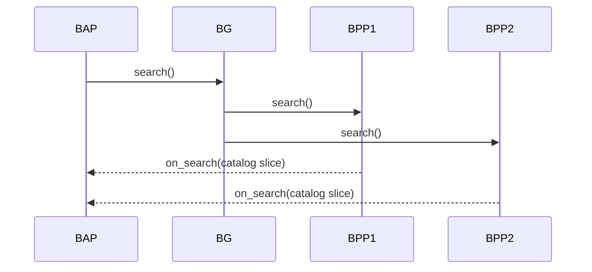
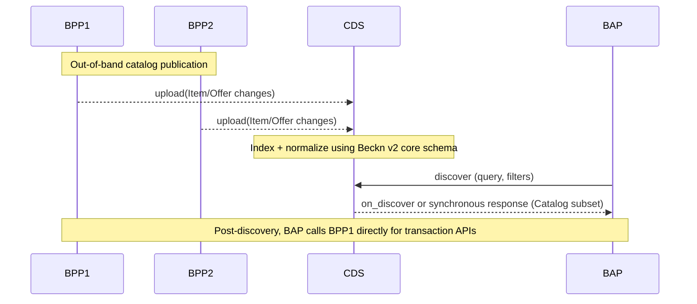

# Beckn Protocol Version 2

This repository contains the latest major version of the Beckn Protocol — Version 2 — defining a JSON-LD and schema.org-aligned core schema, updated APIs, and reference flows for the next generation of Beckn networks. It introduces a catalog-first Catalog Discovery Service (CDS) (replacing the Beckn Gateway for discovery), a DeDi-compliant Network Registry, and a modular "core + schema packs" model to enable strong design-time and run-time composability and global semantic interoperability.

## Version History

| Version | Status | Branch | Key Changes |
|---------|--------|--------|-------------|
| v2.0.0 | Superseded | — | Introduced per-object schema structure (`schema/<Object>/v2.0/`), JSON-LD alignment, CDS and DeDi architecture |
| v2.0.1 | **Current** | `core-2.0.0-rc2-alt` | Universal `/beckn/{action}` endpoint (GET + POST), GET Query Mode for QR/deep-link interactions, all schemas externalized to `schema.beckn.io`, consolidated top-level `schema/vocab.jsonld` and `schema/context.jsonld` |

---

## Repository Structure

```
protocol-specifications-v2/
├── api/
│   └── v2.0.1/
│       └── beckn.yaml          # OpenAPI 3.1.1 — Beckn Protocol API v2.0.1
├── schema/
│   ├── vocab.jsonld            # Beckn core OWL vocabulary (top-level)
│   └── context.jsonld          # Beckn core JSON-LD context (top-level)
└── README.md
```

> Schema types (`Action`, `RequestAction`, `CallbackAction`, `Ack`, `Nack`, etc.) are published externally at **[schema.beckn.io](https://schema.beckn.io)** and referenced by `$ref` in the OpenAPI spec. Domain-specific schema packs are maintained in separate repositories.

---

## 1. High-level goals of v2

Beckn v2 reorganizes the protocol around:
- **Global semantic interoperability** via JSON-LD and deep alignment with schema.org and other globally interoperable linked data schemas.
- **Design-time composability**: modular core + pluggable domain-specific "schema".
- **Run-time composability**: independent but interoperable actors (BAP, BPP, CDS, Registry) that can be recombined without changing the core.
- **Registry and discovery modernization**:
  - BG → CDS: Beckn Gateway is replaced by a Catalog Discovery Service (CDS).
  - Legacy Registry → DeDi-compliant Registry: Network Registry becomes compliant with the Decentralized Directory (DeDi) protocol.

---

## 2. Schema changes: from v1 to v2

### 2.1 From OpenAPI/JSON Schema to JSON-LD + schema.org

#### v1.x
- API and data models primarily expressed as OpenAPI 3.x with embedded JSON Schema.
- Domain semantics encoded as ad-hoc JSON fields inside the Beckn message envelope.
- Limited machine-readable linkage to global vocabularies.

#### v2.0.x
- All core entities are JSON-LD graphs with:
  - `@context` — Beckn core context + domain contexts.
  - `@type` — Beckn and/or schema.org types (e.g. `beckn:Order`, `schema:Order`).
- Fields are explicitly mapped to schema.org wherever possible, with `beckn:` used for protocol-specific semantics.
- APIs are defined against these JSON-LD entities, not bespoke JSON blobs.

#### Benefits
- **Global semantic interoperability**: External ecosystems can consume Beckn data as generic JSON-LD / schema.org without custom adapters.
- **Forward compatibility**: New properties can be added in domain contexts without breaking core parsing.
- **Shared tooling**: Off-the-shelf semantic tools (RDF libraries, graph DBs, JSON-LD validators) become usable directly.

### 2.2 Core vs Domain-specific Attributes (Schema)

#### v1.x
- Many domain fields placed directly in order, item, or network-specific extensions.
- Adding new sectors often required patching the core schema or adding new domain-specific APIs.

#### v2.0.x
- **Core schema**: small, stable set of types — Catalog, Item, Offer, Order, OrderItem, Payment, Fulfillment, Invoice, Provider, Buyer, Location, etc.
- **Composable Attributes**: Each core entity has one or more `...Attributes` fields typed as `Attributes` (JSON-LD containers). Domain / rail-specific models are delivered as composed, self-describing schema packs with their own `@context` and `@type` definitions.
- **Protocol evolution**: New industries → new schema packs, not changes to core. Network policies decide which schema are allowed/required.

#### Design-time composability
- Core entities act as slots into which arbitrary domain vocabularies can be plugged.
- Multiple schema can co-exist for the same entity (e.g. "mobility + carbon accounting" for an `Item`).
- Networks can mandate a minimal schema set for interoperability and allow additional schema for richer bilateral integrations.

#### Run-time composability
- BAPs, BPPs, Beckn ONIX, and CDS can inspect `@context`/`@type` at run-time to decide which schema they understand.
- Unknown schema can be safely ignored or passed through, keeping backward compatibility.

---

## 3. API changes

### 3.1 v2.0.1: Universal `/beckn/{action}` endpoint

v2.0.1 introduces a single universal endpoint that handles all Beckn protocol actions:

```
GET  /beckn/{action}   — Body Mode or Query Mode
POST /beckn/{action}   — Request or Callback actions
```

#### GET — Body Mode
The action payload is sent as a JSON request body; the signature is transmitted in the `Authorization` header. Used for server-to-server interactions where the caller has a registered callback endpoint.

#### GET — Query Mode *(new in v2.0.1)*
The action payload and signature are both expressed as URL query parameters:
```
GET /beckn/{action}?Authorization={Signature}&RequestAction={RequestActionQuery}
```
This makes the entire request a self-contained URL suitable for **QR codes**, **deep links**, **bookmarkable pages**, **frontend UIs**, and **IoT/embedded clients**. In Query Mode, the caller MUST NOT expect an asynchronous callback; the server acknowledges with `Ack` (HTTP 200) only.

#### POST
Handles both forward actions (`RequestAction`) and callback actions (`CallbackAction`). The `action` path parameter determines which variant is applicable.

#### Response semantics
| Code | Meaning |
|------|---------|
| `200 Ack` | Receipt confirmed; signature valid; async callback will follow |
| `409 AckNoCallback` | Received but no callback due to a business constraint |
| `400 NackBadRequest` | Malformed or invalid request |
| `401 NackUnauthorized` | Invalid or missing authentication |
| `500 ServerError` | Internal error on the network participant's platform |

All schema types are externalized to `schema.beckn.io` and referenced via `$ref` in `api/v2.0.1/beckn.yaml`.

### 3.2 Discovery: BG multicast → CDS push-based discovery

#### v1.x: BG-mediated multicast catalog pull
In v1.x networks, Beckn Gateway (BG) primarily:
- Accepted `search` from BAPs.
- Performed multicast fan-out to all (or policy-filtered) BPPs.
- Received `on_search` callback responses back from BPPs to BAPs.

#### Workflow (OLD)


#### v2.0.x: CDS-centric, asynchronous catalog push
In v2, BG is replaced by a more comprehensive actor: the **Catalog Discovery Service (CDS)**.

Key differences:
- Discovery is no longer BG multicast "pull" of catalogs.
- Each BPP asynchronously pushes catalog updates to CDS (publish/notify model).
- BAPs query CDS for discovery; CDS resolves, aggregates, and returns results.
- BAPs reach BPPs directly only when initiating a post-discovery transaction flow (`/select`, `/init`, etc.).

#### Workflow (NEW)


#### Implications
- BG's role is expanded into CDS — a catalog-first discovery service with rich indexing over standardized `Catalog` / `Item` / `Offer` graphs and network-configurable policies for ranking, filtering, and personalization.
- Catalog dissemination happens continuously, independent of any specific BAP request.
- Discovery becomes a read-optimized lookup over the CDS index, not a real-time multicast workflow.

### 3.3 Network Registry: Beckn lookup/subscribe → DeDi-compliant registry

#### v1.x
- Network Registry exposed bespoke Beckn APIs for `lookup` and `subscribe`.
- Registry semantics were Beckn-specific and often tightly coupled to each network's implementation.

#### v2.0.x
- Network Registry is re-architected to be compliant with the **Decentralized Directory (DeDi) protocol**.
- The registry is now a public directory in DeDi terms: publicly accessible, machine-readable, exposed via standard HTTPS APIs.
- Beckn participant metadata (DID, endpoints, signing keys, capabilities, network membership) is modeled as DeDi directory records.
- Beckn clients perform DeDi lookups rather than bespoke Beckn `lookup`/`subscribe`.

#### Benefits
- Shared trust layer across ecosystems, not just Beckn.
- Easier multi-network composition: a BAP or BPP can discover participants via the same DeDi-compliant registry.
- Evolvable registry semantics: new attributes (e.g., compliance certifications, ESG scores) can be plugged into directory records without changing Beckn core.

### 3.4 API surface and layering

v2 strengthens separation of concerns across the three API layers:

| Layer | v1.x | v2.0.x |
|-------|------|--------|
| **Transaction** | `/search`, `/select`, `/init`, `/confirm`, `/status`, etc. — bespoke JSON | Same actions via `/beckn/{action}` — entities are JSON-LD types with schema.org mappings |
| **Discovery** | BG multicast | CDS-facing (catalog publication) + BAP-facing (search/query) |
| **Registry** | Custom Beckn `lookup`/`subscribe` | DeDi endpoints and DeDi record types |

---

## 4. Benefits of v2.0.x

### 4.1 Design-time composability
- **Minimal, stable core**: Most future changes land in schema compositions, CDS configuration, or DeDi directory schemas — not in the core protocol.
- **Domain schema packs**: New verticals (loans, climate, mobility, health) are added via separate JSON-LD contexts and Attributes models.
- **Configurable networks**: Network policies specify required/optional schema, allowed discovery strategies in CDS, and Registry namespaces.
- **Easier governance**: Core WG focuses on a small base schema + architectural constraints; Sectoral WGs create and maintain independent schema lists.

### 4.2 Run-time composability
- **Composable actors**: BAP, BPP, CDS, DeDi Registry, and auxiliary Agents (pricing, fulfillment, risk, etc.) can be deployed and evolved independently.
- **Graph-native data**: JSON-LD entities can be stored in graph databases and enriched with linked data from other ecosystems (identity, credentials, geospatial, ESG).
- **Progressive adoption**: Systems can implement a subset of the schema and flows while still interoperating at the core level.

### 4.3 Global semantic interoperability
- **Shared vocabularies**: Using schema.org as a base vocabulary dramatically reduces ambiguity across countries and industries.
- **Linked registries and catalogs**: DeDi provides a universal way to publish and verify public directories, including Beckn registries.
- **Machine-understandable contracts**: Orders, offers, prices, and terms are expressed in semantically rich JSON-LD, enabling automated reasoning, contract verification, and cross-network analytics.

---

## 5. Architectural prerequisites

To adopt v2.0.x, implementations should assume:

1. **JSON-LD support** — Ability to parse and validate JSON-LD; handling of `@context` resolution (either local or via controlled document loaders).
2. **schema.org-aware modeling** — Teams should be comfortable mapping business concepts to schema.org types/properties.
3. **CDS infrastructure** — A Catalog Discovery Service that accepts push-based catalog updates from BPPs, indexes Beckn v2 `Catalog` / `Item` / `Offer` graphs, and exposes search/query APIs for BAPs.
4. **DeDi-compliant Registry** — A registry implementation that publishes Beckn participant records as DeDi directory entries and exposes DeDi APIs for lookups, queries, and verification.
5. **Network configuration & governance** — Clear policies for which schema are mandatory, how versions are managed, and how CDS and Registry endpoints are bootstrapped and rotated.
6. **Security & trust** — Continued use of Beckn's digital signatures, non-repudiation guarantees, and transport security, aligned with DeDi's trust and verification mechanisms.

---

## 6. Design considerations for implementers

### 6.1 Versioning & migration from v1.x
- Treat v2.0.x as a new line of the protocol, not an in-place upgrade.
- Plan separate:
  - **Registry migration**: map existing v1 participant records into DeDi directory records.
  - **Catalog migration**: convert v1 item models to v2 `Item` + `Offer` JSON-LD graphs with appropriate schema compositions.
- Maintain dual-stack in transitional phases: v1.x APIs and registry for production; v2.0.x APIs, CDS, and DeDi registry for pilots.

### 6.2 Network design-time choices
Define, per network:
- **Minimal core**: Core entities that must always be present (`Order`, `Provider`, `Location`, etc.).
- **Mandatory schema packs**: e.g., `mobility-core`, `retail-core`, `carbon-core`.
- **Optional enrichments**: Loyalty, ratings, ESG/green attributes, etc.
- **CDS configuration**: Ranking functions, filters, relevance scoring.
- **DeDi namespaces**: How network IDs, sectors, and jurisdictions are mapped to DeDi directory structures.

### 6.3 Runtime behavior & resilience
- **Asynchronous flows remain fundamental**: All transaction APIs are asynchronous, consistent with v1.x design.
- **Idempotency & replay safety**: Handle repeated publications and updates without side effects; use stable identifiers and timestamps to deduplicate.
- **Observability**: Introduce metrics and traces across BPP → CDS catalog publication, CDS indexing and search, and DeDi registry lookups — crucial in multi-actor, multi-network deployments.

---

## 7. Scope & non-goals of v2.0.x
- No mandatory migration schedule defined.
- Focus on architecture, not policies: Network-specific policies (fees, SLAs, dispute resolution) are out of scope and remain network decisions layered on top of core.

---

## 8. How to use this repository

Use this repo as the reference baseline for:
- **Implementing Beckn v2.0.1-compatible network participants** (BAP, BPP, CDS, Registry) — see `api/v2.0.1/beckn.yaml`.
- **Understanding the Beckn core vocabulary and JSON-LD context** — see `schema/vocab.jsonld` and `schema/context.jsonld`.
- **Designing Beckn v2-compatible CDS implementations**.
- **Prototyping DeDi-backed Beckn registries**.
- **Defining and iterating on domain-specific schema packs** aligned to your vertical.

### When contributing:
- Keep changes to the core schema extremely conservative.
- Prefer new or updated schema packs and configuration examples.
- Ensure all additions maintain JSON-LD validity and schema.org alignment where possible.

---

## 9. Related resources

| Resource | Link |
|----------|------|
| Beckn Protocol v1 specification | https://github.com/beckn/protocol-specifications |
| Beckn schema registry | https://schema.beckn.io |
| Beckn website | https://beckn.io |

> To observe the latest developments on this specification, check out the `core-2.0.0-rc2-alt` branch of this repo.

---

## 10. Issues & discussions

Visit the [Issues](../../issues) and [Discussions](../../discussions) board of this repository for queries, proposals, and community feedback.
