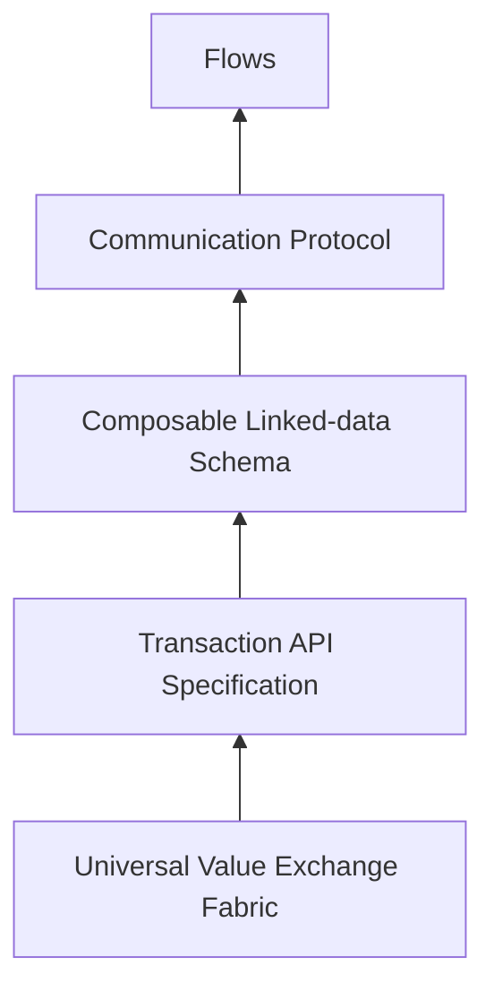
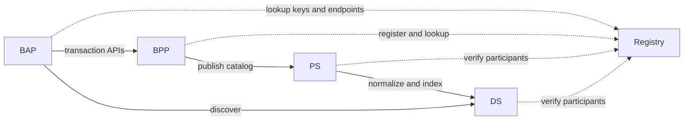
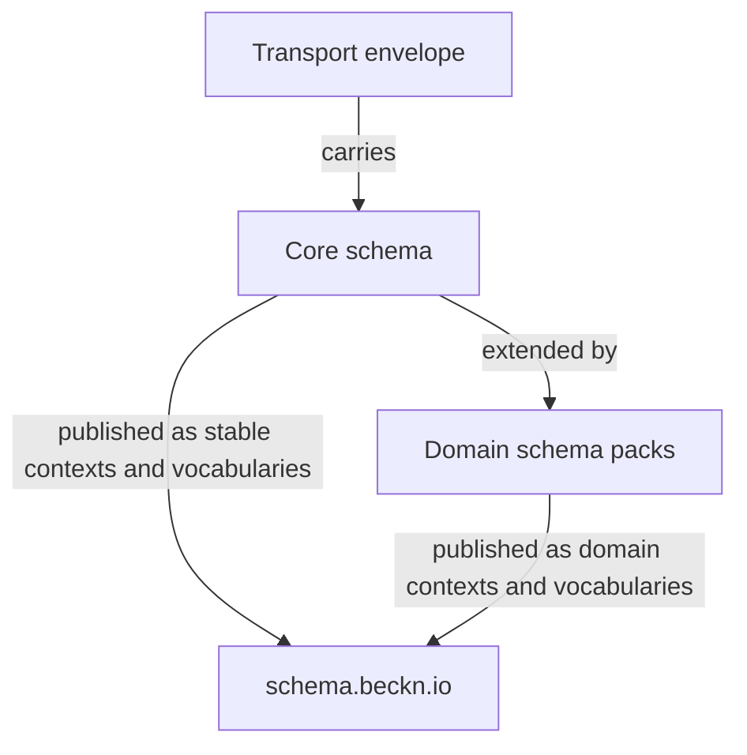
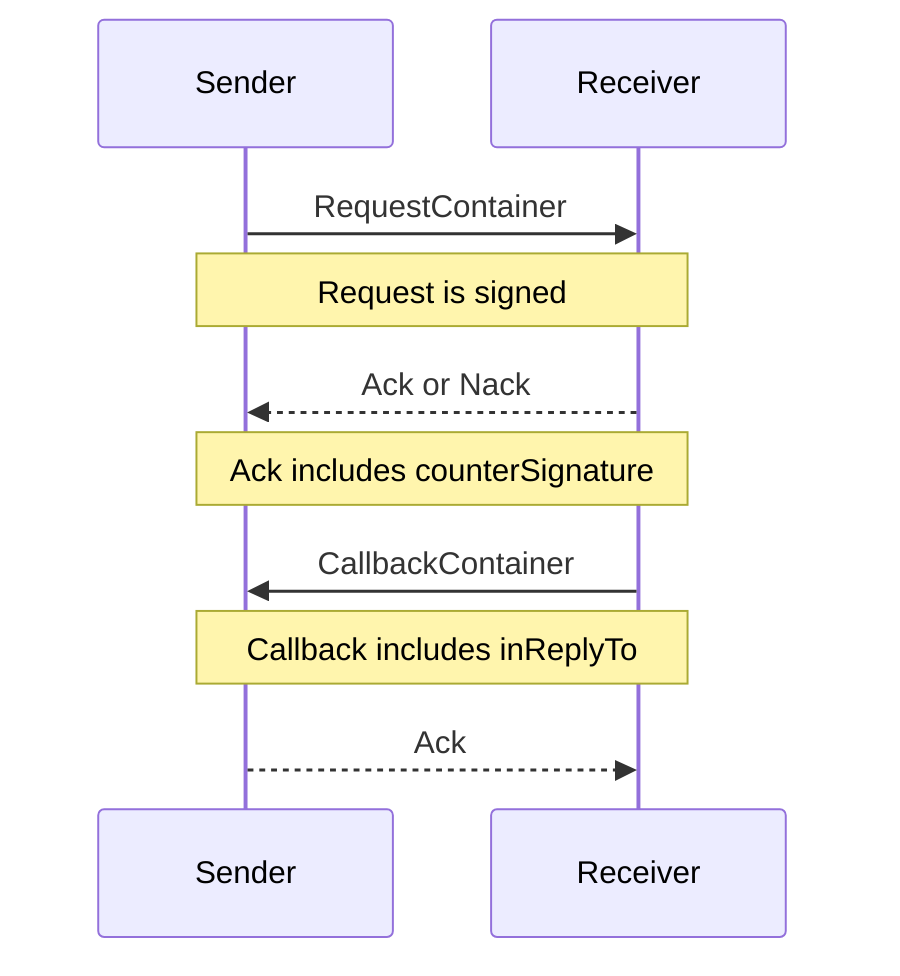
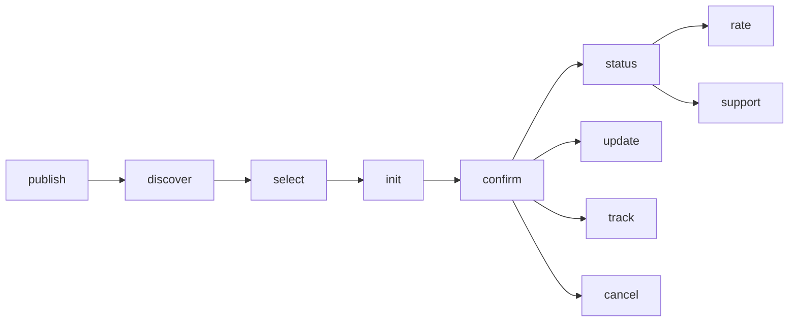
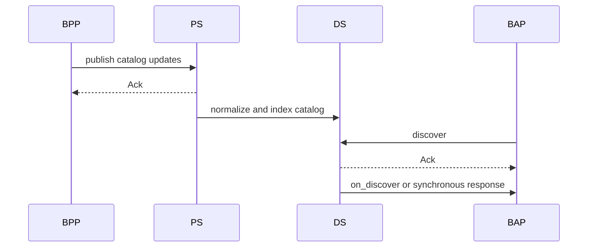
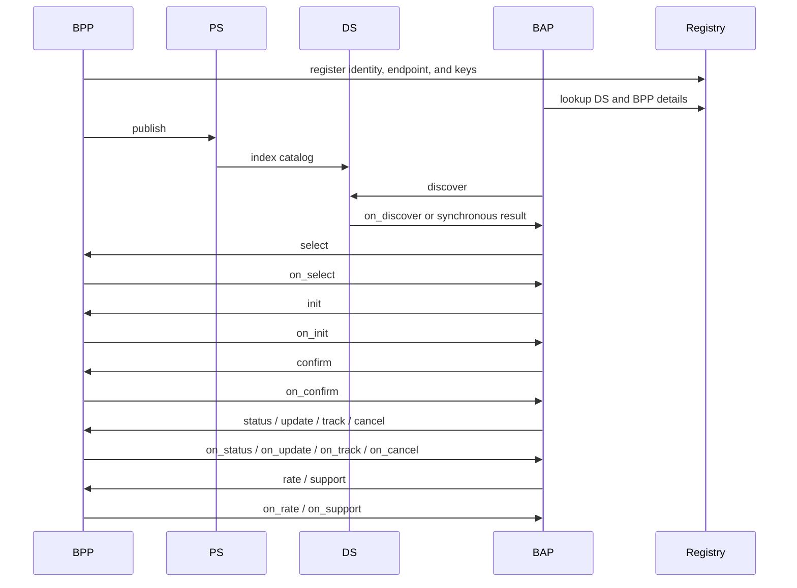

# Introduction to Beckn Protocol Version 2.0

The **Beckn Protocol Version 2.0** specification defines a standard protocol stack that allows independently run applications to take part in trusted value exchange transactions. These transactions usually move through discovery, contracting, fulfillment, and post-fulfillment.

This document explains Beckn v2 at a high level. It is an overview. It is meant to help a human or an AI agent understand how the parts fit together before going into the full API files and schema files.

This protocol stack consists of the following layers (bottom to top)

1. Universal Value Exchange Fabric
2. Transaction API Specification
3. Composable Linked-data Schema
4. Communication Protocol  
5. Flows



Let us understand each of these layers briefly.

## Network Architecture

A Beckn network is a set of separate platforms. Each platform is run independently. The protocol gives them a common way to talk to each other.

In Beckn v2 the main actor roles are the following:

1. BAP (Beckn Application Platform) - the buyer side or user side platform  
2. BPP (Beckn Provider Platform) - the seller side or provider side platform  
3. PS (Publishing Service) - the service that receives catalog publications from BPPs  
4. DS (Discovery Service) - the service that answers discovery queries from BAPs  
5. Registry - the trust directory that stores participant identity, endpoints, and public keys

A BAP discovers supply through a DS. A BPP publishes its catalog to a PS. After discovery, the BAP usually talks directly to the BPP for the transaction. All actors use the Registry to find endpoints and public keys and to verify signatures.

In Beckn v2 the Registry is a DeDi-compliant directory. This means the trust layer is treated as a proper public directory and not as a custom side system.



The important point is this: Beckn v2 does not depend on a live multicast gateway for discovery. Discovery is catalog-first and index-based.

## API Specification

The API specification defines the common shape of Beckn messages and endpoints.

In Beckn v2, the endpoint pattern is simple:

```text
/discover, /on_discover, /select, /on_select, and related action endpoints
```

For example, a participant may expose endpoints such as:

- `/discover`
- `/on_discover`
- `/select`
- `/on_select`
- `/confirm`
- `/on_confirm`

The exact actions a participant supports depend on its role.

Every Beckn API call carries a transport envelope and a business payload.

The transport envelope is the fixed part of the protocol. It carries things like the action name, IDs, time, and routing data. The business payload is the domain data inside the message.

Fields such as `context`, `message`, `inReplyTo`, `status`, and signatures belong to the transport contract. They are fixed. They must not be renamed or redefined by domain schema.

At a high level, the main action groups are:

1. Discovery - `discover`, `on_discover`  
2. Contracting - `select`, `on_select`, `init`, `on_init`, `confirm`, `on_confirm`  
3. Fulfillment - `status`, `on_status`, `update`, `on_update`, `track`, `on_track`, `cancel`, `on_cancel`  
4. Post-fulfillment - `rate`, `on_rate`, `support`, `on_support`  
5. Infrastructure - `publish` and Registry lookups

## Composable linked-data schema

In Beckn v2, the business payload is not just plain JSON. It is JSON-LD.

JSON-LD lets every type and field carry a shared meaning. It does this mainly through two ideas:

- `@context` - tells the reader where the meaning of terms comes from
- `@type` - tells the reader what kind of object it is

This is important because Beckn is meant to work across domains, geographies, and networks. A machine should not only read the data. It should also understand what the data means.

Beckn v2 separates schema into three layers:

1. The transport envelope layer - the API envelope and container schemas  
2. The core schema layer - shared business types such as `Catalog`, `Item`, `Offer`, `Intent`, `Contract`, `Provider`, `Fulfillment`  
3. The domain schema pack layer - domain specific extensions such as retail, mobility, health, logistics, and others



Where possible, Beckn maps types and fields to schema.org. When Beckn needs its own meaning, it uses the Beckn namespace. This gives global interoperability without losing Beckn-specific meaning.

This layered design solves an important problem. The transport API can stay small and stable. At the same time, the business schema can grow over time. New domains can be added without changing the basic transport contract.

The `schema.beckn.io` website is the public place where these schema resources can be published and browsed. It gives stable IRIs, JSON-LD contexts, RDF vocabularies, and versioned schema pages. In simple words, it is the public map of meaning for Beckn data.

## Communication Protocol

The communication protocol defines how Beckn messages move over the network.

At the transport level, Beckn v2 uses HTTPS and digital signatures.

There are three main request modes:

1. POST - used for normal forward requests and callbacks  
2. legacy GET Body mode - used when a GET request with a JSON body is allowed  
3. legacy GET Query mode - used when the whole request must fit inside a URL, such as a QR code or a deep link

Every request except legacy GET Query mode carries a Beckn Signature in the `Authorization` header. The receiver verifies that signature using the sender's public key from the Registry.

The communication pattern is usually as follows:

1. The sender sends a signed request  
2. The receiver immediately returns `Ack` or `Nack`  
3. If the request is accepted, the business result usually comes later as a callback  
4. The callback carries `inReplyTo` so it can be tied to the original request  
5. The `Ack` carries a `counterSignature`, which works as a signed receipt



This means Beckn is not just request-response in the usual web sense. It is mainly an asynchronous and event-driven protocol.

At a practical level, Beckn supports all of the following patterns:

- **Same-session acknowledgement** - the receiver immediately says whether it received the message  
- **Asynchronous business response** - the actual business result comes later through a callback  
- **Synchronous business response in some cases** - for example, discovery results may also be returned synchronously depending on network policy  
- **Later state-driven messages** - a later message may be sent because the state changed, not because a user clicked a button at that moment

legacy GET Query mode is a special case. It is used when the request must be a self-contained URL. In that mode, the server must not send an asynchronous callback. It only returns an acknowledgement.

## Workflows

Workflows are the business paths built on top of the API actions.

The protocol gives reusable actions. A network then combines those actions into a workflow.

A simple Beckn workflow often looks like this:

1. A BPP publishes catalog data  
2. A BAP discovers that catalog through a DS  
3. The BAP starts a transaction with a BPP  
4. The BAP and BPP agree on terms  
5. The BPP fulfills the contract  
6. The parties may exchange rate or support information later



Not every network uses every action. Not every domain needs every step. The protocol gives the building blocks. The network chooses the path.

# Understanding the Beckn API Specification

This section gives the Beckn API picture at a level useful for implementation. It keeps the discussion short and clear. A separate document can go action by action in more detail.

## What changed in Beckn v2

If you have seen older Beckn material, these are the changes that matter most:

1. Discovery is no longer based on live gateway multicast. BPPs publish catalogs to PS. BAPs discover through DS.  
2. The API surface is simplified around the common endpoint pattern `/discover, /on_discover, /select, /on_select, and related action endpoints`.  
3. The transport contract and the business schema are now clearly separated.  
4. The business payload is JSON-LD, with shared meaning through `@context` and `@type`.  
5. The Registry is aligned to a DeDi-compliant directory model.  
6. Non-repudiation is stronger because acknowledgements can carry `counterSignature` and callbacks can carry `inReplyTo`.

## What a Beckn network participant must do

Any platform can take part in a Beckn network if it can do the following:

1. Register its identity, endpoint, and public keys in the Registry  
2. Send signed Beckn messages  
3. Verify signed Beckn messages from others  
4. Implement the endpoints needed for its role  
5. Read and produce the shared JSON-LD payloads

## The main actors

Let us look at the main actors one by one.

### BAP

A BAP is the buyer side platform. It is the platform where the user, buyer, or demand side experience lives.

A BAP usually does the following:

1. Sends discovery requests to a DS  
2. Receives discovery results  
3. Sends transaction requests to BPPs  
4. Receives callbacks from BPPs  
5. Shows the results to the end user

### BPP

A BPP is the provider side platform. It is the platform where the provider's catalog, pricing, contract logic, and fulfillment logic live.

A BPP usually does the following:

1. Publishes its catalog to a PS  
2. Receives transaction requests from BAPs  
3. Sends callbacks to BAPs  
4. Updates contract and fulfillment state over time

### PS

A PS is the cataloging service.

It receives catalog publications from BPPs, validates them, normalizes them, and prepares them for indexing.

### DS

A DS is the catalog discovery service.

It keeps an index of published catalog data and answers discovery requests from BAPs. This is why Beckn v2 discovery is fast and does not need live fan-out to all BPPs.

### Registry

The Registry is the trust directory of the network.

It stores participant records, endpoints, capabilities, and public keys. Before a participant sends a message, it can use the Registry to find where to send the message and how to verify the signature.

## What every Beckn packet contains

Every Beckn request or callback contains two main parts:

- `context`
- `message`

The `context` carries the routing and control data. The `message` carries the business data.

A callback also carries `inReplyTo` so that it can be tied to the original request.

A simplified Beckn packet looks like this:

```json
{
  "context": {
    "domain": "beckn:retail",
    "action": "discover",
    "version": "2.0.0",
    "bapId": "bap.example.com",
    "bapUri": "https://bap.example.com/callback",
    "transactionId": "txn-123",
    "messageId": "msg-456",
    "timestamp": "2026-03-27T00:00:00Z",
    "ttl": "PT30S"
  },
  "message": {
    "@context": [
      "https://schema.org/",
      "https://schema.beckn.io/core/v2.0/context.jsonld"
    ],
    "@type": "Intent"
  }
}
```

The important thing to remember is this: the transport envelope and the business payload are different concerns.

- The transport envelope tells you how the message should move  
- The business payload tells you what the message means

## Transport envelope and business payload

Beckn v2 keeps these two layers separate on purpose.

The transport layer gives a stable message frame. It defines the container schemas such as `Context`, `RequestContainer`, `CallbackContainer`, `Ack`, `Nack`, `CounterSignature`, and `InReplyTo`.

The business layer gives the actual domain objects such as `Catalog`, `Item`, `Offer`, `Intent`, `Contract`, `Fulfillment`, `Tracking`, `Rating`, and `Support`.

This separation has a big benefit. The transport layer stays stable. The business layer can evolve across domains.

## A note on v2 words

In older Beckn explanations, you will often see the word `Order`.

In Beckn v2 core schema, the more exact word is `Contract`. The idea is similar. It is the formal record of what the parties agreed to. In the same way, `ContractItem` replaces the older `OrderItem`.

This matters mainly at the schema layer. The transaction idea itself remains easy to understand: discovery leads to agreement, agreement leads to fulfillment, and fulfillment may be followed by support or rate.

## The main request modes

The same Beckn action can be carried in different transport modes.

### POST

POST is the normal mode for:

- forward requests such as BAP to DS or BAP to BPP
- callbacks such as DS to BAP or BPP to BAP

### legacy GET Body mode

legacy GET Body mode lets a caller send a Beckn request in a GET request with a JSON body. This is useful in cases where GET semantics are needed but the caller can still send a body and expects a later callback.

### legacy GET Query mode

legacy GET Query mode puts the full request and signature inside the URL query string.

This is useful for:

- QR codes
- deep links
- bookmarkable discover links
- simple browser or device clients

In legacy GET Query mode there is no asynchronous callback. The server only returns an `Ack` or a `Nack`.

## How discovery works in Beckn v2

Discovery is one of the biggest changes in Beckn v2.

In older models, discovery often depended on a gateway sending the query to many BPPs in real time.

In Beckn v2, discovery is catalog-first.

1. A BPP publishes catalog updates to a PS  
2. The PS validates and normalizes the data  
3. The PS forwards the data to a DS  
4. The DS indexes the catalog data  
5. A BAP sends a `discover` request to the DS  
6. The DS returns matching catalog data  
7. After discovery, the BAP talks directly to the chosen BPP



This design gives three major benefits:

1. Discovery becomes faster  
2. BPPs do not need to answer every live discovery query  
3. Catalog publication and catalog discover can scale separately

## The main action groups

The Beckn actions are best understood by stage.

| Stage | Main actions | What they do |
|---|---|---|
| Discovery | `discover`, `on_discover` | Find matching catalog data |
| Contracting | `select`, `on_select`, `init`, `on_init`, `confirm`, `on_confirm` | Agree on scope, terms, price, and create the contract |
| Fulfillment | `status`, `on_status`, `update`, `on_update`, `track`, `on_track`, `cancel`, `on_cancel` | Manage the live state of the contract |
| Post-fulfillment | `rate`, `on_rate`, `support`, `on_support` | Handle rate and support |
| Infrastructure | `publish`, Registry lookups | Publish supply and resolve trust data |

A simple way to think about these stages is:

1. **Discovery** - find what is available  
2. **Contracting** - agree what will happen  
3. **Fulfillment** - do what was agreed  
4. **Post-fulfillment** - rate, support, and close the loop

## A full Beckn flow at a glance



Not every transaction uses every step. For example, some networks may not use `track`. Some domains may not need `support`. Some contracts may not change after confirmation, so `update` may never be used.

## What an implementer should build

If you want to start implementing Beckn, it helps to think role by role.

### If you are building a BAP

You usually need to build the following:

1. A client for calling DS and BPP endpoints  
2. Callback endpoints for receiving `on_` actions  
3. Registry lookup support  
4. Message signing and signature verification  
5. JSON-LD payload handling  
6. Contract and fulfillment state management on the buyer side

### If you are building a BPP

You usually need to build the following:

1. Catalog publication to a PS  
2. Request endpoints for transaction actions  
3. Callback sending to BAPs  
4. Registry registration and key publication  
5. Message signing and signature verification  
6. Contract, payment, and fulfillment logic on the provider side

### If you are building a PS

You need to build:

1. A `publish` endpoint  
2. Catalog validation and normalization  
3. Deduplication and merge logic  
4. Forwarding of normalized catalog graphs to one or more DS instances

### If you are building a DS

You need to build:

1. A `discover` endpoint  
2. An index for `Catalog`, `Item`, `Offer`, and related graphs  
3. Ranking, filtering, and query logic  
4. Callback or synchronous response handling as allowed by the network policy

### If you are building any Beckn actor

You should also remember the following:

1. Use HTTPS  
2. Verify signatures on every incoming message  
3. Use the Registry for public key resolution  
4. Treat the transport envelope as fixed  
5. Treat the `message` as the business payload  
6. Load JSON-LD contexts in a controlled way. Do not trust unknown remote contexts blindly.

## Summary

Beckn v2 becomes easy to understand once the separation of concerns is clear.

- The **Universal Value Exchange Fabric** provides the basic building blocks for value exchange
- The **API specification** tells you what endpoint and packet shape to use
- The **Composable Linked-data Schema** tells you what the payload means
- The **Communication Protocol** tells you how signed requests, acknowledgements, and callbacks move
- The **Workflows** tell you how the actions are combined for a real business journey

At a practical level, Beckn v2 works like this:

1. Providers publish catalog data  
2. Discovery services index that data  
3. Buyer side platforms discover matching supply  
4. Buyer and provider platforms agree on terms  
5. The provider fulfills the contract  
6. The parties may exchange rate or support data after that

If you understand these six ideas, you can start reading the Beckn transport files, schema files, and network guides with the right mental model.
