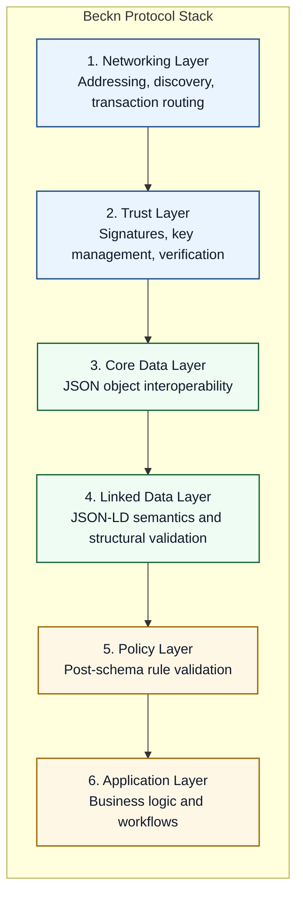
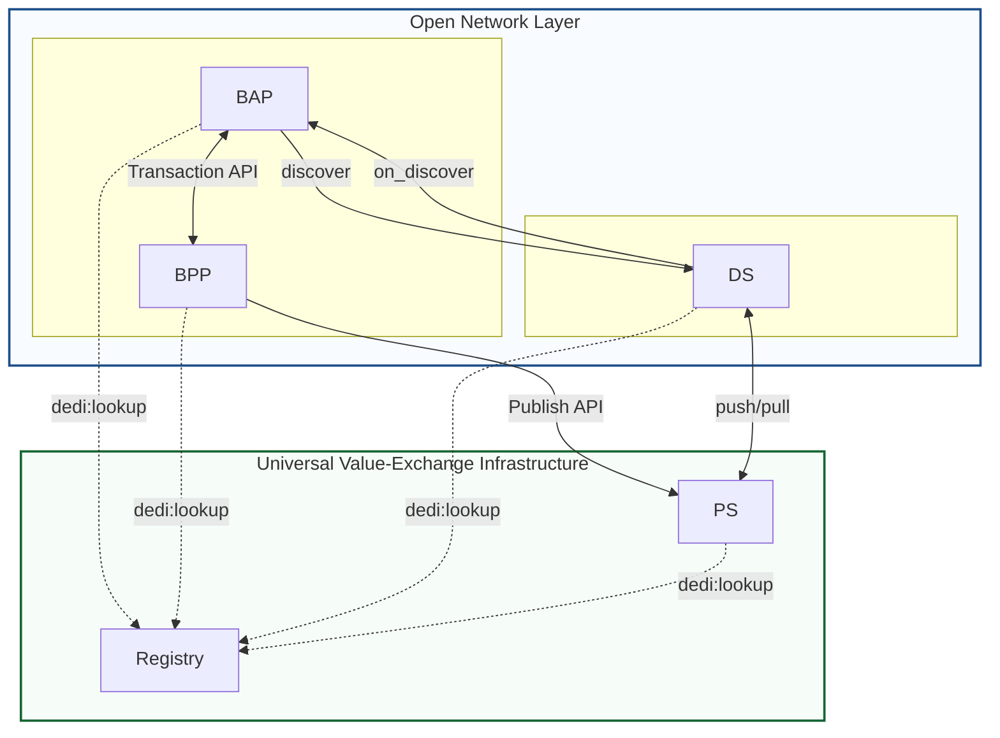
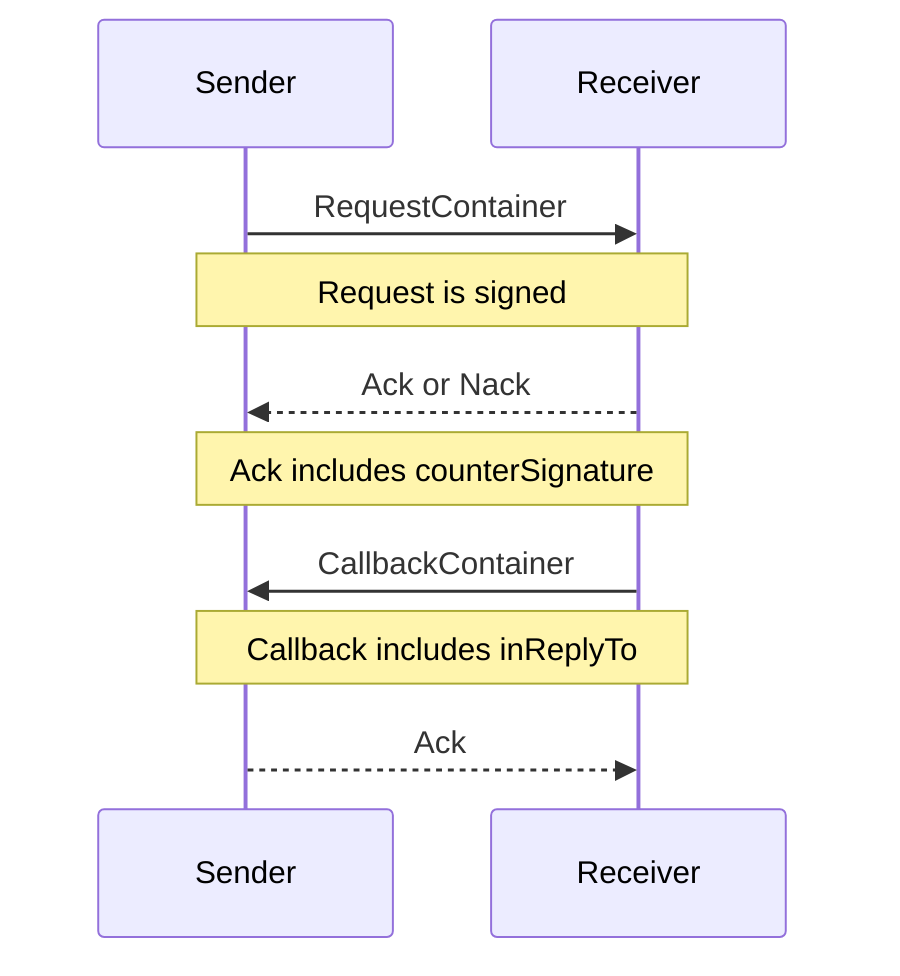
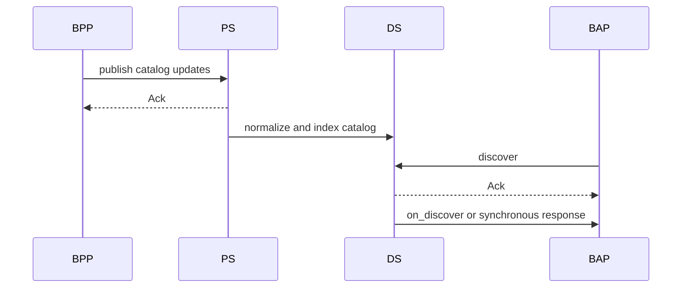
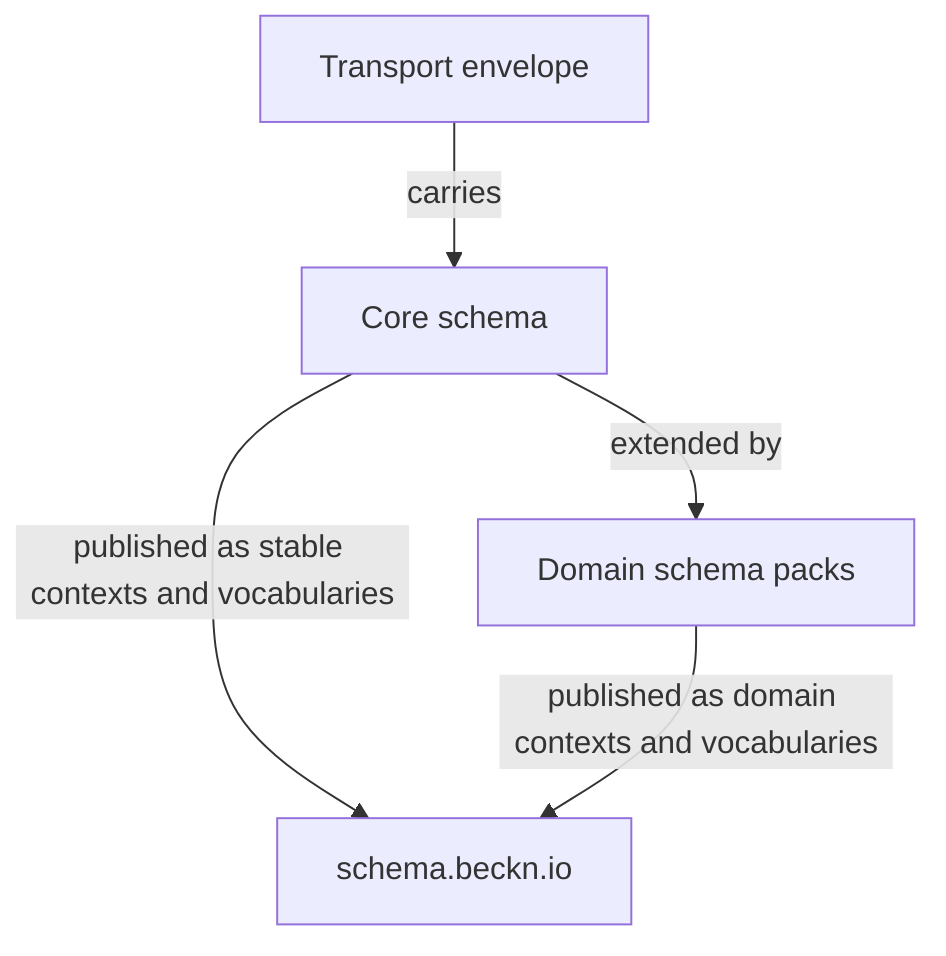
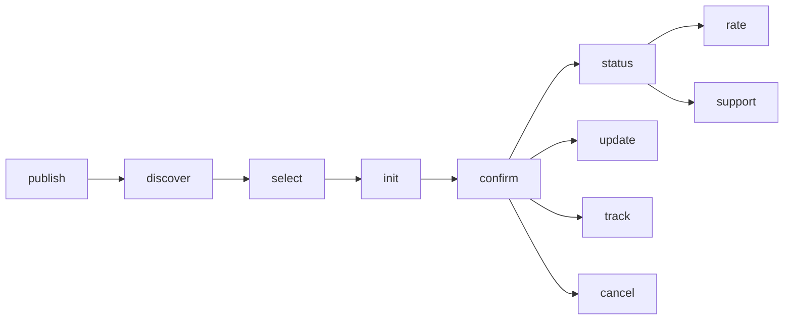
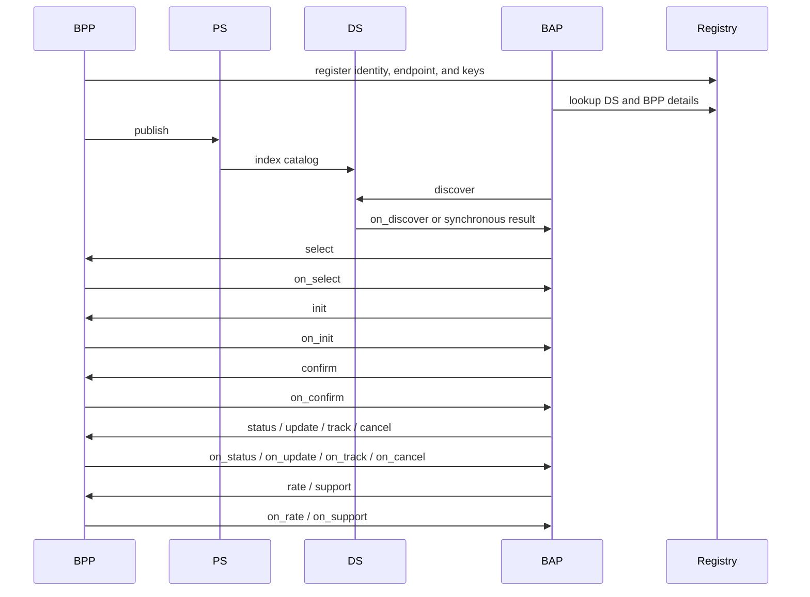

# The Beckn Protocol Stack

The **Beckn Protocol Version 2.0** specification defines a standard protocol stack that allows independently run applications to take part in trusted value exchange transactions. These transactions usually move through discovery, contracting, fulfillment, and post-fulfillment.

This document explains the Beckn v2 protocol stack at a high level. It is meant to help a human or an AI agent understand how the layers fit together before going into the full API files and schema files.

This protocol stack consists of the following layers (bottom to top) as shown in the diagram



Let us understand each of these layers briefly.

1. **Networking Layer:** Handles addressing, sync / async behaviour, Registry lookup, Discovery API calls, Transaction API calls, etc.  
2. **Trust Layer:** Handles signing, signature verification, key management
3. **Core Data Layer:** Core objects are JSON and are structurally validated using JSON Schema
4. **Linked Data Layer:** `Attribute` properties bridge into JSON-LD for semantic linking, with JSON Schema used for structure
5. **Policy Layer:** Handles post-schema, policy rules validation
6. **Application Layer:** Handles business logic

## Layer 1: Networking Layer

The networking layer defines how participants are arranged and how requests, callbacks, and discovery traffic move between them.

### Network Architecture

A Beckn network is a set of independently run platforms that communicate through common protocol contracts.

In Beckn v2, the runtime can be viewed as two architectural bands:

1. **Open Network Layer (top):** BAP, BPP, DS  
2. **Universal Value-Exchange Infrastructure (bottom):** Registry, PS



The key networking shift in v2 is catalog-first discovery. Discovery does not depend on live multicast fan-out.

### Endpoint Pattern and Action Surface

Beckn endpoints follow a simple action/callback pairing pattern:

```text
/discover, /on_discover, /select, /on_select, and related action endpoints
```

Typical role endpoints include:

- `/discover`
- `/on_discover`
- `/select`
- `/on_select`
- `/confirm`
- `/on_confirm`

Action support depends on the participant role and network policy.

### Request Modes and Message Exchange

Beckn v2 supports three transport request modes:

1. `POST` for normal forward requests and callbacks  
2. `legacy GET Body` mode where GET with JSON body is allowed  
3. `legacy GET Query` mode where request and signature are URL-contained

The standard exchange pattern is:

1. Signed request is sent  
2. Receiver returns `Ack` or `Nack` immediately  
3. Business result returns later via callback in most flows  
4. Callback carries `inReplyTo` for correlation  
5. `Ack` may carry `counterSignature` as signed receipt



In `legacy GET Query` mode, the server only returns acknowledgement and does not send asynchronous callbacks.

### Discovery Path in v2

Discovery is index-based and catalog-first:

1. BPP publishes catalog updates to PS  
2. PS validates/normalizes and shares with DS  
3. DS indexes catalog data  
4. BAP sends `discover` to DS  
5. DS returns matching results (sync or callback per policy)



## Layer 2: Trust Layer

The trust layer provides identity, key resolution, signing, verification, and non-repudiation.

- Registry is the network trust directory for participant identity, endpoints, capabilities, and public keys.
- Registry lookups are used before request dispatch and during signature verification.
- Every request except `legacy GET Query` mode carries a Beckn Signature in `Authorization`.
- Receiver verifies sender signatures using public keys from Registry.
- `counterSignature` in `Ack` strengthens non-repudiation.

In Beckn v2, Registry alignment to a DeDi-compliant model makes trust directory behavior explicit and interoperable.

## Layer 3: Core Data Layer

The core data layer defines structural interoperability for shared business objects as standard JSON objects.

Core data schemas are validated using JSON Schema validators. Some properties in core schemas are typed as `Attribute`; these are the bridge points into Layer 4.

### Envelope vs Business Payload

Every Beckn packet contains:

- `context` (routing/control metadata)
- `message` (business payload)

Callbacks additionally carry `inReplyTo` for request correlation.

Fields such as `context`, `message`, `inReplyTo`, `status`, and signatures are part of the transport contract and must not be renamed by domain models.

A simplified packet:

```json
{
  "context": {
    "domain": "beckn:retail",
    "action": "discover",
    "version": "2.0.0",
    "bapId": "bap.example.com",
    "bapUri": "https://bap.example.com/callback",
    "transactionId": "txn-123",
    "messageId": "msg-456",
    "timestamp": "2026-03-27T00:00:00Z",
    "ttl": "PT30S"
  },
  "message": {
    "@context": [
      "https://schema.org/",
      "https://schema.beckn.io/core/v2.0/context.jsonld"
    ],
    "@type": "Intent"
  }
}
```

### Shared Core Types

Core schema objects include `Catalog`, `Item`, `Offer`, `Intent`, `Contract`, `Provider`, `Fulfillment`, `Tracking`, `Rating`, and `Support`.

Note on terminology: v2 uses `Contract` and `ContractItem` where older materials often used `Order` and `OrderItem`.

## Layer 4: Linked Data Layer

The linked data layer gives semantic interoperability through JSON-LD objects.

When a core schema uses `Attribute`, that value can carry JSON-LD structure for semantic linking across domains and networks.

- `@context` defines where term meanings come from.
- `@type` defines object meaning.
- Schema terms map to `schema.org` where possible and Beckn namespace where needed.
- JSON-LD processors validate and resolve semantic links.
- JSON Schema validators enforce structural correctness of the JSON payload.

Beckn v2 schema composition is layered:

1. Transport envelope schemas  
2. Core schema vocabulary  
3. Domain schema packs (retail, mobility, health, logistics, etc.)



`schema.beckn.io` publishes stable IRIs, JSON-LD contexts, RDF vocabularies, and versioned schema resources.

## Layer 5: Policy Layer

The policy layer governs post-schema rules and runtime behavior chosen by each network.

Typical policy-controlled areas include:

1. Whether an action response is synchronous, asynchronous callback, or both  
2. Which action groups are mandatory, optional, or disallowed in a domain  
3. Validation profiles beyond base schema checks  
4. Discovery behavior, ranking, and query constraints at DS level  
5. Timeout/TTL and acknowledgement handling expectations

This is why Beckn actions are reusable building blocks: protocol structure is common, while policy decides concrete operational behavior.

## Layer 6: Application Layer

The application layer contains business workflows, role logic, and state transitions.

### Main Action Groups

| Stage | Main actions | What they do |
|---|---|---|
| Discovery | `discover`, `on_discover` | Find matching catalog data |
| Contracting | `select`, `on_select`, `init`, `on_init`, `confirm`, `on_confirm` | Agree on scope, terms, price, and create the contract |
| Fulfillment | `status`, `on_status`, `update`, `on_update`, `track`, `on_track`, `cancel`, `on_cancel` | Manage live contract state |
| Post-fulfillment | `rate`, `on_rate`, `support`, `on_support` | Handle rating and support |
| Infrastructure | `publish`, Registry lookups | Publish supply and resolve trust data |

### Typical Workflow

1. BPP publishes catalog data  
2. BAP discovers through DS  
3. BAP starts transaction with BPP  
4. BAP and BPP agree terms  
5. BPP fulfills contract  
6. Parties exchange rating/support if needed



### Role Responsibilities

**BAP**

1. Calls DS and BPP endpoints  
2. Receives `on_*` callbacks  
3. Uses Registry lookup support  
4. Maintains buyer-side contract/fulfillment state

**BPP**

1. Publishes catalog to PS  
2. Serves transaction actions from BAPs  
3. Sends callbacks to BAPs  
4. Maintains provider-side contract/payment/fulfillment logic

**DS**

1. Exposes `discover` endpoint  
2. Maintains searchable index for catalog graph  
3. Applies ranking/filter/query logic  
4. Returns sync or callback results per policy

**PS**

1. Receives catalog publications from BPPs  
2. Validates and normalizes catalogs  
3. Pushes/pulls catalog state with DS

**Registry**

1. Stores identity, endpoints, keys, and capabilities  
2. Serves trust lookups to BAP, BPP, DS, and PS

### Full Flow at a Glance



Not every domain uses every action. Networks apply only the actions needed by their business process and policy profile.

## Summary

Beckn v2 is easiest to implement when viewed strictly as a six-layer stack:

1. **Networking Layer** - participant topology, endpoints, request modes, and callback patterns  
2. **Trust Layer** - identity, signatures, Registry lookup, and non-repudiation  
3. **Core Data Layer** - JSON object schemas and stable packet contracts validated by JSON Schema  
4. **Linked Data Layer** - `Attribute`-driven JSON-LD semantics with JSON-LD and JSON Schema validation  
5. **Policy Layer** - network-specific operational rules above schema  
6. **Application Layer** - business workflows across discovery, contracting, fulfillment, and support

If this layered mental model is clear, the transport files, schema files, and network guides become easier to read and implement correctly.
