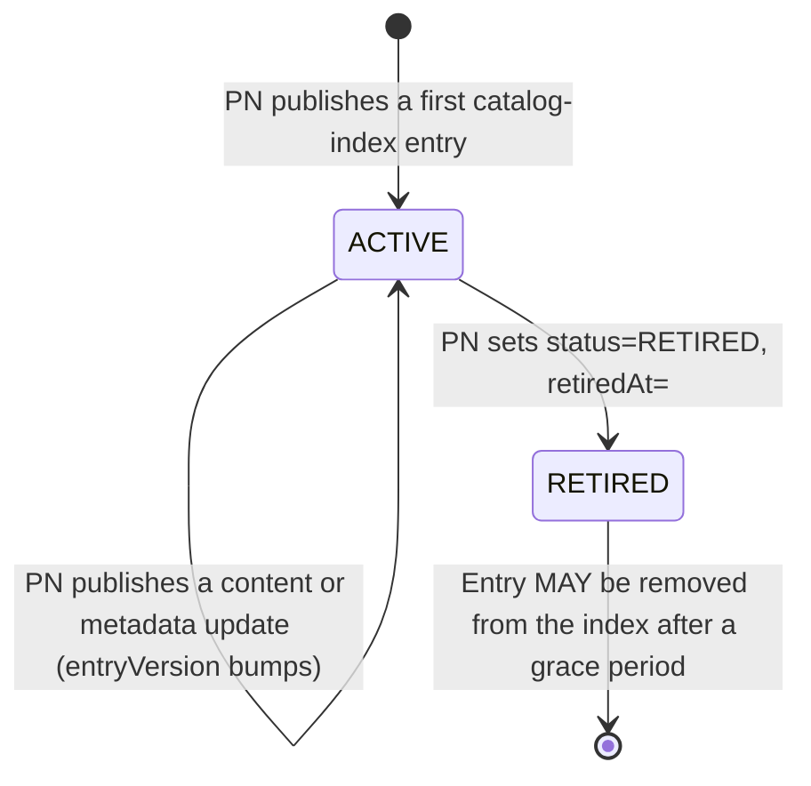

# Decentralized Catalog Publishing and Discovery

## Document Details
- **ID:** NFH-TBD
- **Publication Status:** Draft
- **Authors:**
  - Mayuresh A Nirhali, Networks for Humanity
- **Created:** 2026-08-05
- **Updated:** 2026-08-05
- **Version history:** Draft-01 (2026-08-05): Initial publication.
- **Latest editor's draft:** Not yet pushed to a branch of `protocol-specifications-v2`. Will be linked once a working branch exists.
- **Implementation report:** Not available. This document is at Initial Draft status; report will be linked in the next formal release of this RFC, following merge to main.
- **Stress test report:** Untested: no reference implementation has been exercised against this specification yet. A crawler reference implementation (an ONIX plugin) and publisher-side tooling are tracked as implementation deliverables, not yet built against this draft.
- **Conformance impact:** Implementers operating a Provider Node (PN) MUST self-host and self-sign catalog data instead of calling `POST /catalog/publish`; implementers operating a Discovery Service (DS) MUST crawl and verify DeDi-anchored catalog files instead of calling `POST /catalog/pull`/`POST /catalog/search`/`POST /catalog/subscription`.
- **Security/privacy implications:** Introduces two new signature scopes (per-catalog-file self-signature, per-catalog-index-entry self-signature) and removes a single, centrally-enforced publish-time validation gate; see §Security Considerations and §Privacy Considerations.
- **Replaces / Relates to:** Relates to [NFH-006](./API.md) (Beckn API Endpoints), [NFH-007](./Authentication_and_Trust.md) (Authentication and Trust), [NFH-012](./Schema_Design_Guide.md) (Schema Design Guide). Does not replace any existing RFC in full; retires the `Fabric API - Cataloging Service` endpoint group defined in `beckn.yaml`, tracked as a follow-up edit (see §Non-Goals).
- **Feedback:**
  - Issues: Click [here](#) (link to be added once a tracking issue exists)
  - Discussions: Click [here](#) (link to be added; MUST include an NFH Fabric Support Forum thread before this leaves Draft status)
  - Pull Requests: Click [here](#) (link to be added once a branch/PR exists)
- **Errata:** To be published.

## Abstract

This RFC retires the centralized Cataloging Service (CS) and its seven endpoints (`/catalog/publish`, `/catalog/on_publish`, `/catalog/push`, `/catalog/subscription`, `/catalog/pull`, `/catalog/on_pull`, `/catalog/search`) as the mechanism by which Provider Nodes (PNs) make catalogs discoverable. In their place, a PN self-hosts its own catalog data as self-signed files on infrastructure it already controls, discoverable by extending its existing Beckn Subscriber DeDi record with one new field. A Discovery Service (DS) discovers and indexes this data by crawling — resolving each PN's DeDi manifest, verifying signed catalog files and self-signed catalog-index entries, and applying incremental updates — instead of calling a mandatory, shared Fabric write API. `/discover` and `/on_discover` are unaffected; the `Catalog` schema itself is unaffected. This RFC commits catalog access to being public-only and does not re-home the Rego policy-as-code enforcement currently specified against the CS in NFH-012. Companion artifacts: new `CatalogFile`, `CatalogChangeFile`, and Catalog Index schemas, and one additive field on the existing DeDi `Beckn_subscriber` schema.

## Disclaimer

This RFC commits catalog access to being public-only, with no restricted or access-gated catalog path (see Non-Goal NG1). Any existing or planned NFO policy that assumes per-catalog download restriction — for example, a master catalog visible only to approved resellers — is not supported by this design and would need to be re-implemented, if still required, as an access-control layer the NFO operates entirely outside this protocol. This is a deliberate scope decision, not an oversight; it is not excused elsewhere in this document.

## Table of Contents

- [Decentralized Catalog Publishing and Discovery](#decentralized-catalog-publishing-and-discovery)
  - [Document Details](#document-details)
  - [Abstract](#abstract)
  - [Disclaimer](#disclaimer)
  - [Table of Contents](#table-of-contents)
  - [Introduction](#introduction)
  - [Specification](#specification)
    - [Definitions](#definitions)
    - [Motivation](#motivation)
    - [Design Goals and Non-Goals](#design-goals-and-non-goals)
    - [Roles and Actors](#roles-and-actors)
    - [Protocol Flows](#protocol-flows)
      - [10.1 Onboarding and steady-state publish](#101-onboarding-and-steady-state-publish)
      - [10.2 Discovery crawl](#102-discovery-crawl)
      - [10.3 Master/Regular catalog resolution](#103-masterregular-catalog-resolution)
      - [10.4 Catalog entry lifecycle](#104-catalog-entry-lifecycle)
      - [10.5 Error flows](#105-error-flows)
      - [10.6 Async trigger conditions](#106-async-trigger-conditions)
      - [10.7 AI Agent exercisability](#107-ai-agent-exercisability)
    - [Schema Changes](#schema-changes)
    - [Security Considerations](#security-considerations)
    - [Privacy Considerations](#privacy-considerations)
    - [Breaking Changes and Migration](#breaking-changes-and-migration)
    - [Conformance Requirements](#conformance-requirements)
    - [Security and Interoperability Considerations](#security-and-interoperability-considerations)
    - [Prior Art](#prior-art)
  - [Conclusion](#conclusion)
    - [Open Questions](#open-questions)
  - [Acknowledgements](#acknowledgements)
  - [References](#references)
  - [Appendix A — Worked Examples (Informative)](#appendix-a--worked-examples-informative)
  - [Appendix B — Pre-Submission Checklist](#appendix-b--pre-submission-checklist)
  - [Appendix C — Version History](#appendix-c--version-history)

## Introduction

Catalog discovery in Beckn Protocol v2.0.0 is currently mediated by the Cataloging Service (CS), one of three Fabric Threads named as mandatory infrastructure in `beckn.yaml`'s "Required Infrastructure Building Blocks," alongside the Namespacing Service and Global Root Registry. Every PN that wants its catalogs discoverable MUST call `POST /catalog/publish` against the CS; every DS that wants to serve consumers MUST subscribe to and pull from that same CS. Catalog reach — arguably the single highest-value capability a PN needs from the fabric — currently depends on one piece of shared, centrally-operated infrastructure that every PN and DS on every network must trust, regardless of which network they transact on.

The working group should engage with this RFC because it relocates where trust is anchored for the entire discovery phase of the protocol. If accepted, catalog data moves off Fabric-hosted infrastructure entirely: a PN publishes by writing signed files to storage it already controls, and a DS discovers PNs by crawling the same DeDi identity layer already used to resolve `bapId`/`bppId` keys, rather than by calling a mandatory Fabric write API. This is a foundational-layer change with direct implications for every implementer currently integrating against the CS-published `/catalog/*` endpoints, and for how NFOs enforce catalog quality once the CS's publish-time gate is removed.

## Specification

The key words "MUST", "MUST NOT", "REQUIRED", "SHALL", "SHALL NOT", "SHOULD", "SHOULD NOT", "RECOMMENDED", "MAY", and "OPTIONAL" in this document are to be interpreted as described [here](./Keyword_Definitions.md).

### Definitions

- **Provider Node (PN):** unchanged from `beckn.yaml` — the fabric identity that owns catalog data. Under this RFC, a PN's Registry-anchored identity is also its DeDi publisher identity for catalog data.
- **Discovery Service (DS):** unchanged from `beckn.yaml` — the fabric identity that serves `/discover`/`/on_discover`. Under this RFC, a DS also crawls PN-hosted catalog data to populate its own index.
- **Catalog file:** a self-signed file, conforming to the new `CatalogFile` schema, hosted by a PN at a URL of its own choosing, wrapping exactly one unmodified `Catalog` object.
- **Change file:** a self-signed file, conforming to the new `CatalogChangeFile` schema, carrying an incremental delta (added/updated/removed resources or offers) between two versions of one catalog.
- **Catalog index:** a self-signing, per-catalog-entry file, hosted by a PN, listing every catalog it offers together with references to that catalog's current baseline and change files. Not a DeDi file; DeDi does not ingest it.
- **DeDi manifest:** the existing DeDi artifact at `/.well-known/dedi.json` on a PN's domain, unmodified by this RFC.
- **Beckn Subscriber record:** the existing DeDi record carrying a PN's `subscriber_id`, `url`, `type`, `domain`, and signing key(s); this RFC adds one field to it.
- **Normative:** requirements that define conformance and interoperability behavior.
- **Informative:** explanatory guidance that does not by itself define conformance.

### Motivation

**Current State.** `beckn.yaml` defines a `Fabric API - Cataloging Service` tag covering seven endpoints: `POST /catalog/publish` → `POST /catalog/on_publish` (a PN pushes `Catalog` objects to the CS; the CS validates, indexes, and reports per-catalog `ACCEPTED`/`REJECTED`/`PARTIAL` via `CatalogProcessingResult`); `POST /catalog/subscription` (a DS declares interest via `networkIds`/`schemaTypes`, backed by `CatalogSubscribeAction`/`CatalogSubscription`); `POST /catalog/push` (the CS pushes matching updates to subscribed DSes); and `POST /catalog/search`/`POST /catalog/pull` → `POST /catalog/on_pull` (a DS queries or bulk-retrieves the CS's index, backed by `CatalogSearchAction`/`CatalogPullAction`/`CatalogPullCallbackAction`). `/discover` and `/on_discover` sit on top of whatever the DS has indexed via this pipeline and are unaffected by this RFC.

**Identified Problems.**
1. A PN's discoverability on every network it participates in depends on the availability, policy, and rate limits of one shared service it does not operate — CS downtime is a single point of failure for catalog reach, fabric-wide, affecting every PN and DS simultaneously.
2. The CS requires every PN to run a second, protocol-specific write path (`POST /catalog/publish`) in addition to whatever infrastructure it already operates to serve its own catalog data — a website, a CDN, an existing product feed — duplicating infrastructure a PN commonly has already.
3. [NFH-007](./Authentication_and_Trust.md), §12 open questions, already identifies that a DS receiving a catalog via the CS receives a payload signed by the CS, not by the originating PN: the DS trusts the CS not to tamper, but has no independent way to verify the catalog contents are exactly what the PN submitted, without trusting the CS itself. This RFC treats that open question as a requirement to satisfy, not merely acknowledge.
4. `CatalogSubscription`'s `networkIds`/`schemaTypes` filtering happens once, at the CS. Every DS's relevance logic is therefore delegated to whoever operates the CS, rather than being something a DS can compute independently against openly available data.

**Why the Current Design Cannot Be Extended.** The identified problems are properties of having a mandatory, centrally-operated write path at all, not properties of that path's specific request/response shape. Adding a signature field to `CatalogPublishAction`'s payload would address problem 3 alone; it does not address problems 1 or 2 — the CS remains a mandatory single point of failure for discoverability, and PNs still need a bespoke write path in addition to whatever hosting they already run. Only removing the mandatory shared write path, while preserving the trust properties the CS currently provides, resolves all four problems together.

**Requirements.**
- **R1.** A PN MUST be able to make a catalog discoverable without calling any Fabric-operated write API.
- **R2.** A DS MUST be able to independently verify that a catalog's content originated from the PN that claims to publish it, without relying on transport-level trust in any intermediary.
- **R3.** A DS MUST be able to discover which catalogs a PN offers, and detect changes to them, without a mandatory subscription API operated by a third party.
- **R4.** The mechanism MUST reuse the PN's and DS's existing fabric identity (their Registry-anchored DeDi keys) rather than introduce a second identity or key-management scheme for catalog data specifically.
- **R5.** The `Catalog` schema and the `/discover`↔`/on_discover` exchange MUST NOT change.
- **R6.** The mechanism MUST support incremental updates to a catalog without requiring a full re-publish of unchanged content.
- **R7.** The mechanism MUST provide a defined tombstone behavior for catalog retirement, so a DS can distinguish "no longer offered" from "host unreachable."

### Design Goals and Non-Goals

**Design Goals.**
- **G1** (→ R1): Publishing is an act of writing signed files to self-controlled storage; it is never an API call.
- **G2** (→ R2, R4): Every catalog file and every catalog-index entry carries its own detached signature, verifiable against the PN's Registry-anchored key, independent of any intermediary.
- **G3** (→ R3): A DS discovers a PN's catalogs by resolving one new field on the PN's existing Beckn Subscriber DeDi record to a catalog index, then crawling from there — no subscription API required.
- **G4** (→ R6): A catalog's updates are expressed as an immutable baseline plus a chain of change files, so a DS fetches only what changed.
- **G5** (→ R7): A catalog-index entry carries an explicit `status`/`retiredAt` tombstone.
- **G6** (→ R5): No change to `Catalog`, `/discover`, or `/on_discover`.

**Non-Goals.**
- **NG1 — Restricted (access-gated) catalogs.** Deliberately rejected, not deferred. Catalog access is public-only under this design (see Disclaimer); any party with a catalog file's URL can fetch it. A network requiring confidentiality for specific catalogs is out of this RFC's scope entirely and would need an access-control layer operating outside this protocol.
- **NG2 — Re-homing Rego policy-as-code enforcement.** [NFH-012](./Schema_Design_Guide.md) §"Policy-as-code" and its conformance requirement CON-012-19 currently specify that the CS validates submitted catalogs against Rego policy attached to referenced master catalogs, before publishing. This RFC removes the CS's publish-time enforcement point but does not yet specify where that validation runs instead. Deferred to a follow-up RFC — see Open Questions.
- **NG3 — Master/Regular resource inheritance semantics.** `resourceDirectives[].extends.masterResourceId` and `variant` are reused as-is from today's `publishDirectives`; this RFC relocates where resolution happens (see §10.3) but does not redesign the semantics themselves.
- **NG4 — A specific crawler implementation.** This RFC specifies the artifacts and the verification contract a crawler MUST satisfy. It does not mandate specific software; an ONIX plugin implementation is anticipated as a reference, not required by this specification.
- **NG5 — Changes to the DeDi protocol itself.** This RFC composes the existing, externally-governed DeDi manifest/file format (see GOVERNANCE.md's note on Registry protocols, governed by Linux Foundation Decentralized Trust) and proposes exactly one additive field on one existing DeDi schema (`Beckn_subscriber`). It does not modify DeDi's protocol and has no authority to.
- **NG6 — Retiring the CS's endpoints and schemas from `beckn.yaml`, and the corresponding edits to NFH-001, NFH-006, and NFH-007.** Tracked as a fast-follow once this design is accepted; not performed by this RFC. This RFC's Breaking Changes and Migration section identifies exactly what those edits will need to be.

### Roles and Actors

| Actor | Protocol Identity | Role in this RFC's Flows | Endpoints Invoked | Endpoints Implemented |
|---|---|---|---|---|
| PN | Registry-anchored domain identity (unchanged) | Self-hosts and self-signs its own catalog files, change files, and catalog index; adds `catalog_index_urls` to its existing Beckn Subscriber DeDi record | None new — HTTP GET against its own storage is not a protocol-defined invocation | None new — hosts static files; no server required for the flows this RFC defines |
| DS | Registry-anchored domain identity (unchanged) | Resolves PNs' DeDi manifests and Beckn Subscriber records; crawls, verifies, and indexes catalog files; serves `/discover` from its own index | Conditional HTTP `GET` against PN-hosted DeDi and catalog files; existing DeDi lookup for Registry keys | `/discover`, `/on_discover` (unchanged from `beckn.yaml`) |
| CN | Registry-anchored domain identity (unchanged) | Unaffected — calls `/discover` exactly as today | `/discover` | `/on_discover` |
| NFO | Registry-anchored domain identity (unchanged) | Publishes and maintains the `beckn-subscriber-reference` membership registry a DS uses for network-scoped relevance filtering | None new | None new |

The CS does not appear in this table: this RFC's central proposal is that the CS's role in catalog discovery is retired, not delegated. Note for the working group: [NFH-010](./RFC_Authoring_Guide.md) §9 currently restricts permissible RFC actors to `{CN, PN, CS, Fabric}`, a list that does not include `DS` or `NFO` despite both being used throughout `beckn.yaml` today. This RFC uses `DS` and `NFO` consistent with existing spec usage; reconciling NFH-010's actor list is tracked as a separate governance fix, not performed here.

### Protocol Flows

#### 10.1 Onboarding and steady-state publish

A PN's one-time onboarding and every subsequent publish follow the same shape; only the frequency differs.

```mermaid
sequenceDiagram
    actor PN as Provider Node
    participant Store as PN-controlled storage
    participant DeDi as DeDi (Registry)

    Note over PN: One-time, at onboarding
    PN->>PN: Generate/confirm Ed25519 key already registered on the Registry
    PN->>Store: Host catalog file(s), change file(s) as they occur, and the catalog index
    PN->>DeDi: Add catalog_index_urls to its existing Beckn Subscriber record; re-sign; update manifest digest
    Note over PN,DeDi: PN is now discoverable — no publish call was made

    Note over PN: On every content update
    PN->>PN: Edit catalog file, or emit a new change file
    PN->>PN: Sign the file (JCS canonicalization minus the signature field)
    PN->>PN: Re-sign the catalog-index entry (entryVersion bumped; content-lineage version bumped only if a file was actually published)
    PN->>Store: Publish the updated file(s) and index
    Note over PN,DeDi: DeDi manifest and Subscriber record are untouched by this step
```

A PN MUST sign every catalog file and every change file it publishes (§Schema Changes, `CatalogFile`/`CatalogChangeFile`). A PN MUST NOT publish a catalog-index entry whose `entryVersion`, or whose `baseline.version`/`changes[].version`, regresses relative to the entry it most recently published for that `catalogId`.

#### 10.2 Discovery crawl

```mermaid
sequenceDiagram
    actor DS as Discovery Service
    participant Reg as Registry / DeDi
    participant PN as PN-controlled storage

    DS->>Reg: Enumerate PNs relevant to a networkId (existing registry lookup)
    DS->>PN: GET https://{domain}/.well-known/dedi.json (conditional)
    PN-->>DS: DeDi manifest (signed)
    DS->>DS: Verify manifest signature against Registry-registered key
    DS->>PN: GET Beckn Subscriber record referenced by the manifest
    PN-->>DS: Subscriber record, incl. catalog_index_urls (signed)
    DS->>DS: Verify Subscriber record digest against the manifest
    DS->>PN: GET each catalog_index_urls entry (conditional)
    PN-->>DS: Catalog index (self-signing per entry)
    loop for each catalog entry
        DS->>DS: Verify entry signature; compare entryVersion and content-lineage versions to stored cursor
        alt entry unchanged
            DS->>DS: Skip — nothing to fetch
        else entry changed
            DS->>PN: GET baseline or change file(s) required by the cutover rule
            PN-->>DS: Catalog file / change file (self-signed)
            DS->>DS: Verify file signature and digest; schema-validate; apply upserts/removals; advance cursor
        end
    end
    Note over DS: Consumers query /discover against this index; they never wait on a crawl
```

A DS MUST perform every verification step shown above before indexing any catalog content; a DS MUST NOT index a catalog file or catalog-index entry that fails any verification step. A DS SHOULD use conditional HTTP requests (`ETag`/`If-Modified-Since`) to avoid re-fetching unchanged artifacts.

#### 10.3 Master/Regular catalog resolution

Resolution of a REGULAR catalog resource's `resourceDirectives[].extends.masterResourceId` reference moves from centralized publish-time merge (performed today by the CS) to DS-side resolution at index time: a DS MUST inherit attributes from the named MASTER resource into the REGULAR resource, with the REGULAR resource's own fields taking precedence, using the same merge semantics as today. A DS MAY use a catalog-index entry's `catalogType` to order its crawl (indexing MASTER catalogs before resolving REGULAR catalogs that reference them) without needing to fetch every file first. Behavior when a referenced MASTER catalog has not yet been crawled is an open question (see Open Questions).

#### 10.4 Catalog entry lifecycle



A PN MUST set an entry's `status` to `RETIRED` and populate `retiredAt` before removing a catalog's files; a PN MUST NOT silently omit a previously-published catalog entry from the index without first tombstoning it. A DS that observes a tombstoned entry MUST treat the catalog as no longer offered and MUST NOT continue serving previously-indexed content for it via `/on_discover`.

#### 10.5 Error flows

| Trigger | Detected By | Response Schema / Signal | Caller MUST |
|---|---|---|---|
| Catalog file digest does not match the index entry's declared digest | DS, during fetch | No response schema (internal crawl failure) | MUST discard the fetched content; MUST NOT index it; MUST log the failure to a feedback log the PN can read (mechanism deferred — see Open Questions) |
| Catalog file's own embedded signature fails verification | DS, during fetch | Same as above | MUST discard; MUST NOT index; MUST log |
| Catalog-index entry signature fails verification | DS, during index fetch | Same as above | MUST discard the entry; MUST NOT index any of its files; MUST log |
| `entryVersion` or content-lineage version regresses relative to stored cursor | DS, comparing fetched entry to cursor | Same as above | MUST flag as a possible rollback/tamper condition; MUST NOT apply the regressed content |
| Mismatch between a catalog file's own internal `catalogId`/`version` and the index entry's declared `catalogId`/`version` | DS, after fetching the file | Same as above | MUST treat exactly as a digest mismatch — discard, don't index, log; MUST NOT attempt to reconcile by preferring either side |
| DeDi manifest or Subscriber record signing key not present in the manifest's current `keys[]` | DS, during manifest/record verification | DeDi's own verification failure (per DeDi spec, out of this RFC's scope) | MUST treat everything signed with that key as unverifiable; MUST NOT index |
| `catalogId` domain prefix does not match the crawled PN's own domain | DS, during entry verification | No response schema | Behavior open — see Open Questions ("id-collision enforcement") |

#### 10.6 Async trigger conditions

The crawl in §10.2 is DS-initiated and pull-only; there is no PN-initiated delivery in this RFC's core mechanism. A PN MAY additionally operate an out-of-band change-signal mechanism to invite a DS to crawl sooner than its own schedule; if it does, a DS receiving such a signal MUST still perform the full verification in §10.2 before trusting anything — an unsolicited signal MUST NOT be treated as verified content. The design, ownership, and pricing of any such signal mechanism is out of scope for this RFC (see Open Questions).

#### 10.7 AI Agent exercisability

Every flow in this section is exercisable by an AI Agent without human input: publishing (§10.1) is a deterministic file-generation and signing pipeline; crawling and verification (§10.2) is a deterministic fetch-verify-index loop with no decision point requiring human judgment; retirement (§10.4) is a state transition triggered by a PN-side automated process. No flow in this RFC requires human-in-the-loop confirmation.

### Schema Changes

**`CatalogFile` (new).** Models the real-world act of a PN making one catalog's content independently verifiable at rest. An existing schema cannot be reused: `Catalog` itself has `additionalProperties: false`, leaving no room for a sibling `signature` field without either changing `Catalog` (excluded by R5/G6) or wrapping it. `CatalogFile` is `{ catalogId, version, next_update, catalog, signature }`: `catalogId` and `version` are assigned by the PN and MUST match the corresponding catalog-index entry; `next_update` is assigned by the PN and bounds how long the file's freshness may be trusted when fetched directly, independent of the index; `catalog` is an unmodified `Catalog` object, assigned by the PN; `signature` is a detached signature (JCS canonicalization of the document minus this field, per RFC 8785) over every other field, keyed by the PN's Registry-registered key.

**`CatalogChangeFile` (new).** Models the real-world act of a PN publishing an incremental delta to a previously-published catalog. `{ catalogId, fromVersion, toVersion, next_update, resources: { upserts: [Resource], removals: [string] }, offers: { upserts: [Offer], removals: [string] }, catalog, signature }`. `resources.upserts`/`offers.upserts` items are complete, schema-valid `Resource`/`Offer` objects (existing schemas, reused by reference, not duplicated); `catalog` carries optional catalog-level attribute changes (name, validity window); `signature` follows the same convention as `CatalogFile`.

**Catalog Index (new).** Models the real-world act of a PN declaring the complete, current set of catalogs it offers, each independently verifiable. Not a DeDi file; not part of `beckn.yaml`. Top-level: `{ nodeId, next_update, catalogs: [...] }`. Each entry: `{ catalogId, entryVersion, catalogType, status, networkIds, schemaTypes, baseline: { version, url, size, digest }, changes: [{ version, url, size, digest }], retiredAt?, signature }`. `entryVersion` is assigned by the PN and MUST be bumped on any change to the entry, content or metadata; `signature` is a detached signature over the entire entry minus itself. **Open, per §Open Questions:** the canonical publication location for this schema.

**`Beckn_subscriber` (modified, externally governed).** One additive field, `catalog_index_urls` — an array of `{ url }` objects, assigned by the PN. Backward-compatible: existing records without this field are unaffected; a DS that does not find it simply has no catalog index to crawl for that PN. Because this schema is governed under DeDi/Linux Foundation Decentralized Trust, not this repository's CWG (see GOVERNANCE.md), this change requires coordination with that governance process and is tracked as a dependency, not something this RFC can merge unilaterally.

**Cross-artifact alignment.** `catalog_index_urls`, `entryVersion`, and the Catalog Index's field names are new named terms with no existing `context.jsonld`/`vocab.jsonld` entries. A companion PR in the `schemas` repository is required before this RFC can leave Draft status; not yet opened.

### Security Considerations

This RFC's flows conform to [NFH-007](./Authentication_and_Trust.md)'s general model for the parts that don't change: Registry key resolution and revocation, and the `/discover`↔`/on_discover` exchange itself. Specific to this RFC, not already covered by NFH-007:

1. **Two new signature scopes.** Neither `CatalogFile`/`CatalogChangeFile` self-signing nor catalog-index entry self-signing are HTTP transport signatures — both are JCS-canonicalized, detached signatures over file content at rest, verified independent of any request. NFH-007 does not currently define this pattern; this RFC introduces it as a new, catalog-specific mechanism, not an extension of the `Signature` schema used on the transaction leg.
2. **Resolves an existing NFH-007 open question.** NFH-007 §12's second open question asks whether PNs should produce an application-layer signature over catalog payloads that a DS can verify independent of the CS. This RFC's `CatalogFile` self-signature is that mechanism; the open question SHOULD be marked resolved in NFH-007 once this RFC merges.
3. **Removal of a single, centrally-enforced publish-time gate.** Today, the CS validates every submitted catalog once, centrally, before indexing. Under this RFC, validation happens independently, at crawl time, by every DS that chooses to crawl a given PN. A malicious or malformed catalog can never be trusted by a conforming DS (verification is mandatory per §10.2), but there is no longer a single, shared verdict — two DSes may, in principle, apply different strictness and reach different conclusions about the same PN. This is an accepted trade-off, not a gap; see §Security and Interoperability Considerations.
4. **Host-compromise exposure is DeDi's, not new.** Because the manifest at `/.well-known/dedi.json` is the trust anchor for a PN's keys (`did:web`-style), a full compromise of a PN's web host can swap keys and files together. This is an accepted trade-off in DeDi's own design, inherited unchanged by this RFC; mitigated by external monitors watching for unexpected key changes, per DeDi's own guidance.

### Privacy Considerations

No field introduced by this RFC carries new PII. `catalog_index_urls` is a set of URLs pointing to a PN's own hosted infrastructure; `entryVersion`, `next_update`, `status`, `networkIds`, `schemaTypes`, and the catalog-index/file signature fields carry no personal data. `Catalog.provider` (business/contact details) is unchanged and unaffected by this RFC — its existing privacy posture, whatever it is today, is not altered by relocating where the surrounding `Catalog` object is hosted.

### Breaking Changes and Migration

| Changed Artifact | Replacement | Migration Path | Target Removal Version |
|---|---|---|---|
| `POST /catalog/publish` / `POST /catalog/on_publish` | Self-hosted, self-signed `CatalogFile` + catalog-index entry | PNs MUST begin hosting `CatalogFile`s and a catalog index, and add `catalog_index_urls` to their Beckn Subscriber record, before ceasing calls to `/catalog/publish`. Both mechanisms MAY coexist during migration; a CS operator SHOULD advertise a sunset date. | v2.1.0 |
| `POST /catalog/subscription` (POST/GET/DELETE) | DS-internal crawl-target configuration, driven by networkId registry enumeration | DSes MUST replace subscription management with their own crawl scheduler; no server-side migration action needed once the CS is decommissioned. | v2.1.0 |
| `POST /catalog/push` | DS-initiated crawl (§10.2), optionally accelerated by an out-of-band change signal (§10.6, design deferred) | DSes MUST switch from push-receipt to a pull/crawl loop. | v2.1.0 |
| `POST /catalog/pull` / `POST /catalog/on_pull` | Catalog index's `baseline`/`changes[]` fetch, per the cutover rule in `CatalogFile`/`CatalogChangeFile` | DSes MUST replace bulk-pull requests with direct, verified fetches against PN-hosted files. | v2.1.0 |
| `POST /catalog/search` | No fabric-mandated replacement; a DS MAY expose an equivalent search API to its own downstream consumers over its own index | No action required by PNs; DS operators choosing to keep a search surface implement it themselves. | v2.1.0 |
| `CatalogPublishAction`, `CatalogOnPublishAction`, `CatalogProcessingResult`, `CatalogSubscribeAction`, `CatalogSubscription`, `CatalogSearchAction`, `CatalogPullAction`, `CatalogPullCallbackAction`, `CatalogSubscriptionResponse` schemas | `CatalogFile`, `CatalogChangeFile`, Catalog Index schema (this RFC) | Retired alongside their endpoints. Not removed from `beckn.yaml` by this RFC (see Non-Goal NG6) — tracked as a fast-follow. | v2.1.0 |

No change to `Catalog`, `/discover`, or `/on_discover` — nothing migrates on that surface.

### Conformance Requirements

| ID | Requirement | Level |
|---|---|---|
| CON-TBD-01 | A PN MUST be able to make a catalog discoverable without calling any Fabric-operated write API. | MUST |
| CON-TBD-02 | A PN MUST sign every `CatalogFile` and `CatalogChangeFile` it publishes, per the JCS-canonicalization convention in §Schema Changes. | MUST |
| CON-TBD-03 | A PN MUST NOT publish a catalog-index entry whose `entryVersion` regresses relative to the entry it most recently published for that `catalogId`. | MUST |
| CON-TBD-04 | A PN MUST NOT publish a catalog-index entry whose `baseline.version` or any `changes[].version` regresses relative to what it most recently published for that `catalogId`. | MUST |
| CON-TBD-05 | A PN MUST set an entry's `status` to `RETIRED` and populate `retiredAt` before removing that catalog's files from its host. | MUST |
| CON-TBD-06 | A DS MUST verify a fetched DeDi manifest's signature against the Registry-registered key for the crawled domain before trusting anything it lists. | MUST |
| CON-TBD-07 | A DS MUST verify a fetched Beckn Subscriber record's digest against the value the manifest signs for it. | MUST |
| CON-TBD-08 | A DS MUST verify each catalog-index entry's self-signature before indexing any file it references. | MUST |
| CON-TBD-09 | A DS MUST verify each fetched `CatalogFile`/`CatalogChangeFile`'s own embedded signature, in addition to its digest, before indexing it. | MUST |
| CON-TBD-10 | A DS MUST NOT index a catalog file or catalog-index entry that fails any verification step in §10.2. | MUST NOT |
| CON-TBD-11 | A DS MUST treat a regression in `entryVersion` or in content-lineage version, relative to its own stored per-catalog cursor, as a possible rollback and MUST NOT apply the regressed content. | MUST |
| CON-TBD-12 | A DS MUST treat a mismatch between a catalog file's internal `catalogId`/`version` and its index entry's declared `catalogId`/`version` the same as a digest mismatch — discard, do not index. | MUST |
| CON-TBD-13 | A DS MUST treat a catalog-index entry with `status: RETIRED` as no longer offered and MUST NOT continue serving previously-indexed content for it via `/on_discover`. | MUST |
| CON-TBD-14 | A DS MUST inherit a REGULAR resource's attributes from its declared MASTER resource, with the REGULAR resource's own fields taking precedence, per §10.3. | MUST |
| CON-TBD-15 | A DS receiving an out-of-band change signal MUST still perform full verification per §10.2 before trusting any content; the signal itself MUST NOT be treated as verified. | MUST NOT |
| CON-TBD-16 | This RFC's flows MUST NOT introduce, and no conforming implementation MUST provide, a restricted or access-gated catalog path. | MUST NOT |
| CON-TBD-17 | Every `Resource`/`Offer` object inside a `CatalogChangeFile`'s `upserts[]` MUST be a complete, schema-valid object per the existing `Resource`/`Offer` schemas. | MUST |
| CON-TBD-18 | A DS SHOULD use conditional HTTP requests (`ETag`/`If-Modified-Since`) when re-fetching a previously-seen DeDi manifest or catalog index. | SHOULD |
| CON-TBD-19 | All new schema designs introduced by this RFC MUST comply with NFH-009 conformance requirements CON-005-01 through CON-005-15. | MUST |

### Security and Interoperability Considerations

Distinct from the per-mechanism analysis above, this RFC's aggregate effect on the protocol's trust and interoperability posture:

- **New trust relationship: availability, not authenticity, now depends on the PN's chosen host.** Content is self-signed and independently verifiable regardless of where it's served from, but if a PN's storage becomes unreachable, no Fabric-operated mirror exists to fall back to. This is a deliberate trade against the CS's current single-mirror model, not an oversight.
- **New failure mode: cross-DS index divergence.** Because there is no single shared index, two DSes crawling the same PN on different schedules, or applying different verification strictness, can legitimately disagree about whether a given catalog is currently discoverable. §Security Considerations item 3 already names this; it is restated here because it is a protocol-wide interoperability property, not a per-mechanism detail.
- **No new cross-implementation ambiguity beyond what's already flagged as open** in §Open Questions (id-collision enforcement, MASTER-catalog-not-yet-crawled behavior) — both are named explicitly rather than left implicit, consistent with this section's purpose.

### Prior Art

- **[nfh-trust-labs/DeDi PR #2](https://github.com/nfh-trust-labs/DeDi/pull/2), "Origin-hosted publishing"** — standardizes self-hosted, signed DeDi files plus a well-known manifest, at the protocol level, for every DeDi registry. Adopted directly for the manifest/Subscriber-record mechanism in §10.1; this RFC's `catalog_index_urls` field is the one addition on top of it.
- **Debian APT `Pdiffs`** ([Debian repository format](https://wiki.debian.org/DebianRepository/Format#indices_difference_files_.28diffs.29)) — per-version diff files beside a full package index, with fallback to the full file when accumulated diffs grow too large. Adopted for the baseline-plus-change-file incremental model in `CatalogFile`/`CatalogChangeFile`.
- **OpenStreetMap Planet.osm diffs** ([wiki.openstreetmap.org/wiki/Planet.osm/diffs](https://wiki.openstreetmap.org/wiki/Planet.osm/diffs)) — a numbered diff stream with periodic baselines, served as plain files over HTTP. Adopted alongside APT `Pdiffs` for the same reason: both independently arrived at sequence-numbered diffs over timestamps, which informed this RFC's decision to use monotonic integers for `version`/`entryVersion` rather than timestamps.
- **RFC 8615 (Well-Known URIs)** — governs the fixed `/.well-known/dedi.json` path this RFC depends on unchanged; not modified, only relied upon.
- **RFC 8785 (JSON Canonicalization Scheme, JCS)** — adopted for the signing-input canonicalization of every new self-signed artifact in this RFC, matching DeDi's own convention.
- **RFC 7515 (JSON Web Signature, JWS)** — referenced as an available detached-signature encoding for catalog-index entries, as an alternative to the simpler `{keyId, value}` tuple this RFC's examples use; not mandated either way (see §Schema Changes).
- **`did:web`** — cited as the closest external analogue to DeDi's manifest-at-well-known-path trust model (a domain's own TLS-served document is the root of trust for its keys). Not separately adopted; DeDi already follows this pattern and this RFC inherits it unchanged.
- **The CS itself (`beckn.yaml`, current `Fabric API - Cataloging Service`)** — the design being replaced. Rejected for the reasons in §Motivation; retained in `beckn.yaml` until the follow-up edit in Non-Goal NG6.

## Conclusion

If accepted, this RFC removes catalog discoverability's dependence on any Fabric-operated write API, closes an existing open question in NFH-007 about end-to-end PN-origin proof, and gives every PN a publishing path that costs it nothing beyond storage it likely already runs. The criteria for advancing this RFC to Candidate status: resolution of the Open Questions below, a companion `schemas` repository PR for the new named terms, and at least one reference crawler implementation exercised against a live PN fixture.

### Open Questions

1. **Catalog Index schema publication venue.** Where `CatalogFile`, `CatalogChangeFile`, and the Catalog Index schema are canonically published and versioned is not yet decided.
2. **Multi-index representation.** Whether a PN's multiple catalog indexes (e.g., separating retail from mobility) are listed as a list-valued field on the Subscriber record (this RFC's current proposal) or directly in the DeDi manifest's own `files[]` is unresolved.
3. **Id-collision enforcement.** What a DS does when a publisher's file declares an id outside its own domain, and how a collision within one publisher's own files is reported back, is not yet decided.
4. **MASTER-catalog-not-yet-crawled behavior.** What a DS does when a REGULAR catalog references a MASTER catalog it has not yet crawled, or that belongs to a publisher outside its crawl set, is not yet decided.
5. **Change-signal / relay service design.** What carries an out-of-band change signal (§10.6), who operates it, and how it's priced, are all undecided; only the rule that it must never be trusted as verified content is fixed.
6. **Feedback-log design.** Where a PN's crawl-rejection feedback log (§10.5) lives, whether it's per-DS or aggregated, its format, and its retention are undecided.
7. **Rego policy-as-code re-homing.** Where NFH-012's master-catalog policy validation (currently specified against the CS) runs once the CS is retired is explicitly out of this RFC's scope (Non-Goal NG2) and needs its own follow-up RFC.
8. **Key-resolution-path convergence.** The transaction leg resolves Registry keys via a path that, after this RFC, differs slightly from the catalog-crawl path's key resolution (both via the Subscriber record, but reached differently) — whether these should be explicitly unified is open.
9. **NFH-010 actor-list reconciliation.** §Roles and Actors uses `DS` and `NFO`, which are not on NFH-010 §9's current permissible-actors list. Whether NFH-010 needs amending, or whether this RFC needs an explicit exception, is open.

## Acknowledgements

This RFC synthesizes design discussion carried out over several working sessions, and draws directly on `nfh-trust-labs/DeDi` PR #2 ("Origin-hosted publishing") for its manifest/Subscriber-record mechanism.

## References

**Normative References**
- [Keyword Definitions](./Keyword_Definitions.md) [NFH-002] — governs interpretation of MUST/SHOULD/MAY throughout this RFC.
- [Authentication and Trust](./Authentication_and_Trust.md) [NFH-007] — governs Registry key resolution/revocation, relied upon unchanged; §Security Considerations resolves one of its open questions.
- [Schema Design Guide](./Schema_Design_Guide.md) [NFH-012] — CON-012-19 is the conformance rule this RFC's Non-Goal NG2 explicitly declines to re-home.
- [RFC Authoring Guide](./RFC_Authoring_Guide.md) [NFH-010] — governs this document's own structure; §9's actor list is flagged in Open Questions.
- `api/v2.0.0/beckn.yaml` — defines the `Catalog`, `Resource`, `Offer` schemas reused unmodified, and the seven endpoints/nine schemas this RFC's Breaking Changes section identifies for retirement.
- [nfh-trust-labs/DeDi PR #2](https://github.com/nfh-trust-labs/DeDi/pull/2) — defines the DeDi manifest and file format this RFC composes.
- [RFC 8785 — JSON Canonicalization Scheme (JCS)](https://www.rfc-editor.org/rfc/rfc8785) — governs the signing-input canonicalization for every new self-signed artifact.
- [RFC 8615 — Well-Known Uniform Resource Identifiers](https://www.rfc-editor.org/rfc/rfc8615) — governs the fixed manifest path this RFC depends on.

**Informative References**
- [Debian Repository Format — index difference files (Pdiffs)](https://wiki.debian.org/DebianRepository/Format#indices_difference_files_.28diffs.29)
- [OpenStreetMap Planet.osm diffs](https://wiki.openstreetmap.org/wiki/Planet.osm/diffs)
- [RFC 7515 — JSON Web Signature (JWS)](https://www.rfc-editor.org/rfc/rfc7515)
- [W3C `did:web` Method Specification](https://w3c-ccg.github.io/did-method-web/)

## Appendix A — Worked Examples (Informative)

All examples below are informative and non-normative. They have not yet been run through automated schema-validation tooling (`@redocly/cli lint` or equivalent) — see Appendix B.

#### Example 1 — `CatalogFile`

```json
{
  "catalogId": "open-economy.nfh.global/electronics-2026",
  "version": 40,
  "next_update": "2026-07-30T09:00:00Z",
  "catalog": {
    "id": "open-economy.nfh.global/electronics-2026",
    "descriptor": { "name": "Open Economy Electronics" },
    "provider": {
      "id": "open-economy.nfh.global/provider",
      "descriptor": { "name": "Open Economy" }
    },
    "resources": [
      {
        "id": "open-economy.nfh.global/item-laptop-xps-15",
        "descriptor": { "name": "Dell XPS 15" },
        "resourceAttributes": {
          "@context": "https://schema.beckn.org/retail/schema/1.1.0/context.jsonld",
          "@type": "ElectronicsItem",
          "brand": "Dell",
          "inStock": true
        }
      }
    ],
    "offers": [],
    "validity": { "startDate": "2026-01-01", "endDate": "2026-12-31" },
    "isActive": true
  },
  "signature": { "keyId": "key-1", "canonicalization": "JCS", "value": "3nF8k2v9QwZ...==" }
}
```

#### Example 2 — Catalog Index (excerpt, one entry)

```json
{
  "nodeId": "open-economy.nfh.global",
  "next_update": "2026-07-24T09:00:00Z",
  "catalogs": [
    {
      "catalogId": "open-economy.nfh.global/electronics-2026",
      "entryVersion": 7,
      "catalogType": "REGULAR",
      "status": "ACTIVE",
      "networkIds": ["ion.nfh.global"],
      "schemaTypes": ["https://schema.beckn.org/retail/schema/1.1.0/context.jsonld"],
      "baseline": {
        "version": 40,
        "url": "https://cdn.open-economy.nfh.global/beckn/electronics-2026.v40.json",
        "size": 1848320,
        "digest": "sha-256:9f2c..."
      },
      "changes": [
        { "version": 41, "url": "https://cdn.open-economy.nfh.global/beckn/electronics-2026.v41.changes.json", "size": 18240, "digest": "sha-256:5b1a..." }
      ],
      "signature": { "keyId": "key-1", "value": "..." }
    }
  ]
}
```

#### Example 3 — Beckn Subscriber record excerpt showing the new field

```json
{
  "subscriber_id": "open-economy.nfh.global",
  "url": "https://open-economy.nfh.global",
  "type": "BPP",
  "domain": "retail",
  "countries": ["IDN"],
  "signing_public_key": "...",
  "catalog_index_urls": [
    { "url": "https://cdn.open-economy.nfh.global/beckn/catalog-index.json" }
  ]
}
```

## Appendix B — Pre-Submission Checklist

This RFC has NOT completed the checklist and MUST remain in Draft status until it does. Current state, honestly assessed:

**Document Identity and Completeness**
- [x] ID field uses `NFH-TBD` as placeholder
- [x] All Document Details fields populated, including Stress Test Report with `Untested: <reason>`
- [x] Replaces / Relates to links to at least one RFC document
- [ ] Feedback section links to a real Issue / Discussion / PR — placeholders only, no branch or issue exists yet
- [x] Abstract is 100–200 words, self-contained, references companion schema/API artifact
- [x] Table of Contents is present with accurate links
- [x] All mandatory sections are present or explicitly marked N/A with justification

**Design Principle Compliance**
- [x] Decentralization: stated throughout §Motivation/§Design Goals
- [x] Fabric-driven: R1–R7 trace to named `beckn.yaml` behavior
- [x] Agent-first: §10.7 confirms exercisability
- [ ] Pragmatism: implications for non-AI-native systems (manual PN operators without tooling) not yet separately addressed
- [ ] Semantic interoperability: normative terms defined in §Definitions, but not yet cross-checked against schema.beckn.io for existing equivalents beyond what §Schema Changes states
- [ ] Reusability via abstraction: schema.beckn.io survey not yet performed as a distinct, evidenced step
- [x] Trust by design: §Security Considerations confirms NFH-007 conformance

**Flows and Diagrams**
- [x] Every async flow has a sequence diagram
- [x] The one lifecycle resource (catalog entry) has a state machine diagram
- [x] Every error condition in §10.5 has a trigger and a MUST statement
- [x] Every flow has an AI Agent exercisability statement (§10.7)

**Normative Language**
- [x] Normative statements use MUST/MUST NOT/SHOULD/SHOULD NOT/MAY
- [x] No domain-specific vocabulary ("order", "seller", "buyer", "product") in normative text
- [x] BG does not appear anywhere in this document

**Cross-Artifact and Schema**
- [ ] New schemas' compliance with NFH-009 CON-005-01–15 asserted (CON-TBD-19) but not individually verified line-by-line
- [ ] Companion `schemas` repository PR — not yet opened
- [x] §Breaking Changes and Migration is complete with specific paths

**Examples**
- [ ] Examples have NOT been run through `@redocly/cli lint` or equivalent
- [x] All examples labelled informative
- [x] No required fields missing from any example, by inspection

**Prior Art and References**
- [x] Prior Art names more than three specific prior works with one-sentence analysis each
- [x] All citation labels appear in References
- [x] Normative/informative references are in separate subsections

**Process**
- [ ] No GitHub Issue or NFH Fabric Support Forum discussion exists yet — this RFC predates both
- [x] Open Questions section present and populated
- [x] Version History (Appendix C) started with Draft-01

## Appendix C — Version History

| Version | Date | Changes |
|---|---|---|
| Draft-01 | 2026-08-05 | Initial publication. |
