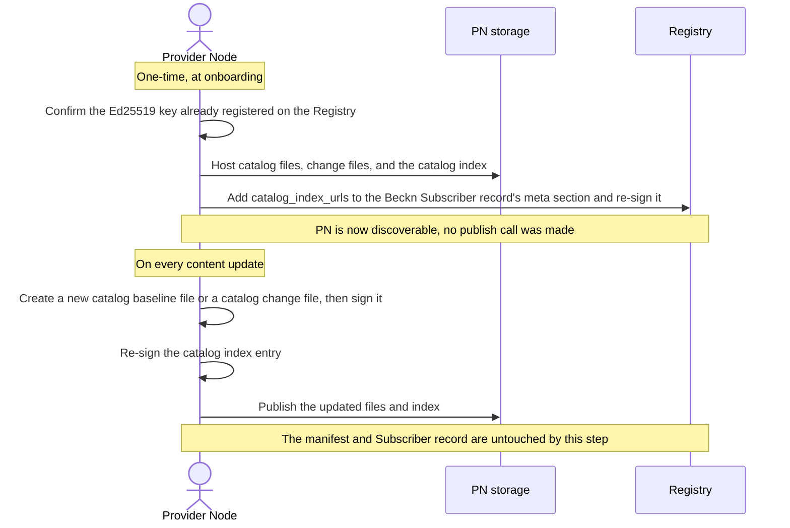
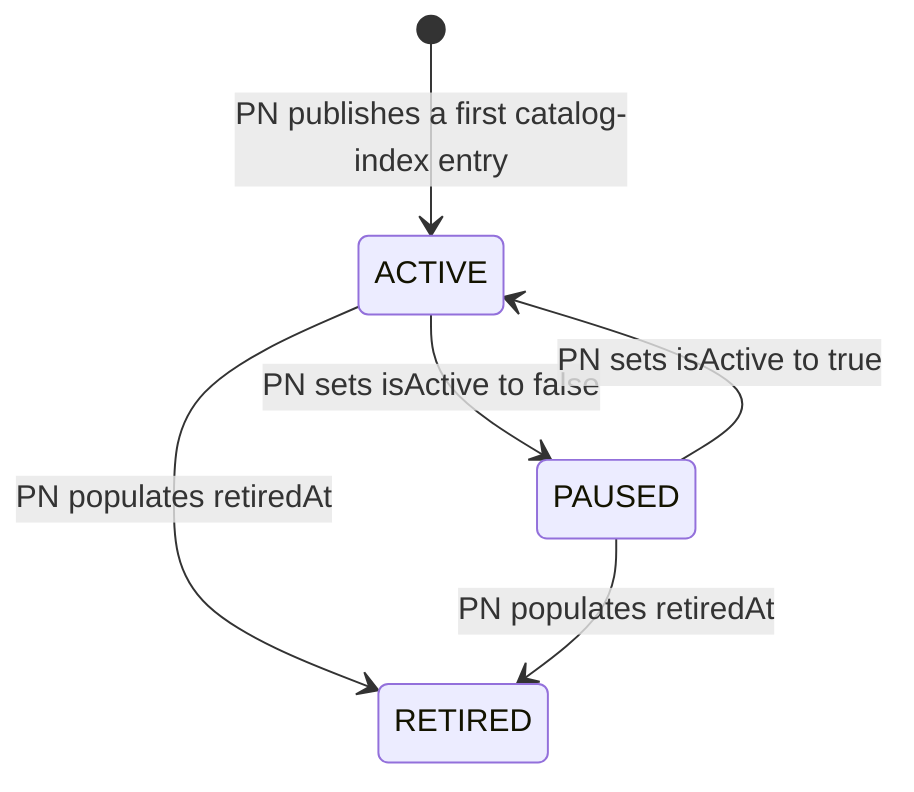

# Decentralized Catalog Publishing and Discovery

## Document Details
- **ID:** NFH-014
- **Publication Status:** Draft
- **Authors:**
  - Mayuresh Nirhali and Beckn Architecture Working Group
- **Created:** 2026-08-05
- **Updated:** 2026-08-07
- **Version history:** Initial version (2026-08-05): Initial publication.
- **Latest editor's draft:** Click [here](https://github.com/beckn/protocol-specifications-v2/blob/decentralised-catalog/docs/Catalog_Publishing_and_Discovery.md).
- **Implementation report:** Not available. This document is at Initial Draft status; report will be linked in the next formal release of this RFC, following merge to main.
- **Stress test report:** Untested: no reference implementation has been exercised against this specification yet. Reference crawling tools and publisher tools are tracked as implementation deliverables, not yet built against this draft.
- **Conformance impact:** Implementers operating a Provider Node (PN) MUST self-host and self-sign catalog data; implementers operating a Discovery Service (DS) MUST crawl and verify Registry-anchored catalog files to build their own index.
- **Security/privacy implications:** Introduces two new signature scopes (per-catalog-file self-signature, per-catalog-index-entry self-signature); see §Security Considerations and §Privacy Considerations.
- **Replaces / Relates to:** Relates to [NFH-003](./The_Beckn_Protocol_Stack.md) (The Beckn Protocol Stack) for network topology and actor definitions; [NFH-006](./API.md) (Beckn API Endpoints), [NFH-007](./Authentication_and_Trust.md) (Authentication and Trust), [NFH-012](./Schema_Design_Guide.md) (Schema Design Guide). Establishes decentralized catalog publishing and discovery as a capability of the beckn enabled network; does not replace any existing RFC in full.
- **Feedback:**
  - Issues: Click [here](#) (link to be added once a tracking issue exists)
  - Discussions: Click [here](#) (link to be added; MUST include an NFH Fabric Support Forum thread before this leaves Draft status)
  - Pull Requests: Click [here](#) (link to be added once a branch/PR exists)
- **Errata:** To be published.

## Abstract

This RFC specifies decentralized catalog publishing and discovery on the beckn enabled network. A Provider Node (PN) self-hosts signed catalog files and a signed catalog index on infrastructure it controls, and points to that index via `catalog_index_urls` in its Beckn Subscriber Registry record's `meta` section. A Discovery Service (DS) resolves that pointer, crawls and independently verifies every file, and builds its own index. Catalog access is uniformly public — any party with a file's URL can fetch it — and a network operator's membership registry, not this RFC's mechanism, governs which catalogs a network-scoped DS trusts. This RFC does NOT address restricted or access-gated catalogs (CON-TBD-16), a specific crawler implementation, or changes to `/discover`/`/on_discover`; it also does not remove or migrate `beckn.yaml`'s existing Cataloging Service endpoints, only marks them deprecated (§End-to-End Flow). The companion `schemas` repository PR for this RFC's new named terms has not yet been opened (§Schema Changes, "Cross-artifact alignment"). See [NFH-003](./The_Beckn_Protocol_Stack.md) for network topology and actor definitions.

## Table of Contents

- [Decentralized Catalog Publishing and Discovery](#decentralized-catalog-publishing-and-discovery)
  - [Document Details](#document-details)
  - [Abstract](#abstract)
  - [Table of Contents](#table-of-contents)
  - [Introduction](#introduction)
  - [Specification](#specification)
    - [Definitions](#definitions)
    - [Motivation](#motivation)
    - [Requirements](#requirements)
    - [Roles and Actors](#roles-and-actors)
    - [Publishing Artifacts and Layering](#publishing-artifacts-and-layering)
    - [Protocol Flows](#protocol-flows)
      - [10.1 Onboarding and steady-state publish](#101-onboarding-and-steady-state-publish)
      - [10.2 Discovery crawl](#102-discovery-crawl)
      - [10.3 Master/Regular catalog resolution](#103-masterregular-catalog-resolution)
      - [10.4 Catalog entry lifecycle](#104-catalog-entry-lifecycle)
      - [10.5 Error flows](#105-error-flows)
      - [10.6 Async trigger conditions](#106-async-trigger-conditions)
      - [10.7 AI Agent exercisability](#107-ai-agent-exercisability)
    - [Versioning](#versioning)
    - [Schema Changes](#schema-changes)
    - [Security Considerations](#security-considerations)
    - [Privacy Considerations](#privacy-considerations)
    - [End-to-End Flow (Informative)](#end-to-end-flow-informative)
    - [Conformance Requirements](#conformance-requirements)
    - [Security and Interoperability Considerations](#security-and-interoperability-considerations)
    - [Prior Art](#prior-art)
  - [Conclusion](#conclusion)
    - [Open Questions](#open-questions)
  - [Acknowledgements](#acknowledgements)
  - [References](#references)
  - [Appendix A — Worked Examples (Informative)](#appendix-a--worked-examples-informative)
  - [Appendix B — Pre-Submission Checklist](#appendix-b--pre-submission-checklist)
  - [Appendix C — Version History](#appendix-c--version-history)

## Introduction

**Start with [NFH-003](./The_Beckn_Protocol_Stack.md) if you would like to understand the overall publishing flow.** That RFC defines the actors (CN, PN, DS, Registry), the two-band architecture, and how they connect at the stack level. This RFC assumes that context and specifies only the catalog-publishing and catalog-discovery mechanism within it.

Concretely:

- A PN hosts its own catalog data as self-signed files, on infrastructure it already controls (a website, a CDN, an object store), discoverable through its existing identity on the beckn enabled network.
- A DS finds and verifies that data by crawling, using the same Registry identity layer already used across the beckn enabled network, and builds its own index from what it verifies.
- No shared, centrally-operated service sits in either path.

The working group should engage with this RFC because it defines where trust is anchored for the entire discovery phase of the protocol: in the PN's own signature over its own content, verified independently by every DS, rather than in a single intermediary every participant must trust.

## Specification

The key words "MUST", "MUST NOT", "REQUIRED", "SHALL", "SHALL NOT", "SHOULD", "SHOULD NOT", "RECOMMENDED", "MAY", and "OPTIONAL" in this document are to be interpreted as described [here](./Keyword_Definitions.md).

### Definitions

Actor definitions and network topology are in [NFH-003](./The_Beckn_Protocol_Stack.md); this section defines only what this RFC adds or repurposes.

- **PN, DS:** as defined in NFH-003. Under this RFC, a PN's Registry-anchored identity is also its publisher identity for catalog data; a DS also crawls PN-hosted catalog data to populate its own index.
- **Node:** any network participant with a Registry entry — its own Registry manifest and Beckn Subscriber record. Not PN-specific: a CN, DS, or NFO is equally a node. This RFC's flows concern a PN's node specifically, which may be the PN's own domain or a subdomain a platform assigns to a provider it onboards (see §Publishing Artifacts and Layering).
- **Catalog file:** a self-signed file, conforming to the new `CatalogFile` schema, hosted by a PN at a URL of its own choosing, wrapping exactly one instance of the existing `Catalog` schema — the schema's shape is unmodified by this RFC, not its content, which changes and versions normally.
- **Change file:** a self-signed file, conforming to the new `CatalogChangeFile` schema, hosted by a PN at a URL of its own choosing, carrying an incremental delta (added/updated/removed resources or offers) between two versions of one catalog.
- **Catalog index:** a self-signing, per-catalog-entry file, hosted by a PN, listing every catalog it offers under that index together with references to that catalog's current baseline and change files. Not a Registry file; the Registry does not ingest it. A node may host more than one catalog index.
- **Registry manifest:** the existing directory-protocol artifact at `/.well-known/dedi.json` on a node's domain, unmodified by this RFC.
- **Beckn Subscriber record:** the existing Registry record carrying a node's `subscriber_id`, `url`, `type`, `domain`, and signing key(s). Unmodified by this RFC; `catalog_index_urls` lives in a proposed generic `meta` object alongside it, not on the schema itself (§Schema Changes).
- **Membership registry:** an NFO's existing registry, used unmodified by this RFC to express which nodes a network-scoped DS trusts.
- **Compaction:** the act of a PN folding an accumulated chain of change files into a fresh baseline, published alongside — not in place of — the change files that led up to it, which stay listed for a grace period so a DS mid-lineage can still reach the new baseline by applying diffs (§10.1).
- **Normative:** requirements that define conformance and interoperability behavior.
- **Informative:** explanatory guidance that does not by itself define conformance.

### Motivation

**Current State.** `beckn.yaml`'s Fabric API - Cataloging Service group (`/catalog/publish`, `/catalog/subscribe`, `/catalog/pull`, `/catalog/push`, `/catalog/search`, and their callbacks) is today's catalog-publishing mechanism: a PN submits its catalog to a centrally-operated Cataloging Service (CS), which validates, indexes, and relays it to subscribing DSes.

**Identified Problems.** (1) A DS trusts the CS's relayed copy of a catalog, not a PN-signed one — it has no independent way to verify the content matches what the PN actually submitted (§Security Considerations resolves this for the new model; it remains an open question for the CS path, per [NFH-007](./Authentication_and_Trust.md)). (2) Every PN and every DS depends on one shared, centrally-operated service being available and correctly run; the CS is a single point of failure and a single operational bottleneck for the entire discovery phase. (3) A PN has no sovereignty over how or where its own catalog data is hosted, verified, or served — publishing requires calling a service it doesn't control.

**Why the Current Design Cannot Be Extended.** Adding self-signing to catalogs relayed through the CS would not remove the CS from the trust or availability path — a DS would still be verifying the CS's relay, not the PN's origin, unless the CS is bypassed entirely. The problems above are structural to routing catalog data through a shared intermediary, not fixable by hardening that intermediary; only removing it from the path (self-hosting and direct DS verification) addresses R1–R5 below.

### Requirements

- **R1.** A PN MUST have full sovereignty and governance control over the catalog it manages, and MUST be able to make it discoverable without calling any beckn API.
- **R2.** A DS MUST be able to independently verify that a catalog's content originated from the PN that claims to publish it, and MUST be able to discover which catalogs a PN offers and detect changes to them, without relying on transport-level trust in any intermediary.
- **R3.** A PN and DS MUST reuse their existing network identity (their Registry-anchored keys) rather than introduce a second identity or key-management scheme for catalog data specifically.
- **R4.** The mechanism MUST support incremental updates to a catalog without requiring a full re-publish of unchanged content.
- **R5.** A DS MUST be able to distinguish "no longer offered" from "host unreachable" using a positive, verifiable signal — never by inferring meaning from an entry's absence.

### Roles and Actors

Full actor and topology definitions are in [NFH-003](./The_Beckn_Protocol_Stack.md). This RFC's flows involve:

| Actor | Protocol Identity | Role in this RFC's Flows | Endpoints Invoked | Endpoints Implemented |
|---|---|---|---|---|
| PN | Registry-anchored domain identity (unchanged) | Self-hosts and self-signs its own catalog files, change files, and catalog index(es); adds `catalog_index_urls` to its Beckn Subscriber Registry record's `meta` section | None new — HTTP GET against its own storage is not a protocol-defined invocation | None new — hosts static files; no server required |
| DS | Registry-anchored domain identity (unchanged) | Resolves PNs' Registry manifests and Beckn Subscriber records; crawls, verifies, and indexes catalog files; serves `/discover` from its own index | Conditional HTTP `GET` against PN-hosted Registry and catalog files; existing Registry lookup for keys | `/discover`, `/on_discover` (unchanged from `beckn.yaml`) |
| CN | Registry-anchored domain identity (unchanged) | Unaffected — calls `/discover` exactly as today | `/discover` | `/on_discover` |
| NFO | Registry-anchored domain identity (unchanged) | Publishes and maintains the membership registry a DS uses for network-scoped trust; see below | None new | None new |

**Membership governs trust, not access.**
- A network is real, under this RFC, only when its NFO has published a membership registry.
- A node's presence in that registry is binary: either a reference record exists for it, or it doesn't.
- A PN either belongs to one or more networks or operates independently of any network. An independent PN — one whose catalogs carry no `networkIds` — never touches a membership registry: it registers on the Registry layer like any node and is discoverable to every DS. This is the default case, not a special one.

### Publishing Artifacts and Layering

A **PN** node's publishing surface is four kinds of file across two layers:

1. The **Registry manifest**, at the fixed, well-known path `/.well-known/dedi.json`, written once at onboarding. Lists the Beckn Subscriber record among the node's Registry files.
2. The **Beckn Subscriber record**, conforming to the existing, unmodified `Beckn_subscriber` schema. `catalog_index_urls` lives in the record's `meta` section (§Schema Changes), not on the schema. Changes only when an index URL is added, removed, or moved, or when identity details change for reasons unrelated to catalogs.
3. One or more **catalog indexes** — plain, self-signing files, updated on every publish. Not a Registry file.
4. **Catalog files and change files** — the actual content, each self-signed (§Schema Changes). Not Registry files.

Files 1–2 are the Registry layer: they follow the Registry's published record format exactly and change rarely. Files 3–4 are the catalog layer: neither is a Registry file, and this is where all publish-time churn lives.

**Indexes belong to the node, never to an individual provider inside it.** A catalog index can be hosted by different kinds of node, without introducing a fifth artifact:

- **An independent PN** hosting its own catalog index for its own catalogs — its own manifest, Subscriber record, and index(es); nothing aggregates it.
- **A platform PN** onboarding many providers as **one node**: it keeps many catalog-index *entries*, one per provider's catalog, not necessarily many separate indexes — even though `catalog_index_urls` is itself an array. Each catalog inside names its own provider — the `Catalog` schema already carries a `provider` object for this — and the platform signs every file with its own key. This is today's provider-platform relationship, expressed as files instead of API calls.
- **A provider run as a subdomain node** (e.g. `provider-x.platform.com`) hosting its own manifest, Subscriber record, index(es), and keys; one host's storage can serve many such small nodes side by side.

A PN MUST NOT maintain a separate, per-provider catalog index inside a platform node; a catalog's own `provider` field, not a separate index, is what distinguishes providers sharing one node.

### Protocol Flows

#### 10.1 Onboarding and steady-state publish

A PN's one-time onboarding and every subsequent publish follow the same shape; only the frequency differs.



**PN specification.**
- MUST sign every catalog file and every change file it publishes (§Schema Changes, `CatalogFile`/`CatalogChangeFile`).
- MUST NOT publish a catalog-index entry whose `entryVersion`, `baseline.version`, or any `changes[]` entry's `toVersion`, regresses relative to the entry it most recently published for that `catalogId`.
- **Canonical serialization and immutable URLs:** MUST serialize a catalog file with a stable key order and formatting on every publish, so a digest changes only when content changes. For `baseline` and every `changes[]` entry specifically, MUST publish a new version at a new, immutable URL; MUST NOT overwrite a previously-published version in place. (`latest`, below, is a deliberate, narrowly-scoped exception to this rule — not a relaxation of it.)
- **Key rotation:** MUST NOT remove a signing key from its manifest's `keys[]` while any currently-listed catalog-index entry, baseline, or change file it has published is signed with that key — except when retiring that key specifically because it was compromised. Ordinary rotation requires no eager re-signing: a PN adds its new key to `keys[]`, starts signing new content with it, and lets old, still-current content age out naturally through ordinary publishing or compaction before removing the old key. Compromise-driven revocation is different: content signed by a key being revoked for compromise MUST be re-signed with a new key or accepted as unverifiable (§10.5).
- **Compression:** MAY serve any `CatalogFile`/`CatalogChangeFile` gzip-compressed, signaled purely by the file's URL extension (`.json.gz` for compressed, `.json` for plain).
- **Compaction:** MAY compact when a catalog's change-file chain exceeds a threshold it chooses. Trigger — MAY be any of:
  - change-file count
  - combined change-file size relative to baseline
  - a fixed schedule

  Type — MAY be either of:
  - **Baseline compaction:** emit a fresh baseline at a new URL and point the index at it.
  - **Change-file compaction:** squash several small change files into one spanning the same version range, without touching the baseline.

  On compacting the baseline, MUST retain and continue to list, not merely host, the superseded change files for at least one full `next_update` cycle after the compaction — i.e., until the `next_update` timestamp in effect at the time of compaction has passed; MAY retain them longer, MUST NOT retain them for less.
- **Full-file consumption:** MAY publish and maintain a `latest` entry (§Schema Changes) — a full `CatalogFile` at a stable URL, overwritten in place on every update, explicitly exempt from the immutable-URL rule above — for consumers who want fully-current content without ever applying `changes[]`. If published, MUST keep the index's declared `latest.digest` in sync with what's actually at `latest.url`. On retiring a catalog for which `latest` was published, MUST make one final write to that same URL populating `CatalogFile.retiredAt`, and SHOULD continue serving that tombstoned file at the stable URL rather than taking it down — a consumer that only ever fetches `latest` directly, without revisiting the index, otherwise has no way to learn the catalog is gone.

**DS specification.**
- MUST decompress a `.json.gz` file before parsing it, and MUST compute or verify its digest and signature against the canonical, decompressed content — never the compressed bytes.
- **Cutover rule:** if the combined `size` of a catalog's pending change files exceeds a threshold fraction of its baseline `size`, SHOULD fetch the baseline instead of the accumulated changes. Crawl logic needs no special handling for compaction specifically — it always resolves to this same rule, regardless of why or when a PN compacted; the retention obligation above is entirely on the publish side. A consumer that skips `changes[]` application entirely and only ever reads `baseline` will lag behind the catalog's true current version between compactions — see Full-file consumption below, and `latest` in §Schema Changes, for the alternative that avoids this.
- **Full-file consumption (informative):** any consumer — an incremental DS choosing to skip the complexity, or a standalone tool (a QA/moderation crawler, say) that never implements `changes[]` application at all — MAY fetch and verify `latest`, or `baseline` if a PN doesn't publish one, directly, and MAY use `crawlHint` to decide how often to re-fetch it. No separate mode, flag, or schema is involved: this is the same published index entry and the same `CatalogFile` verification already defined, just read partially. MUST treat a directly-fetched `latest` carrying `retiredAt` exactly as it would the index entry's own `retiredAt` (§10.4) — no longer offered, not to be served.
- **`latest` does not remove the index from the loop:** a full-file consumer MUST still periodically re-fetch the index — at least as often as `crawlHint`/`next_update` suggests — to obtain `latest.url` in the first place and its current `latest.digest` to verify against. `latest` removes the need to apply `changes[]`; it does not make the index optional.

**Rationale.**
- *Compression:* gzip output isn't guaranteed byte-stable across tool versions for identical input, so signing the compressed form would make a legitimate re-publish indistinguishable from tampering — hence decompress-then-verify, always. The index entry's `size` reflects the file's actually-served size (compressed, when `.json.gz` is used), since that's what the cutover rule and egress budgeting actually care about.
- *Key rotation vs. revocation:* treating every rotation as if it were a compromise would force a PN to re-sign its entire historical catalog surface before ever retiring a key — an unreasonable operational burden most PNs would fail to meet correctly. Separating "routine" from "compromised" lets an old key stay verifiable for exactly as long as anything still depends on it, without weakening the response to an actual compromise, which still requires the same hard cutover any signature-based trust model needs.
- *Compaction trigger choice:* entirely the PN's own operational choice with no interoperability impact. A size-based trigger pairs naturally with the cutover rule's own threshold, keeping a PN's storage and index proportionate to what a DS would prefer anyway.
- *Why `latest` is a deliberate, narrow exception to immutability, not a weakening of it:* `baseline`/`changes[]` stay strictly immutable because incremental, cursor-tracking DSes depend on that for caching and version-diffing correctness. `latest` serves a different audience that doesn't care about lineage at all, only current content — for that audience, a stable, overwritten URL is strictly more useful than an ever-changing set of immutable ones. The one cost is that a fetch landing mid-overwrite can see a digest mismatch against what the index just declared; this is treated exactly like any other digest mismatch (§10.5) — MUST NOT be indexed — except a consumer MAY treat it as a transient, self-correcting publish race and simply retry, rather than as evidence of tampering, since `latest` is expected to change underfoot in a way `baseline`/`changes[]` never should. `latest` is why a full-file consumer skips implementing `changes[]` application — it is not why such a consumer would ever stop revisiting the index: locating `latest.url` and verifying against a current `latest.digest` both still come from there.
- *Why the compaction grace period is anchored to `next_update` specifically:* a DS that re-crawls at least as often as `next_update` requires is guaranteed to observe a compaction while the superseded chain is still listed, and can complete its transition via the cutover rule without ever being stranded — it keeps applying "changes after my cursor" in sequence, arriving at content identical to the new baseline without ever fetching the baseline snapshot. This replaces a vaguer "cover your slowest crawler" judgment call with a concrete minimum tied to a value the PN already publishes for exactly this kind of freshness promise. `changes[]` is consequently longer for a while after a compaction than under a hard reset, shrinking back once the cycle elapses — some of compaction's index-payload benefit is deferred, not eliminated.

#### 10.2 Discovery crawl


- A DS MUST perform every verification step shown above before indexing any catalog content.
- A DS MUST NOT index a catalog file or catalog-index entry that fails any verification step.
- A DS SHOULD use conditional HTTP requests (`ETag`/`If-Modified-Since`) to avoid re-fetching unchanged artifacts.

**Enumerating PNs (informative) — two conformant shapes:**
- Direct Registry enumeration: a DS enumerates candidate domains and reads each one's manifest itself.
- A separate registry service that caches Registry records with a reverse lookup, answering "which index URIs are relevant to me" in one call.
- Both are conformant — neither changes what gets verified or how; a registry service is never treated as an authority, since every file a DS ingests is still verified at its own source. Which shape a DS chooses is a deployment decision, not a protocol requirement.

#### 10.3 Master/Regular catalog resolution

A REGULAR catalog's index entry carries `dependencies.masters` (§Schema Changes) pointing at the MASTER catalog(s) its resources extend:

```json
"dependencies": {
  "masters": [
    { "catalogId": "open-economy.nfh.global/electronics-master", "version": 12, "indexUrl": "https://cdn.open-economy.nfh.global/beckn/catalog-index.json" }
  ]
}
```

**PN specification.**
- MUST keep `dependencies.masters[]` current with what its resources actually extend via `resourceDirectives[].extends.masterResourceId`, including `version`, updated to the MASTER's `baseline.version` last validated against whenever that changes.

**DS specification.**
- MUST inherit attributes from a REGULAR resource's declared MASTER resource, with the REGULAR resource's own fields taking precedence, using the same merge semantics `publishDirectives` already defines.
- MAY use a catalog-index entry's `catalogType` to order its crawl — indexing MASTER catalogs before resolving REGULAR catalogs that reference them — without fetching every file first.
- MAY use `dependencies.masters[].catalogId` to check whether a MASTER dependency is already crawled and indexed, `.version` to notice the MASTER has since moved past what this REGULAR catalog was validated against (an informational hint, not a hard version pin — §10.3's inheritance rule always merges against whatever the MASTER's current content actually is), and `.indexUrl` as a shortcut to the index that should contain it.
- MUST verify whatever it fetches via `indexUrl` exactly as it would via ordinary discovery, and MUST fall back to standard Registry resolution (§10.2) if the hint is stale, unreachable, or fails verification — `indexUrl` is not itself signed.
- What a DS should do when a declared dependency has not yet been crawled (fetch out of order, index partially, or wait) remains an open question.
- `Resource.id` and `Offer.id` are globally unique in `beckn.yaml`, not catalog-scoped — the same id can legitimately be published from two independently-signed catalogs, whether or not one `extends` the other; each catalog's `resources`/`offers` are part of that catalog's own signed content and lifecycle, with no structural link between two catalogs that happen to list the same id outside the explicit Master/Regular relationship. A DS that deduplicates records by `id` across catalogs (e.g., to avoid showing a consumer the same product twice) MUST reference-count: a deduplicated record MUST remain in the DS's index as long as any catalog the DS treats as ACTIVE or PAUSED (§10.4) still contains that id, and MUST be removed only once every catalog referencing it has been retired.

**Rationale.**
- *Why `dependencies` exists at all:* `catalogType` alone tells a DS *that* a REGULAR catalog extends something, not *which* MASTER catalog(s) or where to find them — previously that required fetching the file, inspecting every `extends.masterResourceId` individually, and, if the MASTER belonged to a different PN, resolving that PN's manifest and Subscriber record from scratch just to locate its index. `dependencies.masters` answers both questions from the index alone.
- *Why `indexUrl` is a hint, not a trust delegation:* a malicious REGULAR-catalog publisher could otherwise point it at a dead, wrong, or attacker-controlled URL; treating it as an unauthenticated locator caps the damage at a wasted fetch, never a false trust (§Security Considerations item 3).
- *Why reference-counting, not simple deletion:* retiring, pausing, or removing one catalog has no effect on any other catalog's own independently-signed listing of the same id — a DS that deletes a shared resource the moment any one referencing catalog disappears would wrongly stop showing something still legitimately offered elsewhere.

#### 10.4 Catalog entry lifecycle

A catalog-index entry existing at all is a precondition for having a lifecycle state, not itself a state. The complete lifecycle is the three states below, each verified by something a DS can positively observe on a fetched, signed entry — never by something's absence.



**PN specification.**
- `isActive` (mirrored from the untouched `catalog.isActive`, §Schema Changes) MAY be toggled in either direction at any time — just another entry edit: `entryVersion` bumps, `baseline`/`changes[]` are untouched.
- MUST populate an entry's `retiredAt` before it stops publishing updates for that catalog. Retirement is one-way: MUST NOT unset `retiredAt` once populated.
- `baseline`/`changes[]` are dropped from the entry once `retiredAt` is set, since there is nothing left to fetch.
- If `latest` was published for the catalog, MUST make one final write to that stable URL populating `CatalogFile.retiredAt` (§Schema Changes), and SHOULD continue serving it there rather than taking it down — this is the only way a consumer that fetches `latest` directly, without revisiting the index, learns the catalog is retired.
- MAY eventually drop a long-retired entry from the index entirely, as its own storage hygiene.

**DS specification.**
- MUST NOT delete or stop tracking a catalog's previously-indexed content solely because `isActive` becomes `false` — a paused catalog stays fully indexed, just excluded from whatever the DS treats as currently-transactable.
- MUST treat a catalog-index entry carrying `retiredAt` as no longer offered and MUST NOT continue serving previously-indexed content for it via `/on_discover`. This is the only condition under which a DS retires a catalog from its own index. The same applies to a directly-fetched `latest` carrying its own `CatalogFile.retiredAt` (§10.1) — a positive signal, verified exactly the same way, regardless of which path found it.
- MUST NOT treat an entry's disappearance, by itself, as meaningful. If a previously-indexed `catalogId` is missing from a later, successfully-fetched, validly-signed index, and no `retiredAt` was observed beforehand, MUST treat this as a possible incomplete crawl (§10.5) — log it, re-verify next cycle — and MUST NOT delete the catalog's previously-indexed content on that basis alone.
- SHOULD, for the duration of that uncertainty, stop surfacing the catalog via `/on_discover` — not deleting it, just not serving it — until it is either re-confirmed present on a later crawl or a `retiredAt` marker is observed.
- Is never required to observe or rely on a PN eventually dropping a long-retired entry; the tombstone, while the entry is still served, is what a DS acts on.

**Rationale.**
- *Why "listed" isn't modeled as a state:* a DS cannot reliably verify absence — a partial crawl, one failed fetch among several `catalog_index_urls`, or a truncated response all look identical to a real removal from the outside. Building the lifecycle only out of things a DS can positively observe (an `isActive` flag, a `retiredAt` marker) avoids ever needing to trust a negative.
- *Why `isActive=false` means keep, not delete:* it's a reversible business decision, not an existence question. Deleting on every pause would force a full baseline re-fetch the moment a PN reactivates a seasonal catalog — exactly the cost incremental crawling exists to avoid.
- *Why "don't show, don't discard" for unconfirmed absence:* it keeps a DS's results trustworthy — never showing something it can't currently vouch for — without paying the cost of premature deletion if the absence turns out to have been a partial crawl rather than a real removal.
- *Why `latest` alone carries its own `retiredAt`:* the same "never trust a negative" principle applies to the direct-fetch path, not just the index-based one. `baseline`/`changes[]` are immutable, versioned snapshots nobody expects to reflect later events, so they need no tombstone of their own. `latest` is the one file a consumer might cache and keep re-fetching directly, indefinitely, without ever revisiting the index — if a PN simply stopped updating or deleted it on retirement, that consumer would face exactly the absence-vs-unreachable ambiguity R5 exists to prevent, just one layer lower than the index.

#### 10.5 Error flows

| Trigger | Detected By | Response Schema / Signal | Caller MUST |
|---|---|---|---|
| Catalog file digest does not match the index entry's declared digest | DS, during fetch | No response schema (internal crawl failure) | MUST discard the fetched content; MUST NOT index it; MUST log the failure to a feedback log the PN can read (mechanism deferred — see Open Questions) |
| Catalog file's own embedded signature fails verification | DS, during fetch | Same as above | MUST discard; MUST NOT index; MUST log |
| Catalog-index entry signature fails verification | DS, during index fetch | Same as above | MUST discard the entry; MUST NOT index any of its files; MUST log |
| `entryVersion` or content-lineage version regresses relative to stored cursor | DS, comparing fetched entry to cursor | Same as above | MUST flag as a possible rollback/tamper condition; MUST NOT apply the regressed content |
| Mismatch between a catalog file's own internal `catalogId`/`version` and the index entry's declared `catalogId`/`version` | DS, after fetching the file | Same as above | MUST treat exactly as a digest mismatch — discard, don't index, log; MUST NOT attempt to reconcile by preferring either side |
| Registry manifest or Subscriber record signing key not present in the manifest's current `keys[]` | DS, during manifest/record verification | Registry's own verification failure (out of this RFC's scope) | MUST treat everything signed with that key as unverifiable; MUST NOT index |
| `catalogId` domain prefix does not match the crawled node's own domain | DS, during entry verification | No response schema | Behavior open — see Open Questions ("id-collision enforcement") |
| A previously-indexed `catalogId` is absent from a successfully-fetched, validly-signed index, with no `retiredAt` ever observed on it | DS, comparing fetched index to its own prior state | No response schema | MUST treat as a possible incomplete crawl, not a removal; MUST log; MUST NOT delete the catalog's previously-indexed content; MUST re-verify on its next crawl cycle |
| `latest`'s fetched content does not match the index entry's declared `latest.digest` | Consumer, during fetch | Same as the general digest-mismatch row | MUST NOT index the mismatched content; MAY treat this specific case as a transient publish race rather than tampering, and retry by re-fetching the index and `latest` again — unlike a mismatch on `baseline`/`changes[]`, which are never expected to change underfoot |

#### 10.6 Async trigger conditions

The crawl in §10.2 is DS-initiated and pull-only; there is no PN-initiated delivery in this RFC's core mechanism.

**PN specification.** MAY additionally operate an out-of-band change-signal mechanism to invite a DS to crawl sooner than its own schedule. The design, ownership, and pricing of any such signal mechanism is out of scope (see Open Questions).

**DS specification.** A DS receiving such a signal MUST still perform the full verification in §10.2 before trusting anything — an unsolicited signal MUST NOT be treated as verified content.

#### 10.7 AI Agent exercisability

Every flow in this section is exercisable by an AI Agent without human input:
- Publishing (§10.1) is a deterministic file-generation and signing pipeline.
- Crawling and verification (§10.2) is a deterministic fetch-verify-index loop with no decision point requiring human judgment.
- Removal from the index (§10.4) is simply the absence of an entry on a PN's next automated publish.

No flow in this RFC requires human-in-the-loop confirmation.

### Versioning

Three independent layers, each with its own scope, kept distinct because they answer different questions.

**Versioning model.**
- **No whole-index version field.** Whether a catalog index has changed at all is answered by ordinary conditional HTTP (`ETag`/`If-Modified-Since`, §10.2).
- **`entryVersion` — has anything changed.** Each catalog entry carries `entryVersion`, an integer a PN MUST bump on *any* change to the entry — content or metadata (`networkIds`, `schemaTypes`, `catalogType`, `dependencies`, `isActive`, `retiredAt` all live in the entry and can change independent of the underlying resources/offers). A DS's cheapest first check: unchanged since the last crawl means skip the entry entirely.
- **`baseline.version` / `changes[]` entries' `fromVersion`/`toVersion` — what's current.** A DS's per-catalog cursor for which change files it still needs; a change entry's own `fromVersion`/`toVersion` (mirroring `CatalogChangeFile`) let a DS confirm the chain is contiguous from the index alone, without fetching each file first. `entryVersion` MUST NOT be conflated with these: `entryVersion` bumps on every edit, but `baseline`/`changes[]` versions bump only when a corresponding file is actually published.
- **File-level versioning.** `CatalogFile` and `CatalogChangeFile` carry `catalogId`, a version marker, and `next_update` inside the file itself, not only in the index entry pointing at it — so a DS can fetch a file directly (a known URL, an out-of-band reference, a storage listing) and verify it entirely on its own.
- **Version numbers are monotonic integers, not timestamps.** Deliberate, not left open (see Rationale).

**Rules governing the relationship between file and index levels.**
- A file's own fields are covered by its own signature (signing input is the whole document minus `signature`) — no separate binding step is needed.
- A mismatch between an index entry's declared `catalogId`/version and a fetched file's own internal `catalogId`/version MUST be treated exactly like a digest mismatch: discard, don't index, log. Neither side is authoritative over the other.
- `next_update` inside a file and on the index it's listed from are not required to agree, and a DS MUST NOT treat a difference as an error — they are independent freshness leases for the two access paths (index-first vs. direct-file).
- `isActive` is not a version-lineage field: a PN MAY toggle it in either direction at will, requiring only an `entryVersion` bump. This is unlike `retiredAt`, which is one-way — different operations, not degrees of the same one.
- A PN MUST NOT unset `retiredAt` once populated, and MUST NOT re-list a `catalogId` that has been retired — a catalog offered again after retirement MUST be published under a new `catalogId`.

**Rationale.**
- *Why no whole-index version field:* a catalog index as a whole is not signed (only its entries are), so a plain, unsigned document-level counter would let a hostile host set it to anything regardless of what it actually served. Rollback detection belongs one layer down, where the signed data actually is.
- *Why `entryVersion` and `baseline`/`changes[]` versions are kept separate:* forcing a metadata-only edit to also bump `baseline.version` would send a DS looking for a file that doesn't exist, or introduce gaps that break the "fetch changes after my cursor" contiguity the incremental scheme depends on.
- *Why monotonic integers, not timestamps:* exactly one PN publishes any given catalog, making an integer counter trivially safe with no coordination or collision risk; a timestamp-as-version would duplicate what `next_update` already carries for staleness; and clock skew or a corrected system clock can make a legitimate republish look like a rollback under a timestamp scheme, which a counter cannot.
- *Why a retired `catalogId` can never be reused:* a DS MAY retain version-lineage state for a retired catalog indefinitely, so re-listing the same `catalogId` risks its version numbers looking like a rollback (§10.5) rather than a fresh start.

### Schema Changes

Three new artifacts. Each is broken down field by field: what it represents, who assigns it, and the specific concern each field solves.

#### `CatalogFile` (new)

Models a PN making one catalog's content independently verifiable at rest, whether reached via the index or fetched directly. The existing `Catalog` schema (already defined in `beckn.yaml`) cannot carry a signature itself: it has `additionalProperties: false`, leaving no room for a sibling `signature` field without either changing `Catalog` or wrapping it — `CatalogFile` is that wrapper.

| Field | Assigned by | Solves |
|---|---|---|
| `catalogId` | PN | Identifies which catalog this is, so a directly-fetched copy is self-describing, and so a DS can cross-check it against the index entry that pointed here. |
| `version` | PN | This file's position in the catalog's content lineage; matched against the index entry's `baseline.version`, and against `CatalogChangeFile.fromVersion`/`toVersion` when applying deltas. |
| `next_update` | PN | How long *this specific file's* freshness may be trusted when fetched directly — independent of the index's own `next_update`; see §Versioning. |
| `catalog` | PN | The actual content: an unmodified `Catalog` object, identical in shape to what `beckn.yaml` already defines. |
| `retiredAt` | PN | Optional; absent on an ordinary `baseline` or on `latest` while the catalog is active. Populated only as a PN's final write to `latest`'s stable URL when retiring a catalog it had published there — the one artifact a direct-fetch-only consumer might keep re-fetching without ever revisiting the index. Same one-way semantics as the index entry's `retiredAt` (§10.4); once a `CatalogFile` carries it, it MUST NOT be unset. |
| `signature` | PN | Detached signature (JCS canonicalization of the document minus this field, per RFC 8785) over every field above, keyed by the PN's Registry-registered key. |

- There is no separate activity field on `CatalogFile` itself. A direct fetch of `latest` can read `catalog.isActive` as current, since `latest` is overwritten in place on every update; a direct fetch of `baseline` reads only that version's activity at its own publish time, which can be stale — the index entry's own `isActive` mirror (§Schema Changes, Catalog Index) is the current, authoritative signal in either case.
- Whether the catalog has been retired (§10.4) is tracked one level up, on the index entry's `retiredAt`, not duplicated here — except for `latest`. `baseline`/`changes[]` are immutable, versioned snapshots that were never expected to reflect anything beyond their own publish-time state, so they carry no retirement signal; `latest` is the one mutable, stably-addressed file a consumer might cache and re-fetch directly without ever revisiting the index, so it alone carries a `retiredAt` field for that reason (§10.1, §10.4).
- The wrap does not reopen the existing `Catalog` schema for changes and does not weaken wire compliance: `Catalog`'s schema still governs the wire format (`/discover`/`/on_discover`), not this hosting file — a DS unwraps `.catalog` back to a bare object before anything reaches the wire. What a DS keeps internally in its own index is its own implementation choice; only wire output must conform.

#### `CatalogChangeFile` (new)

Models a PN publishing an incremental delta to a previously-published catalog, so a DS doesn't have to re-fetch the whole thing on every update.

| Field | Assigned by | Solves |
|---|---|---|
| `catalogId` | PN | Same purpose as in `CatalogFile` — which catalog this delta applies to. |
| `fromVersion` / `toVersion` | PN | The exact version range this delta covers; lets a DS confirm a chain of change files connects cleanly to its own stored cursor before applying any of them. |
| `next_update` | PN | Same freshness purpose as in `CatalogFile`. |
| `resources.upserts` | PN | Resources added or changed since `fromVersion` — complete, schema-valid `Resource` objects (existing schema, reused by reference); a DS replaces by id, never by position. |
| `resources.removals` | PN | Resource ids removed since `fromVersion` — ids only, no object needed. |
| `offers.upserts` / `offers.removals` | PN | Same two purposes, for `Offer`. |
| `catalog` | PN | Optional catalog-level attribute changes (name, validity window) that aren't resource- or offer-specific. |
| `signature` | PN | Same purpose as in `CatalogFile` — proves the delta itself, independent of the index. |

#### Catalog Index (new)

Models a PN declaring the complete, current set of catalogs it offers under one index, each independently verifiable. Not a Registry file; not part of `beckn.yaml`.

Top-level:

| Field | Assigned by | Solves |
|---|---|---|
| `nodeId` | PN | Whose index this is; a DS checks this matches the node it's crawling. |
| `next_update` | PN | How long the index as a whole may be trusted before re-fetching. |
| `catalogs` | PN | The entries themselves, one per catalog. |

Per catalog entry:

| Field | Assigned by | Solves |
|---|---|---|
| `catalogId` | PN | Which catalog this entry describes. |
| `entryVersion` | PN | Whether *anything* about this entry changed since the DS last looked — content or metadata — independent of whether a new file was published; the DS's cheapest first check (§Versioning). |
| `catalogType` | PN | `MASTER` or `REGULAR`; lets a DS order its crawl — indexing MASTER catalogs before resolving REGULAR ones that extend them — without fetching every file first (§10.3). |
| `dependencies.masters[]` (`catalogId`, `version`, `indexUrl`) | PN | Present on a REGULAR catalog entry: one entry per MASTER catalog any of its resources currently extend via `resourceDirectives[].extends.masterResourceId` (§10.3) — `catalogId` for a DS to check whether it's already crawled that MASTER, `version` as an unauthenticated hint of the MASTER's `baseline.version` this REGULAR catalog was last validated against (letting a DS notice the MASTER has since moved on, without fetching anything), `indexUrl` as an unauthenticated shortcut to the index likely to contain it. An array of `{catalogId, version, indexUrl}` objects, not parallel arrays, so the tuple can never drift out of sync; `dependencies` is an object wrapper so a future dependency kind can be added without a breaking schema change. |
| `networkIds` | PN | Which networks this catalog is relevant to — lets a network-scoped DS skip catalogs it doesn't need to bother indexing, without fetching them first. |
| `schemaTypes` | PN | Which domain schema(s) the catalog's content conforms to — the same filtering purpose as `networkIds`, for a DS that only cares about specific domains. |
| `isActive` | PN | Mirrors `catalog.isActive` (unchanged, pre-existing field) so a DS can pre-filter on activity from the index alone, without fetching the file. Freely reversible in either direction (§10.4, ACTIVE↔PAUSED); a change here bumps `entryVersion` like any other edit. Meaningless once `retiredAt` is set. |
| `baseline` (`version`, `url`, `size`, `digest`) | PN | Where to fetch the current full snapshot and how to verify it; present as long as the catalog is not retired. `url` MAY end in `.json.gz` for a gzip-compressed file (§10.1) — a DS decompresses before verifying `digest`. `size` reflects the file's actual served size (compressed, if `.json.gz`), which is what makes the cutover rule (§10.1) computable before downloading anything. |
| `changes[]` (`fromVersion`, `toVersion`, `url`, `size`, `digest`) | PN | Where to fetch each incremental delta since the baseline and how to verify each; a DS applies only the ones after its own stored cursor. `fromVersion`/`toVersion` mirror `CatalogChangeFile`'s own fields, letting a DS confirm the chain connects contiguously to its cursor from the index alone, before fetching anything. Same `.json`/`.json.gz` and compressed-`size` convention as `baseline`. Dropped once `retiredAt` is set. |
| `latest` (`version`, `url`, `size`, `digest`) | PN | Optional. A full, self-signed `CatalogFile` — same shape and verification as `baseline` — that a PN overwrites in place on every update, so a consumer can fetch and verify one URL for fully-current content without ever applying `changes[]`. Unlike `baseline`/`changes[]`, `latest.url` is explicitly exempt from the immutable-URL rule (CON-TBD-23); `version` always reflects whichever content-lineage version is currently published there. Dropped from *this entry* once `retiredAt` is set, same as `baseline` — but the underlying `CatalogFile` at that same stable URL persists as a tombstone (§10.4, §Schema Changes' `CatalogFile.retiredAt`), for a consumer that only ever fetches it directly. |
| `retiredAt` | PN | Absent for an ACTIVE or PAUSED catalog; once populated, it *is* the tombstone (§10.4) — a positive fact a DS verifies on the signed entry itself, never inferred from the entry's absence. One-way: never unset. `baseline`/`changes` are dropped once this is set. |
| `crawlHint` | PN | Optional suggested crawl frequency (comparable to a sitemap's `changefreq`); any consumer — an incremental DS or a full-file-only reader of `latest`/`baseline` — MAY honor it, but stays in control of its own schedule and budget regardless. |
| `signature` | PN | Detached signature over the entire entry minus itself, covering every field above together as one unit. |

- A catalog index MAY additionally carry a whole-index signature, for PNs who want membership and ordering within a served copy covered as well (§Security Considerations).
- An entry's `signature` MAY equally be encoded as a detached JWS (RFC 7515) instead of the `{keyId, value}` tuple shown in Appendix A — the encoding is a schema decision, not a semantic one.
- Signing keys MAY use either Ed25519 or ES256; ES256 matches the signing guidance already used across the beckn enabled network (OPA verifies it natively).
- **Open, per §Open Questions:** the canonical publication location for this schema.

#### `Beckn_subscriber` (unmodified) + `meta.catalog_index_urls` (new, on the Registry's own file format)

- `Beckn_subscriber.json` itself is untouched — no field is added to it.
- `catalog_index_urls` (an array of `{ url }` objects, assigned by the PN) lives in a generic `meta` object alongside the record, the same place the Registry's own API already carries free-form, schema-agnostic data on every registry and record (`api/openapi.yaml`, `meta: { type: object }`, unconstrained).
- The Registry's self-hosted publishing format (`dedi-file.schema.json`, from `nfh-trust-labs/DeDi` PR #2) does not yet have an equivalent: each record there is strictly `{ record_name, details }` with `additionalProperties: false`, no `meta` sibling. This RFC proposes closing that gap: adding the same `meta: object` field, already normative on the Registry's API side, to the self-hosted file schema's record object.
- Backward-compatible regardless: existing records with no `meta.catalog_index_urls` are unaffected; a DS that doesn't find it simply has no catalog index to crawl for that node.

**Cross-artifact alignment.** `catalog_index_urls`, `entryVersion`, and the Catalog Index's field names are new named terms with no existing `context.jsonld`/`vocab.jsonld` entries. A companion PR in the `schemas` repository is required before this RFC can leave Draft status; not yet opened.

### Security Considerations

This RFC's flows conform to [NFH-007](./Authentication_and_Trust.md)'s general model for the parts that don't change: Registry key resolution and revocation, and the `/discover`↔`/on_discover` exchange itself. Specific to this RFC:

1. **Two new signature scopes, protecting at two independent levels.**
   - Neither `CatalogFile`/`CatalogChangeFile` self-signing nor catalog-index entry self-signing are HTTP transport signatures — both are JCS-canonicalized, detached signatures over file content at rest, verified independent of any request.
   - **Protected:** file bytes; file authenticity independent of the index; the catalog entry as a whole, including `isActive`, `retiredAt`, `networkIds`, and `schemaTypes`, all inside one signed scope.
   - **Not protected** (catalog index as a whole is unsigned by default): absence — a stale or hostile host can still serve an old index that omits a newer catalog entry or change file; and cross-catalog ordering.
   - *Mitigation:* `next_update` forces refresh on a short cadence, monotonic version fields expose rollback to any DS with history, and the optional whole-index signature closes the remaining gap for PNs who want it. This residual risk is accepted on the basis that stale discovery data is caught again at transaction time, where the authoritative leg validates independently. It is also why §10.4 requires a DS to treat a catalog's disappearance, absent a prior `retiredAt`, as a possible incomplete crawl rather than a verified removal.
2. **Validation is independent per DS, not centrally enforced once.** A catalog's schema and signature validity are checked at crawl time, independently, by every DS that chooses to crawl a given PN — there is no single, shared verdict the way one centrally-operated validator would produce. This is an accepted property of the design, restated in §Security and Interoperability Considerations because it is protocol-wide.
3. **`dependencies.masters[].indexUrl` is an unauthenticated locator, not a trust delegation.** A malicious REGULAR-catalog publisher cannot forge a MASTER catalog's content this way (CON-TBD-31 requires the fetched entry's own signature to verify against its claimed `catalogId`'s Registry-anchored key), but could point the hint at a dead, wrong, or slow URL to waste a DS's crawl budget — a nuisance-level risk, not a trust break.
4. **Key rotation is safe without eager re-signing; key revocation is not.** CON-TBD-34 requires a PN to keep a rotated-out key listed in `keys[]` for as long as anything currently-listed still depends on it, so ordinary rotation never orphans previously-signed content. This does not weaken revocation: a key retired because it was compromised is removed regardless, and everything only it signed becomes unverifiable per the existing manifest-key error flow (§10.5) — the same outcome as if this RFC had never distinguished the two cases, just without paying that cost on every routine rotation too.

### Privacy Considerations

- No field introduced by this RFC carries new PII.
- `catalog_index_urls` is a set of URLs pointing to a node's own hosted infrastructure; `entryVersion`, `next_update`, `isActive`, `retiredAt`, `networkIds`, `schemaTypes`, `latest`, and the catalog-index/file signature fields carry no personal data.
- `Catalog.provider` (business/contact details) is unchanged and unaffected — its existing privacy posture is not altered by relocating where the surrounding `Catalog` object is hosted.

### End-to-End Flow (Informative)

A worked walkthrough, tying §10.1 through §10.4 together into one concrete scenario. This section is illustrative; the normative requirements live in the sections it references.

1. `open-economy.nfh.global` (a PN) authors a `Catalog` for its electronics line, wraps it in a `CatalogFile`, signs it, and hosts it at a URL on its own CDN (§10.1).
2. It writes a catalog index listing that catalog's entry — `catalogId`, `entryVersion`, `catalogType`, `baseline` — signs the entry, and hosts the index alongside the file.
3. It adds `catalog_index_urls`, pointing at that index, to its Beckn Subscriber record's `meta` section, and re-signs the record (§Publishing Artifacts and Layering). No call was made to any beckn-operated service at any point in these three steps.
4. `nfo-discovery.nfh.global` (a DS scoped to the `nfo.nfh.global` network) enumerates candidate PNs from the Registry, resolves `open-economy.nfh.global`'s Registry manifest and Beckn Subscriber record, and finds `meta.catalog_index_urls` (§10.2).
5. The DS fetches the catalog index, verifies the entry's signature, confirms `open-economy.nfh.global` has a reference record in `nfo.nfh.global`'s membership registry, fetches and verifies the `CatalogFile` itself, and indexes the resulting `Catalog` object.
6. A CN calls `POST /discover` against the DS exactly as it would today; the DS matches the intent against what it crawled and calls `POST /on_discover` on the CN's callback URI with the indexed `Catalog`. This leg, defined in `beckn.yaml`, is entirely unaffected by this RFC.
7. `open-economy.nfh.global` later updates one item's price: it edits the catalog file (or emits a `CatalogChangeFile`), re-signs it, bumps the index entry's `entryVersion` and its `baseline`/`changes[]` version, and re-signs the entry. On its next pass, the DS's conditional fetch of the index detects the change, re-verifies, and re-indexes — no notification was sent or required (§10.6).

Today's `beckn.yaml` catalog endpoints (`POST /catalog/publish`, `/catalog/subscription`, `/catalog/push`, `/catalog/pull`, `/catalog/search`, and their callbacks) keep their existing request/response schemas unchanged; this RFC introduces the flow alongside them and marks them `deprecated: true` in `beckn.yaml`, pointing at this RFC. No endpoint, schema, required field, or example is removed. Their actual retirement path — if and when they're removed — is scoped to a follow-up RFC.

### Conformance Requirements

Grouped by which actor each requirement falls on, so a PN implementer or a DS implementer can read only their own table. A handful apply jointly, or to neither actor specifically; those are listed last.

#### PN requirements

| ID | Requirement | Level |
|---|---|---|
| CON-TBD-01 | A PN MUST be able to make a catalog discoverable without calling any beckn-operated write API. | MUST |
| CON-TBD-02 | A PN MUST sign every `CatalogFile` and `CatalogChangeFile` it publishes, per the JCS-canonicalization convention in §Schema Changes. | MUST |
| CON-TBD-03 | A PN MUST NOT publish a catalog-index entry whose `entryVersion` regresses relative to the entry it most recently published for that `catalogId`. | MUST |
| CON-TBD-04 | A PN MUST NOT publish a catalog-index entry whose `baseline.version` or any `changes[]` entry's `toVersion` regresses relative to what it most recently published for that `catalogId`. | MUST |
| CON-TBD-05 | A PN MUST populate an entry's `retiredAt` before it stops publishing updates for that catalog, and MUST NOT unset it once populated. | MUST |
| CON-TBD-17 | Every `Resource`/`Offer` object inside a `CatalogChangeFile`'s `upserts[]` MUST be a complete, schema-valid object per the existing `Resource`/`Offer` schemas. | MUST |
| CON-TBD-20 | A PN MUST NOT maintain a separate, per-provider catalog index inside a platform node; provider distinction within one node MUST be expressed via each catalog's own `provider` field. | MUST NOT |
| CON-TBD-22 | A PN MUST serialize a catalog file with stable key order and formatting on every publish, so a digest changes only when content changes. | MUST |
| CON-TBD-23 | For `baseline` and every `changes[]` entry, a PN MUST publish a new version at a new, immutable URL and MUST NOT overwrite a previously-published version in place. (`latest` is explicitly exempt — see CON-TBD-36.) | MUST |
| CON-TBD-26 | A PN MUST NOT re-list a `catalogId` that it has previously retired; a catalog offered again after retirement MUST be published under a new `catalogId`. | MUST NOT |
| CON-TBD-30 | A PN MUST populate a REGULAR catalog-index entry's `dependencies.masters[]` with an entry for every MASTER `catalogId` any of its resources currently extend via `resourceDirectives[].extends.masterResourceId`, and MUST keep it current as those references change. | MUST |
| CON-TBD-32 | On compacting a catalog's baseline, a PN MUST retain and continue to list the superseded change files in its catalog index — not merely continue hosting them — for at least one full `next_update` cycle after the compaction, and MUST NOT retain them for less. | MUST |
| CON-TBD-34 | A PN MUST NOT remove a signing key from its manifest's `keys[]` while any currently-listed catalog-index entry, baseline, or change file it has published is signed with that key, unless that key is being retired because it was compromised. | MUST NOT |
| CON-TBD-36 | If a PN publishes a `latest` entry, it MUST keep the index's declared `latest.digest` in sync with what is actually being served at `latest.url`; `latest.url` is exempt from CON-TBD-23's immutability requirement. | MUST |
| CON-TBD-38 | On retiring a catalog for which it had published `latest`, a PN MUST make one final write to `latest.url` populating `CatalogFile.retiredAt`, and SHOULD continue serving that file at the same URL rather than taking it down. | MUST |

#### DS requirements

| ID | Requirement | Level |
|---|---|---|
| CON-TBD-06 | A DS MUST verify a fetched Registry manifest's signature against the Registry-registered key for the crawled domain before trusting anything it lists. | MUST |
| CON-TBD-07 | A DS MUST verify a fetched Beckn Subscriber record's digest against the value the manifest signs for it. | MUST |
| CON-TBD-08 | A DS MUST verify each catalog-index entry's self-signature before indexing any file it references. | MUST |
| CON-TBD-09 | A DS MUST verify each fetched `CatalogFile`/`CatalogChangeFile`'s own embedded signature, in addition to its digest, before indexing it. | MUST |
| CON-TBD-10 | A DS MUST NOT index a catalog file or catalog-index entry that fails any verification step in §10.2. | MUST NOT |
| CON-TBD-11 | A DS MUST treat a regression in `entryVersion` or in content-lineage version, relative to its own stored per-catalog cursor, as a possible rollback and MUST NOT apply the regressed content. | MUST |
| CON-TBD-12 | A DS MUST treat a mismatch between a catalog file's internal `catalogId`/`version` and its index entry's declared `catalogId`/`version` the same as a digest mismatch — discard, do not index. | MUST |
| CON-TBD-13 | A DS MUST treat a catalog-index entry carrying `retiredAt` as no longer offered and MUST NOT continue serving previously-indexed content for it via `/on_discover`. | MUST |
| CON-TBD-14 | A DS MUST inherit a REGULAR resource's attributes from its declared MASTER resource, with the REGULAR resource's own fields taking precedence, per §10.3. | MUST |
| CON-TBD-15 | A DS receiving an out-of-band change signal MUST still perform full verification per §10.2 before trusting any content; the signal itself MUST NOT be treated as verified. | MUST NOT |
| CON-TBD-18 | A DS SHOULD use conditional HTTP requests (`ETag`/`If-Modified-Since`) when re-fetching a previously-seen Registry manifest or catalog index. | SHOULD |
| CON-TBD-21 | A DS crawling on behalf of a specific network MUST check that a PN has a reference record in that network's membership registry before indexing the PN's catalogs under that network's banner. | MUST |
| CON-TBD-24 | A DS MUST NOT treat a difference between a catalog file's own `next_update` and its index entry's `next_update` as an error. | MUST NOT |
| CON-TBD-25 | A DS MUST NOT delete or stop tracking a catalog's previously-indexed content solely because its index entry's `isActive` becomes `false`; it MUST continue to be indexed, only excluded from what the DS treats as currently-transactable. | MUST NOT |
| CON-TBD-27 | A DS MUST NOT treat a previously-indexed `catalogId`'s absence from a successfully-fetched, validly-signed index as evidence of retirement unless it had previously observed a `retiredAt` marker on that entry; absent that, it MUST treat the disappearance as a possible incomplete crawl and MUST NOT delete the catalog's previously-indexed content on that basis alone. | MUST NOT |
| CON-TBD-28 | A DS that deduplicates `Resource`/`Offer` records by their globally-unique `id` across more than one catalog MUST NOT remove a deduplicated record from its own index while any catalog it treats as ACTIVE or PAUSED still references that `id`. | MUST NOT |
| CON-TBD-29 | A DS MUST decompress a `.json.gz`-suffixed `CatalogFile`/`CatalogChangeFile` before computing or verifying its digest or signature, and MUST NOT compute either against the compressed bytes. | MUST |
| CON-TBD-31 | A DS MUST NOT treat a `dependencies.masters[].indexUrl` as authenticated; it MUST verify anything fetched from it exactly as it would via ordinary discovery (§10.2), and MUST fall back to standard Registry resolution if the hint is stale, unreachable, or fails verification. | MUST NOT |
| CON-TBD-35 | A DS SHOULD stop serving a catalog via `/on_discover` for the duration of a possible-incomplete-crawl condition (CON-TBD-27) — without deleting its previously-indexed content — until the catalog is either re-confirmed present or a `retiredAt` marker is observed. | SHOULD |
| CON-TBD-37 | A consumer MUST NOT index content fetched from `latest` that fails to match the index's declared `latest.digest`; it MAY treat this specific mismatch as a transient publish race and retry, rather than as evidence of tampering. | MUST NOT |
| CON-TBD-39 | A consumer MUST treat a directly-fetched `latest` file carrying `CatalogFile.retiredAt` exactly as it would an index entry's own `retiredAt` (CON-TBD-13) — no longer offered, not to be served — regardless of whether it ever revisits the index. | MUST |
| CON-TBD-40 | A full-file consumer of `latest` MUST still periodically re-fetch the index, at least as often as `crawlHint`/`next_update` suggests, to obtain `latest.url` and a current `latest.digest` to verify against; `latest` removes the need to apply `changes[]`, not the need to revisit the index. | MUST |

#### Joint / general requirements

| ID | Requirement | Level |
|---|---|---|
| CON-TBD-16 | This RFC's flows MUST NOT introduce, and no conforming implementation MUST provide, a restricted or access-gated catalog path. | MUST NOT |
| CON-TBD-19 | All new schema designs introduced by this RFC MUST comply with NFH-009 conformance requirements CON-005-01 through CON-005-15. | MUST |
| CON-TBD-33 | A PN MUST place `catalog_index_urls` in its Beckn Subscriber record's `meta` object, and a DS MUST look for it there — neither MUST treat `Beckn_subscriber.json`'s own schema-defined fields (`details`) as the place to find or put it. Contingent on the Registry's self-hosted file schema gaining the `meta` field this depends on (Open Question 9) — not yet satisfiable on a self-hosted file validating against the current schema. | MUST |

### Security and Interoperability Considerations

Distinct from the per-mechanism analysis above, this RFC's aggregate effect on the protocol's trust and interoperability posture:

- **New trust relationship: availability, not authenticity, now depends on the PN's chosen host.** Content is self-signed and independently verifiable regardless of where it's served from, but if a PN's storage becomes unreachable, no centrally-operated mirror exists to fall back to. A deliberate design trade, not an oversight.
- **New failure mode: cross-DS index divergence.** Because there is no single shared index, two DSes crawling the same PN on different schedules, or applying different verification strictness, can legitimately disagree about whether a given catalog is currently discoverable (§Security Considerations item 2).
- **No new cross-implementation ambiguity beyond what's already flagged as open** in §Open Questions (id-collision enforcement, MASTER-catalog-not-yet-crawled behavior).

### Prior Art

- **[nfh-trust-labs/DeDi PR #2](https://github.com/nfh-trust-labs/DeDi/pull/2), "Origin-hosted publishing"** — standardizes self-hosted, signed registry files plus a well-known manifest, at the protocol level, for every registry. Adopted directly for the manifest/Subscriber-record mechanism in §10.1; this RFC proposes one small addition on top of it — a generic `meta` object on the record schema, which `catalog_index_urls` then uses.
- **RFC 8615 (Well-Known URIs)** — governs the fixed `/.well-known/dedi.json` path this RFC depends on unchanged.
- **RFC 8785 (JSON Canonicalization Scheme, JCS)** — adopted for the signing-input canonicalization of every new self-signed artifact, matching the Registry's own convention.
- **RFC 7515 (JSON Web Signature, JWS)** — an available detached-signature encoding for catalog-index entries, as an alternative to the `{keyId, value}` tuple this RFC's examples use; not mandated either way.
- **`did:web`** — the closest external analogue to the Registry's manifest-at-well-known-path trust model. The Registry protocol already follows this pattern and this RFC inherits it unchanged.
- **`beckn.yaml`'s existing `Fabric API - Cataloging Service` group** — the starting point this RFC's design replaces; its endpoints/schemas remain in `beckn.yaml` until a follow-up edit.

## Conclusion

If accepted, this RFC gives every PN a publishing path that costs it nothing beyond storage it likely already runs, and closes an existing open question in NFH-007 about end-to-end PN-origin proof. Criteria for advancing to Candidate status: resolution of the Open Questions below, a companion `schemas` repository PR for the new named terms, and at least one reference crawling tool exercised against a live PN fixture.

### Open Questions

1. **Catalog Index schema publication venue.** Where `CatalogFile`, `CatalogChangeFile`, and the Catalog Index schema are canonically published and versioned is not yet decided.
2. **Id-collision enforcement.** What a DS does when a publisher's file declares an id outside its own domain, and how a collision within one publisher's own files is reported back, is not yet decided.
3. **MASTER-catalog-not-yet-crawled behavior.** What a DS does when a REGULAR catalog references a MASTER catalog it has not yet crawled, or that belongs to a publisher outside its crawl set, is not yet decided.
4. **Change-signal / relay service design.** What carries an out-of-band change signal (§10.6), who operates it, and how it's priced, are all undecided; only the rule that it must never be trusted as verified content is fixed.
5. **Feedback-log design.** Where a PN's crawl-rejection feedback log (§10.5) lives, whether it's per-DS or aggregated, its format, and its retention are undecided.
6. **Rego policy-as-code re-homing.** Where NFH-012's master-catalog policy validation runs once no centrally-operated indexing service exists is undecided and needs its own follow-up RFC.
7. **Key-resolution-path convergence.** The transaction leg resolves Registry keys via a path that, after this RFC, differs slightly from the catalog-crawl path's key resolution (both via the Subscriber record, but reached differently) — whether these should be explicitly unified is open.
8. ~~NFH-010 actor-list reconciliation.~~ Resolved by this RFC: NFH-010 §9's permissible-actors list now includes `DS` and `NFO` alongside `CS`'s removal as a designable actor.
9. **Registry self-hosted-file `meta` field, acceptance and scope.** This RFC depends on the Registry's self-hosted file schema (`dedi-file.schema.json`) gaining a generic `meta: object` field on each record, mirroring what already exists on the Registry's own API (§Schema Changes). Whether that gets accepted, at the record level, the registry level, or both, and on what timeline, is entirely outside this RFC's control; until it lands, `meta.catalog_index_urls` cannot be published on a self-hosted file that validates against the current schema.
10. **How long "currently-listed" persists, for key-rotation purposes (CON-TBD-34).** A PN MUST keep a rotated-out key listed while anything currently-listed still depends on it, but this RFC does not define a maximum bound on how long a PN may take to let old content age out before dropping the old key — in the extreme, a PN that rarely compacts or republishes could keep an old key listed indefinitely. Whether a cap is needed, and if so what it should be, is undecided.

## Acknowledgements

This RFC synthesizes design discussion carried out over several working sessions, and draws directly on `nfh-trust-labs/DeDi` PR #2 ("Origin-hosted publishing") for its manifest/Subscriber-record mechanism.

## References

**Normative References**
- [The Beckn Protocol Stack](./The_Beckn_Protocol_Stack.md) [NFH-003] — network topology and actor definitions this RFC assumes throughout.
- [Keyword Definitions](./Keyword_Definitions.md) [NFH-002] — governs interpretation of MUST/SHOULD/MAY throughout this RFC.
- [Authentication and Trust](./Authentication_and_Trust.md) [NFH-007] — governs Registry key resolution/revocation, relied upon unchanged; §Security Considerations resolves one of its open questions.
- [Schema Design Guide](./Schema_Design_Guide.md) [NFH-012] — names the master-catalog policy validation this RFC declines to re-home.
- [RFC Authoring Guide](./RFC_Authoring_Guide.md) [NFH-010] — governs this document's own structure; §9's actor list is flagged in Open Questions.
- `api/v2.0.0/beckn.yaml` — defines the `Catalog`, `Resource`, `Offer` schemas reused unmodified, and the existing catalog endpoints referenced, unaffected, in §End-to-End Flow.
- [nfh-trust-labs/DeDi PR #2](https://github.com/nfh-trust-labs/DeDi/pull/2) — defines the registry manifest and file format this RFC composes.
- [RFC 8785 — JSON Canonicalization Scheme (JCS)](https://www.rfc-editor.org/rfc/rfc8785) — governs the signing-input canonicalization for every new self-signed artifact.
- [RFC 8615 — Well-Known Uniform Resource Identifiers](https://www.rfc-editor.org/rfc/rfc8615) — governs the fixed manifest path this RFC depends on.

**Informative References**
- [RFC 7515 — JSON Web Signature (JWS)](https://www.rfc-editor.org/rfc/rfc7515)
- [W3C `did:web` Method Specification](https://w3c-ccg.github.io/did-method-web/)

## Appendix A — Worked Examples (Informative)

All examples below are informative and non-normative. They have not yet been run through automated schema-validation tooling (`@redocly/cli lint` or equivalent) — see Appendix B.

#### Example 1 — Registry manifest, pointing at the Beckn Subscriber record

```json
{
  "dedi_version": "0.1",
  "type": "dedi-manifest",
  "domain": "open-economy.nfh.global",
  "keys": [{ "kid": "key-1", "kty": "OKP", "crv": "Ed25519", "x": "..." }],
  "updated_at": "2026-01-05T00:00:00Z",
  "next_update": "2026-08-05T00:00:00Z",
  "files": [
    {
      "registry": "beckn-subscriber",
      "url": "https://open-economy.nfh.global/dedi/beckn-subscriber.dedi.json",
      "schema": "https://schema.beckn.org/dedi/Beckn_subscriber.json",
      "digest": "sha-256:4a8b..."
    }
  ],
  "proof": { "verification_method": "key-1", "canonicalization": "JCS", "jws": "..." }
}
```

#### Example 2 — Beckn Subscriber record, `details` unmodified, `catalog_index_urls` in `meta`

```json
{
  "record_name": "beckn-subscriber",
  "details": {
    "subscriber_id": "open-economy.nfh.global",
    "url": "https://open-economy.nfh.global",
    "type": "BPP",
    "domain": "retail",
    "countries": ["IDN"],
    "signing_public_key": "..."
  },
  "meta": {
    "catalog_index_urls": [
      { "url": "https://cdn.open-economy.nfh.global/beckn/catalog-index.json" }
    ]
  }
}
```

`details` is exactly what `Beckn_subscriber.json` already defines today, unmodified. `meta` is not part of that schema at all. A DS unwraps `details` for anything it checks against `Beckn_subscriber.json`, and separately looks in `meta` for `catalog_index_urls` — the two never need to be reconciled against each other.

#### Example 3 — Catalog Index (excerpt, one ACTIVE, one PAUSED, one RETIRED entry)

Read this before Example 4 — the index is what a DS fetches first, and its `baseline`/`changes[]` entries are what point at the catalog and change files that follow.

```json
{
  "nodeId": "open-economy.nfh.global",
  "next_update": "2026-07-24T09:00:00Z",
  "catalogs": [
    {
      "catalogId": "open-economy.nfh.global/electronics-2026",
      "entryVersion": 7,
      "catalogType": "REGULAR",
      "dependencies": {
        "masters": [
          { "catalogId": "open-economy.nfh.global/electronics-master", "version": 12, "indexUrl": "https://cdn.open-economy.nfh.global/beckn/catalog-index.json" }
        ]
      },
      "isActive": true,
      "networkIds": ["nfo.nfh.global"],
      "schemaTypes": ["https://schema.beckn.org/retail/schema/1.1.0/context.jsonld"],
      "baseline": {
        "version": 40,
        "url": "https://cdn.open-economy.nfh.global/beckn/electronics-2026.v40.json.gz",
        "size": 412800,
        "digest": "sha-256:9f2c..."
      },
      "changes": [
        { "fromVersion": 40, "toVersion": 41, "url": "https://cdn.open-economy.nfh.global/beckn/electronics-2026.v41.changes.json", "size": 18240, "digest": "sha-256:5b1a..." }
      ],
      "latest": {
        "version": 41,
        "url": "https://cdn.open-economy.nfh.global/beckn/electronics-2026.latest.json.gz",
        "size": 418900,
        "digest": "sha-256:2e7f..."
      },
      "signature": { "keyId": "key-1", "value": "..." }
    },
    {
      "catalogId": "open-economy.nfh.global/diwali-specials-2026",
      "entryVersion": 13,
      "catalogType": "REGULAR",
      "isActive": false,
      "networkIds": ["nfo.nfh.global"],
      "schemaTypes": ["https://schema.beckn.org/retail/schema/1.1.0/context.jsonld"],
      "baseline": {
        "version": 3,
        "url": "https://cdn.open-economy.nfh.global/beckn/diwali-specials-2026.v3.json",
        "size": 62410,
        "digest": "sha-256:7c4d..."
      },
      "changes": [],
      "signature": { "keyId": "key-1", "value": "..." }
    },
    {
      "catalogId": "open-economy.nfh.global/electronics-2025",
      "entryVersion": 21,
      "catalogType": "REGULAR",
      "retiredAt": "2026-01-31T00:00:00Z",
      "networkIds": ["nfo.nfh.global"],
      "schemaTypes": ["https://schema.beckn.org/retail/schema/1.1.0/context.jsonld"],
      "signature": { "keyId": "key-1", "value": "..." }
    }
  ]
}
```

- Entry 1's `baseline.url` ends in `.json.gz` — a DS decompresses it before verifying `digest`; `size` (412,800 bytes) reflects the compressed transfer size. Its `dependencies.masters` tells a DS, before fetching anything, that this REGULAR catalog extends resources from `electronics-master`, with `indexUrl` as a shortcut to the index that should contain it — the DS still verifies whatever it fetches from that URL as it would via ordinary discovery (CON-TBD-31). Its `baseline` (Example 4) and `changes[]` (Example 5) are exactly the files worked through next. Its `latest` points to a separate, PN-overwritten URL reflecting version 41 (baseline 40 plus the one change already applied) — a full-file consumer fetches and verifies just this one field, ignoring `changes[]` entirely, and never needs to know a compaction hasn't happened.
- Entry 2 is a seasonal catalog paused out of season — still listed, still tracked, just not currently offered; `isActive` can flip back to `true` at any time.
- Entry 3 is retired — permanently superseded by `electronics-2026`. It carries no `isActive`, `baseline`, or `changes[]`, only `retiredAt`, the positive fact a DS acts on. A PN MAY eventually drop this entry from the index entirely, but a DS never depends on that happening.

#### Example 4 — `CatalogFile` (the baseline Example 3 points to)

```json
{
  "catalogId": "open-economy.nfh.global/electronics-2026",
  "version": 40,
  "next_update": "2026-07-30T09:00:00Z",
  "catalog": {
    "id": "open-economy.nfh.global/electronics-2026",
    "descriptor": { "name": "Open Economy Electronics" },
    "provider": {
      "id": "open-economy.nfh.global/provider",
      "descriptor": { "name": "Open Economy" }
    },
    "bppId": "open-economy.nfh.global",
    "bppUri": "https://open-economy.nfh.global",
    "resources": [
      {
        "id": "open-economy.nfh.global/item-laptop-xps-15",
        "descriptor": { "name": "Dell XPS 15" },
        "resourceAttributes": {
          "@context": "https://schema.beckn.org/retail/schema/1.1.0/context.jsonld",
          "@type": "ElectronicsItem",
          "brand": "Dell",
          "inStock": true
        }
      }
    ],
    "offers": [],
    "validity": { "startDate": "2026-01-01", "endDate": "2026-12-31" },
    "isActive": true
  },
  "signature": { "keyId": "key-1", "canonicalization": "JCS", "value": "3nF8k2v9QwZ...==" }
}
```

`catalog.provider` and `catalog.bppId`/`bppUri` answer different questions and are not interchangeable: `provider` is the catalog-level business entity a resource belongs to (what a CN displays, what `resourceDirectives` scopes by); `bppId`/`bppUri` are the same transaction-leg identity fields `context` already carries on `/discover`↔`/on_discover` — unchanged by this RFC, included here so a DS can populate them correctly when it unwraps `.catalog` back onto the wire, without having to infer them from `provider`, which they need not match (a platform node's `bppId` covers many providers; see §Publishing Artifacts and Layering).

`catalog.validity` (existing field) states the business window during which the catalog's offer is valid — unrelated to, and never superseded by, this RFC's freshness metadata (`next_update`, versions). A DS honors `validity` for offer applicability exactly as it does today; `next_update` and the version fields serve a separate, transport-level purpose: deciding when to re-crawl and which version is being looked at.

#### Example 5 — `CatalogChangeFile` (a change Example 3 points to)

```json
{
  "catalogId": "open-economy.nfh.global/electronics-2026",
  "fromVersion": 40,
  "toVersion": 41,
  "next_update": "2026-08-06T09:00:00Z",
  "resources": {
    "upserts": [
      {
        "id": "open-economy.nfh.global/item-laptop-xps-15",
        "descriptor": { "name": "Dell XPS 15" },
        "resourceAttributes": {
          "@context": "https://schema.beckn.org/retail/schema/1.1.0/context.jsonld",
          "@type": "ElectronicsItem",
          "brand": "Dell",
          "inStock": true
        }
      }
    ],
    "removals": ["open-economy.nfh.global/item-laptop-xps-13-discontinued"]
  },
  "offers": {
    "upserts": [],
    "removals": []
  },
  "signature": { "keyId": "key-1", "canonicalization": "JCS", "value": "9pQ2mR7vXs...==" }
}
```

This delta takes the catalog from `version` 40 (Example 4) to 41: the XPS 15 resource is re-published (a DS replaces it by id, not by position — same content shown here just re-affirms it's still current), and a discontinued XPS 13 variant is removed by id. A DS with a stored cursor at 40 fetches and applies exactly this one file to reach 41, without re-fetching the baseline.

#### Example 6 — Compaction, before and after

Continuing the same catalog: three more updates land after Example 5 (versions 42, 43, 44), each as its own small change file. The PN then compacts. Before compacting, the index entry looks like this:

```json
{
  "catalogId": "open-economy.nfh.global/electronics-2026",
  "entryVersion": 16,
  "baseline": {
    "version": 40,
    "url": "https://cdn.open-economy.nfh.global/beckn/electronics-2026.v40.json.gz",
    "size": 412800,
    "digest": "sha-256:9f2c..."
  },
  "changes": [
    { "fromVersion": 40, "toVersion": 41, "url": "https://cdn.open-economy.nfh.global/beckn/electronics-2026.v41.changes.json", "size": 18240, "digest": "sha-256:5b1a..." },
    { "fromVersion": 41, "toVersion": 42, "url": "https://cdn.open-economy.nfh.global/beckn/electronics-2026.v42.changes.json", "size": 21120, "digest": "sha-256:6c2b..." },
    { "fromVersion": 42, "toVersion": 43, "url": "https://cdn.open-economy.nfh.global/beckn/electronics-2026.v43.changes.json", "size": 19870, "digest": "sha-256:7d3c..." },
    { "fromVersion": 43, "toVersion": 44, "url": "https://cdn.open-economy.nfh.global/beckn/electronics-2026.v44.changes.json", "size": 22430, "digest": "sha-256:8e4d..." }
  ],
  "signature": { "keyId": "key-1", "value": "..." }
}
```

Immediately after compacting — still inside the grace period §10.1 requires:

```json
{
  "catalogId": "open-economy.nfh.global/electronics-2026",
  "entryVersion": 17,
  "baseline": {
    "version": 44,
    "url": "https://cdn.open-economy.nfh.global/beckn/electronics-2026.v44.json.gz",
    "size": 431200,
    "digest": "sha-256:1a2b..."
  },
  "changes": [
    { "fromVersion": 40, "toVersion": 41, "url": "https://cdn.open-economy.nfh.global/beckn/electronics-2026.v41.changes.json", "size": 18240, "digest": "sha-256:5b1a..." },
    { "fromVersion": 41, "toVersion": 42, "url": "https://cdn.open-economy.nfh.global/beckn/electronics-2026.v42.changes.json", "size": 21120, "digest": "sha-256:6c2b..." },
    { "fromVersion": 42, "toVersion": 43, "url": "https://cdn.open-economy.nfh.global/beckn/electronics-2026.v43.changes.json", "size": 19870, "digest": "sha-256:7d3c..." },
    { "fromVersion": 43, "toVersion": 44, "url": "https://cdn.open-economy.nfh.global/beckn/electronics-2026.v44.changes.json", "size": 22430, "digest": "sha-256:8e4d..." }
  ],
  "signature": { "keyId": "key-1", "value": "..." }
}
```

`baseline.version` jumped from 40 straight to 44 — the new baseline already contains everything changes 41–44 applied. The `changes[]` array is untouched: a DS resuming from any cursor in `[40, 44)` — say, one that had only applied up through 42 — filters to "changes after my cursor" as usual, finds 43 and 44 still listed, fetches only those two, and lands on content identical to the new baseline, never touching the baseline file itself. A fresh DS with no cursor just takes `baseline` (44) directly; entries 41–44 don't apply forward from there, so it costs that DS nothing extra. Once the grace period elapses, the PN drops 41–44 from `changes[]` (and MAY stop hosting the files); a DS that hasn't caught up by then falls back to fetching the baseline.

## Appendix B — Pre-Submission Checklist

This RFC has NOT completed the checklist and MUST remain in Draft status until it does. Current state, honestly assessed:

**Document Identity and Completeness**
- [x] ID field assigned: `NFH-014`
- [x] All Document Details fields populated, including Stress Test Report with `Untested: <reason>`
- [x] Replaces / Relates to links to at least one RFC document
- [ ] Feedback section links to a real Issue / Discussion / PR — placeholders only, no branch or issue exists yet
- [x] Abstract is self-contained, references companion schema/API artifact
- [x] Table of Contents is present with accurate links
- [x] All mandatory sections are present or explicitly marked N/A with justification

**Design Principle Compliance**
- [x] Decentralization: stated throughout §Introduction/§Requirements
- [x] Fabric-driven: R1–R5 trace to named `beckn.yaml` behavior
- [x] Agent-first: §10.7 confirms exercisability
- [ ] Pragmatism: implications for non-AI-native systems (manual PN operators without tooling) not yet separately addressed
- [ ] Semantic interoperability: normative terms defined in §Definitions, but not yet cross-checked against schema.beckn.io for existing equivalents beyond what §Schema Changes states
- [ ] Reusability via abstraction: schema.beckn.io survey not yet performed as a distinct, evidenced step
- [x] Trust by design: §Security Considerations confirms NFH-007 conformance

**Flows and Diagrams**
- [x] Every async flow has a sequence diagram
- [x] The one lifecycle resource (catalog entry) has a state machine diagram
- [x] Every error condition in §10.5 has a trigger and a MUST statement
- [x] Every flow has an AI Agent exercisability statement (§10.7)

**Normative Language**
- [x] Normative statements use MUST/MUST NOT/SHOULD/SHOULD NOT/MAY
- [x] No domain-specific vocabulary ("order", "seller", "buyer", "product") in normative text
- [x] BG does not appear anywhere in this document

**Cross-Artifact and Schema**
- [ ] New schemas' compliance with NFH-009 CON-005-01–15 asserted (CON-TBD-19) but not individually verified line-by-line
- [ ] Companion `schemas` repository PR — not yet opened
- [x] Breaking Changes and Migration intentionally omitted: this RFC does not remove or change the meaning of any `beckn.yaml` schema, required field, or example — it only flags the superseded endpoints `deprecated: true`, a non-breaking marker; §End-to-End Flow is provided in its place, and a follow-up RFC will carry actual retirement/migration specifics

**Examples**
- [ ] Examples have NOT been run through `@redocly/cli lint` or equivalent
- [x] All examples labelled informative
- [x] No required fields missing from any example, by inspection

**Prior Art and References**
- [x] Prior Art names more than three specific prior works with one-sentence analysis each
- [x] All citation labels appear in References
- [x] Normative/informative references are in separate subsections

**Process**
- [ ] No GitHub Issue or NFH Fabric Support Forum discussion exists yet — this RFC predates both
- [x] Open Questions section present and populated
- [x] Version History (Appendix C) present

## Appendix C — Version History

| Version | Date | Changes |
|---|---|---|
| Initial version | 2026-08-05 | Initial publication. |
