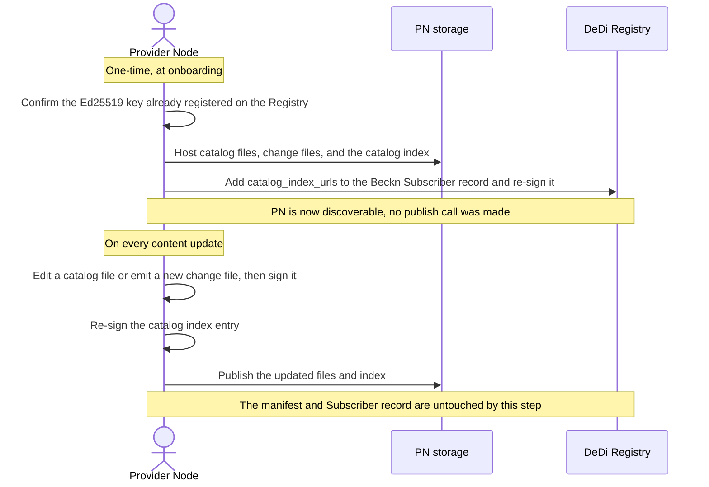
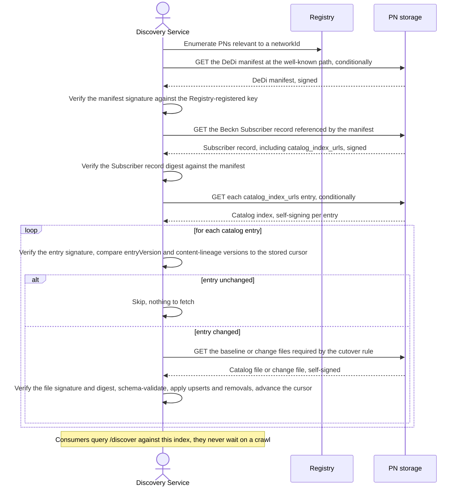
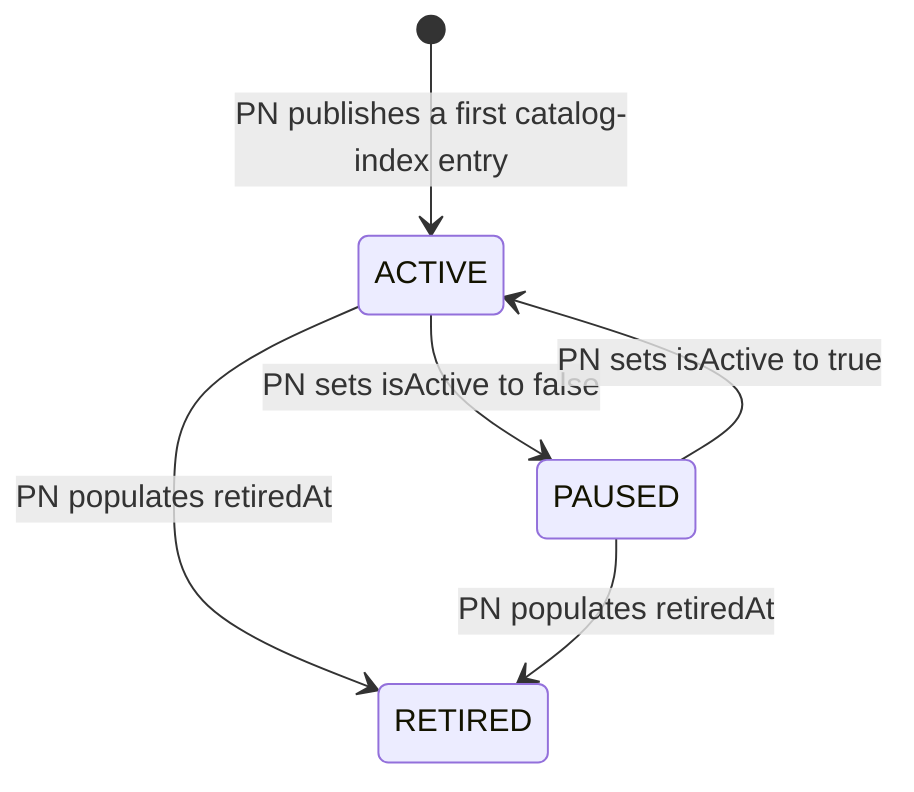

# Decentralized Catalog Publishing and Discovery

## Document Details
- **ID:** NFH-014
- **Publication Status:** Draft
- **Authors:**
  - Mayuresh Nirhali and Beckn Architecture Working Group
- **Created:** 2026-08-05
- **Updated:** 2026-08-05
- **Version history:** Initial version (2026-08-05): Initial publication.
- **Latest editor's draft:** Not yet pushed to a branch of `protocol-specifications-v2`. Will be linked once a working branch exists.
- **Implementation report:** Not available. This document is at Initial Draft status; report will be linked in the next formal release of this RFC, following merge to main.
- **Stress test report:** Untested: no reference implementation has been exercised against this specification yet. Reference crawling tools and publisher tools are tracked as implementation deliverables, not yet built against this draft.
- **Conformance impact:** Implementers operating a Provider Node (PN) MUST self-host and self-sign catalog data; implementers operating a Discovery Service (DS) MUST crawl and verify DeDi-anchored catalog files to build their own index.
- **Security/privacy implications:** Introduces two new signature scopes (per-catalog-file self-signature, per-catalog-index-entry self-signature); see §Security Considerations and §Privacy Considerations.
- **Replaces / Relates to:** Relates to [NFH-006](./API.md) (Beckn API Endpoints), [NFH-007](./Authentication_and_Trust.md) (Authentication and Trust), [NFH-012](./Schema_Design_Guide.md) (Schema Design Guide). Establishes decentralized catalog publishing and discovery as a Fabric capability; does not replace any existing RFC in full.
- **Feedback:**
  - Issues: Click [here](#) (link to be added once a tracking issue exists)
  - Discussions: Click [here](#) (link to be added; MUST include an NFH Fabric Support Forum thread before this leaves Draft status)
  - Pull Requests: Click [here](#) (link to be added once a branch/PR exists)
- **Errata:** To be published.

## Abstract

This RFC establishes a decentralized model for catalog publishing and discovery on the Beckn fabric. A Provider Node (PN) publishes catalog data by hosting self-signed files on infrastructure it already controls, discoverable through one new field on its existing Beckn Subscriber DeDi record. A Discovery Service (DS) builds its own index by crawling — resolving a PN's DeDi manifest, verifying signed catalog files and self-signed catalog-index entries, and applying incremental updates. Catalog access is uniformly public: any party with a file's URL can fetch it, and no download-gating mechanism exists in this design. A PN may organize its catalogs across one or more independently-versioned indexes, and a network operator's membership registry — not this RFC's mechanism — governs which catalogs a network-scoped DS trusts. `/discover` and `/on_discover` are unaffected; the existing `Catalog` schema is unaffected. Companion artifacts: new `CatalogFile`, `CatalogChangeFile`, and Catalog Index schemas, and one additive field on the existing DeDi `Beckn_subscriber` schema.

## Table of Contents

- [Decentralized Catalog Publishing and Discovery](#decentralized-catalog-publishing-and-discovery)
  - [Document Details](#document-details)
  - [Abstract](#abstract)
  - [Table of Contents](#table-of-contents)
  - [Introduction](#introduction)
  - [Specification](#specification)
    - [Definitions](#definitions)
    - [Motivation](#motivation)
    - [Design Goals and Non-Goals](#design-goals-and-non-goals)
    - [Roles and Actors](#roles-and-actors)
    - [Publishing Artifacts and Layering](#publishing-artifacts-and-layering)
    - [Protocol Flows](#protocol-flows)
      - [10.1 Onboarding and steady-state publish](#101-onboarding-and-steady-state-publish)
      - [10.2 Discovery crawl](#102-discovery-crawl)
      - [10.3 Master/Regular catalog resolution](#103-masterregular-catalog-resolution)
      - [10.4 Catalog entry lifecycle](#104-catalog-entry-lifecycle)
      - [10.5 Error flows](#105-error-flows)
      - [10.6 Async trigger conditions](#106-async-trigger-conditions)
      - [10.7 AI Agent exercisability](#107-ai-agent-exercisability)
    - [Versioning](#versioning)
    - [Schema Changes](#schema-changes)
    - [Security Considerations](#security-considerations)
    - [Privacy Considerations](#privacy-considerations)
    - [End-to-End Flow (Informative)](#end-to-end-flow-informative)
    - [Conformance Requirements](#conformance-requirements)
    - [Security and Interoperability Considerations](#security-and-interoperability-considerations)
    - [Prior Art](#prior-art)
  - [Conclusion](#conclusion)
    - [Open Questions](#open-questions)
  - [Acknowledgements](#acknowledgements)
  - [References](#references)
  - [Appendix A — Worked Examples (Informative)](#appendix-a--worked-examples-informative)
  - [Appendix B — Pre-Submission Checklist](#appendix-b--pre-submission-checklist)
  - [Appendix C — Version History](#appendix-c--version-history)

## Introduction

Catalog reach is one of the highest-value capabilities a Provider Node (PN) needs from the fabric, and this RFC establishes it as something a PN provides for itself: a PN hosts its own catalog data as self-signed files on infrastructure it already controls — a website, a CDN, an object store — discoverable through its existing fabric identity. A Discovery Service (DS) finds and verifies that data by crawling, using the same DeDi identity layer already used fabric-wide to resolve a network participant's registered keys, and builds its own index from what it verifies. No shared, centrally-operated service sits in either path.

The working group should engage with this RFC because it defines where trust is anchored for the entire discovery phase of the protocol: in the PN's own signature over its own content, verified independently by every DS, rather than in a single intermediary every participant must trust. This is a foundational-layer change with direct implications for how catalogs are published and indexed fabric-wide, and for how network operators express which catalogs they stand behind.

## Specification

The key words "MUST", "MUST NOT", "REQUIRED", "SHALL", "SHALL NOT", "SHOULD", "SHOULD NOT", "RECOMMENDED", "MAY", and "OPTIONAL" in this document are to be interpreted as described [here](./Keyword_Definitions.md).

### Definitions

- **Provider Node (PN):** unchanged from `beckn.yaml` — the fabric identity that owns catalog data. Under this RFC, a PN's Registry-anchored identity is also its DeDi publisher identity for catalog data.
- **Discovery Service (DS):** unchanged from `beckn.yaml` — the fabric identity that serves `/discover`/`/on_discover`. Under this RFC, a DS also crawls PN-hosted catalog data to populate its own index.
- **Node:** any network participant with a DeDi entry — its own DeDi manifest and Beckn Subscriber record. The term is not PN-specific: a CN, DS, or NFO is equally a node. This RFC's flows concern a PN's node specifically, which may be the PN's own domain, or a subdomain a platform assigns to a provider it onboards; see §Publishing Artifacts and Layering.
- **Catalog file:** a self-signed file, conforming to the new `CatalogFile` schema, hosted by a PN at a URL of its own choosing, wrapping exactly one unmodified `Catalog` object.
- **Change file:** a self-signed file, conforming to the new `CatalogChangeFile` schema, carrying an incremental delta (added/updated/removed resources or offers) between two versions of one catalog.
- **Catalog index:** a self-signing, per-catalog-entry file, hosted by a PN, listing every catalog it offers under that index together with references to that catalog's current baseline and change files. Not a DeDi file; DeDi does not ingest it. A node may host more than one catalog index.
- **DeDi manifest:** the existing DeDi artifact at `/.well-known/dedi.json` on a node's domain, unmodified by this RFC.
- **Beckn Subscriber record:** the existing DeDi record carrying a node's `subscriber_id`, `url`, `type`, `domain`, and signing key(s); this RFC adds one field to it.
- **Membership registry:** an NFO's existing registry of `beckn-subscriber-reference` records, used unmodified by this RFC to express which nodes a network-scoped DS trusts.
- **Compaction:** the act of a PN folding an accumulated chain of change files into a fresh baseline, published alongside — not in place of — the change files that led up to it, which stay listed for a grace period so a DS mid-lineage can still reach the new baseline by applying diffs (§10.1).
- **Normative:** requirements that define conformance and interoperability behavior.
- **Informative:** explanatory guidance that does not by itself define conformance.

### Motivation

**Current State.** `beckn.yaml` defines a `Fabric API - Cataloging Service` tag covering seven endpoints: `POST /catalog/publish` → `POST /catalog/on_publish` (a PN pushes `Catalog` objects to a Fabric-operated service, which validates, indexes, and reports per-catalog `ACCEPTED`/`REJECTED`/`PARTIAL` via `CatalogProcessingResult`); `POST /catalog/subscription` (a DS declares interest via `networkIds`/`schemaTypes`, backed by `CatalogSubscribeAction`/`CatalogSubscription`); `POST /catalog/push` (matching updates are pushed to subscribed DSes); and `POST /catalog/search`/`POST /catalog/pull` → `POST /catalog/on_pull` (a DS queries or bulk-retrieves an index maintained by that same service). `/discover` and `/on_discover` sit on top of whatever the DS has indexed via this pipeline and are unaffected by this RFC.

**Identified Problems.**
1. A PN's discoverability on every network it participates in depends on the availability, policy, and rate limits of one shared service it does not operate — its downtime is a single point of failure for catalog reach, fabric-wide, affecting every PN and DS simultaneously.
2. The current mechanism requires every PN to run a second, protocol-specific write path in addition to whatever infrastructure it already operates to serve its own catalog data — a website, a CDN, an existing product feed — duplicating infrastructure a PN commonly has already.
3. [NFH-007](./Authentication_and_Trust.md), §12 open questions, already identifies that a DS receiving a catalog via the current pipeline receives a payload signed by the intermediary service, not by the originating PN: the DS has no independent way to verify the catalog contents are exactly what the PN submitted, without trusting that intermediary. This RFC treats that open question as a requirement to satisfy, not merely acknowledge.
4. `networkIds`/`schemaTypes` filtering happens once, centrally. Every DS's relevance logic is therefore delegated to whoever operates the shared service, rather than being something a DS can compute independently against openly available data.

**Why the Current Design Cannot Be Extended.** The identified problems are properties of having a mandatory, centrally-operated write path at all, not properties of that path's specific request/response shape. Adding a signature field to the existing publish payload would address problem 3 alone; it does not address problems 1 or 2 — a mandatory intermediary remains a single point of failure for discoverability, and PNs still need a bespoke write path in addition to whatever hosting they already run. Only removing the mandatory shared write path, while preserving the trust properties it currently provides, resolves all four problems together.

**Requirements.**
- **R1.** A PN MUST be able to make a catalog discoverable without calling any Fabric-operated write API.
- **R2.** A DS MUST be able to independently verify that a catalog's content originated from the PN that claims to publish it, without relying on transport-level trust in any intermediary.
- **R3.** A DS MUST be able to discover which catalogs a PN offers, and detect changes to them, without a mandatory subscription API operated by a third party.
- **R4.** The mechanism MUST reuse the PN's and DS's existing fabric identity (their Registry-anchored DeDi keys) rather than introduce a second identity or key-management scheme for catalog data specifically.
- **R5.** The `Catalog` schema and the `/discover`↔`/on_discover` exchange MUST NOT change.
- **R6.** The mechanism MUST support incremental updates to a catalog without requiring a full re-publish of unchanged content.
- **R7.** The mechanism MUST let a DS distinguish "no longer offered" from "host unreachable," via a positive signal a DS can verify on a successfully-fetched entry — not by inferring meaning from an entry's absence, since an incomplete or partial crawl is indistinguishable from a real removal by absence alone.

### Design Goals and Non-Goals

**Design Goals.**
- **G1** (→ R1): Publishing is an act of writing signed files to self-controlled storage; it is never an API call.
- **G2** (→ R2, R4): Every catalog file and every catalog-index entry carries its own detached signature, verifiable against the PN's Registry-anchored key, independent of any intermediary.
- **G3** (→ R3): A DS discovers a PN's catalogs by resolving one new field on the PN's existing Beckn Subscriber DeDi record to one or more catalog indexes, then crawling from there — no subscription API required.
- **G4** (→ R6): A catalog's updates are expressed as an immutable baseline plus a chain of change files, so a DS fetches only what changed.
- **G5** (→ R7): A catalog-index entry carries an explicit, one-way `retiredAt` tombstone; a DS treats retirement as verified only on positively observing it, never by inferring it from an entry's absence.
- **G6** (→ R5): No change to `Catalog`, `/discover`, or `/on_discover`.

**Non-Goals.**
- **NG1 — Restricted (access-gated) catalogs.** Catalog access is public-only under this design; any party with a catalog file's URL can fetch it. This RFC does not define, and does not need, a download-gating mechanism. A network requiring confidentiality for a specific catalog is out of this RFC's scope entirely and would need an access-control layer operating outside this protocol.
- **NG2 — Re-homing Rego policy-as-code enforcement.** [NFH-012](./Schema_Design_Guide.md)'s master-catalog policy validation, currently specified against a centrally-operated indexing service, is out of scope for this RFC. Where that validation runs under this model is an open question — see Open Questions.
- **NG3 — Master/Regular resource inheritance semantics.** `resourceDirectives[].extends.masterResourceId` and `variant` are reused as-is from today's `publishDirectives`; this RFC relocates where resolution happens (see §10.3) but does not redesign the semantics themselves.
- **NG4 — A specific crawler implementation.** This RFC specifies the artifacts and the verification contract a crawler MUST satisfy. It does not mandate specific software; a reference crawling tool is anticipated as an implementation deliverable, not required by this specification.
- **NG5 — Changes to the DeDi protocol itself.** This RFC composes the existing, externally-governed DeDi manifest/file format (see GOVERNANCE.md's note on Registry protocols, governed by Linux Foundation Decentralized Trust) and proposes exactly one additive field on one existing DeDi schema (`Beckn_subscriber`). It does not modify DeDi's protocol and has no authority to.
- **NG6 — Editing `beckn.yaml`'s existing catalog endpoints/schemas, and the corresponding edits to NFH-001, NFH-006, and NFH-007.** Tracked as a fast-follow once this design is accepted; not performed by this RFC. §End-to-End Flow notes exactly which existing endpoints that follow-up will need to touch.
- **NG7 — Collapsing `bapId`/`bppId`/`networkId`/`subscriberId` into a single domain-valued `nodeId`.** Design discussion that fed into this RFC explored replacing today's identity fields with one identifier whose value is a domain, since catalog discovery under this design is already anchored to a PN's domain. That collapse is a cross-cutting identity change affecting the transaction leg as much as the catalog leg, and is deliberately not adopted by this RFC — every flow and schema here keeps `PN`/`DS`/`CN`/`NFO` as Registry-anchored identities exactly as `beckn.yaml` defines them today. If pursued, it belongs in its own RFC; this RFC does not depend on it and would not need revision if it never happens.

### Roles and Actors

| Actor | Protocol Identity | Role in this RFC's Flows | Endpoints Invoked | Endpoints Implemented |
|---|---|---|---|---|
| PN | Registry-anchored domain identity (unchanged) | Self-hosts and self-signs its own catalog files, change files, and catalog index(es); adds `catalog_index_urls` to its existing Beckn Subscriber DeDi record | None new — HTTP GET against its own storage is not a protocol-defined invocation | None new — hosts static files; no server required for the flows this RFC defines |
| DS | Registry-anchored domain identity (unchanged) | Resolves PNs' DeDi manifests and Beckn Subscriber records; crawls, verifies, and indexes catalog files; serves `/discover` from its own index | Conditional HTTP `GET` against PN-hosted DeDi and catalog files; existing DeDi lookup for Registry keys | `/discover`, `/on_discover` (unchanged from `beckn.yaml`) |
| CN | Registry-anchored domain identity (unchanged) | Unaffected — calls `/discover` exactly as today | `/discover` | `/on_discover` |
| NFO | Registry-anchored domain identity (unchanged) | Publishes and maintains the membership registry a DS uses for network-scoped trust; see below | None new | None new |

**Membership governs trust, not access.** A network is real, under this RFC, only when its NFO has published a membership registry — the same `beckn-subscriber-reference` registry participants are onboarded into today, under the NFO's own domain. A node's presence in that registry is binary: either a reference record exists for it, or it doesn't. Two consequences follow directly:

- **Public catalogs need no operator at all.** A PN whose catalogs carry no `networkIds`, or whose only concern is being crawled by any DS willing to crawl it, never touches a membership registry, and every DS can take its catalogs. This is the default case, not a special one.
- **A PN can be its own operator.** Nothing prevents a PN from publishing a membership registry under its own domain and using that domain as the `networkId`, if it wants a specific set of DSes to index it under a named banner. The cost is real: it now does the operator's own job of keeping that registry current.

A DS crawling on behalf of a specific network MUST check that a PN has a reference record in that network's membership registry before indexing the PN's catalogs under that network's banner. This is a relevance/trust decision — which catalogs a *network-scoped* DS indexes — never an access decision: every catalog remains fetchable by anyone regardless of membership.

The CS does not appear in this table: catalog publishing and discovery under this RFC require no centrally-operated actor. Note for the working group: [NFH-010](./RFC_Authoring_Guide.md) §9 currently restricts permissible RFC actors to `{CN, PN, CS, Fabric}`, a list that does not include `DS` or `NFO` despite both being used throughout `beckn.yaml` today. This RFC uses `DS` and `NFO` consistent with existing spec usage; reconciling NFH-010's actor list is tracked as a separate governance fix, not performed here.

### Publishing Artifacts and Layering

A node's publishing surface is four kinds of file across two layers. The DeDi layer — the manifest and the Beckn Subscriber record — follows DeDi's published format exactly and changes rarely. The catalog layer — the index and the catalog/change files — is where all publish-time churn lives, and neither is a DeDi file:

1. The **DeDi manifest**, at the fixed, well-known path `/.well-known/dedi.json`, written once at onboarding. Lists the Beckn Subscriber record among the node's DeDi files.
2. The **Beckn Subscriber record**, a normal DeDi file conforming to the existing `Beckn_subscriber` schema plus this RFC's one new field, `catalog_index_urls`. Changes only when an index URL is added, removed, or moved, or when the node's identity details change for reasons unrelated to catalogs.
3. One or more **catalog indexes** — plain, self-signing files, updated on every publish. Not DeDi files; DeDi never ingests them.
4. **Catalog files and change files** — the actual content, each self-signed; see §Schema Changes.

**A node may host more than one catalog index.** `catalog_index_urls` is a list, not a single URL, specifically so a node can separate concerns that churn independently — for example, a fast-moving retail catalog from a slow-moving mobility one, or a public index from one scoped to a single network. Each index is versioned and signed on its own.

**Indexes belong to the node, never to an individual provider inside it.** This governs how a platform onboarding many providers fits the model, without introducing a fifth artifact:

- A provider that is its own node (its own domain) hosts its own manifest, Subscriber record, and index(es); nothing aggregates it.
- A platform onboarding many providers is **one node**, however many indexes it keeps. Each catalog inside names its own provider — the `Catalog` schema already carries a `provider` object for exactly this — and the platform signs every file with its own key. This is today's provider-platform relationship, expressed as files instead of API calls.
- A provider run as a subdomain node (e.g. `provider-x.platform.com`) has its own manifest, Subscriber record, index(es), and keys; one host's storage can serve many such small nodes side by side.

A PN MUST NOT maintain a separate, per-provider catalog index inside a platform node; a catalog's own `provider` field, not a separate index, is what distinguishes providers sharing one node.

### Protocol Flows

#### 10.1 Onboarding and steady-state publish

A PN's one-time onboarding and every subsequent publish follow the same shape; only the frequency differs.



A PN MUST sign every catalog file and every change file it publishes (§Schema Changes, `CatalogFile`/`CatalogChangeFile`). A PN MUST NOT publish a catalog-index entry whose `entryVersion`, or whose `baseline.version`/`changes[].version`, regresses relative to the entry it most recently published for that `catalogId`.

**Canonical serialization and immutable URLs.** A PN MUST serialize a catalog file with a stable key order and formatting on every publish, so a digest changes only when content changes. A PN MUST publish a new version of a catalog file at a new, immutable URL; it MUST NOT overwrite a previously-published version in place.

**Compression.** A PN MAY serve any `CatalogFile`/`CatalogChangeFile` gzip-compressed to reduce egress, signaled purely by the file's own URL extension: `.json.gz` for compressed, `.json` for plain — a DS applies gzip decompression or not based on that extension alone, with no content-negotiation or header sniffing required, consistent with these files being static, self-hosted artifacts rather than served by an application. A DS MUST decompress a `.json.gz` file before parsing it, and MUST compute or verify its digest and signature against the canonical, decompressed JSON content — never the compressed bytes, since gzip's own output isn't guaranteed byte-stable across tool versions even for identical input, and signing the compressed form would make a legitimate re-publish indistinguishable from tampering. The corresponding index entry's `size` (§Schema Changes), by contrast, reflects the size of the file as actually served — the compressed size, when `.json.gz` is used — since that is what a DS's cutover-rule estimate below and any egress budgeting genuinely care about.

**Compaction.** When a catalog's change-file chain exceeds a threshold the PN chooses — by count, or by combined size relative to the baseline — or on a schedule, a PN MAY compact: emit a fresh baseline at a new URL and point the index at it. Which trigger to use is entirely the PN's own operational choice and has no interoperability impact — a DS's crawl logic is identical regardless of why or when a PN compacted (below). As an informative aside: a size-based trigger pairs naturally with the same threshold the cutover rule already uses, so a PN compacting around "these diffs now cost about as much as the baseline" keeps its own storage and index proportionate to what a DS would prefer anyway. A PN MAY also compact at the change-file level alone, squashing several small change files into one that spans the same version range, without touching the baseline.

Compacting the baseline MUST NOT strand a DS that is mid-lineage. A PN MUST continue to list, not merely host, the change files that led up to the new baseline — for at least the same grace period (chosen by the PN, covering its slowest expected crawler) for which it retains the underlying files themselves. A DS resuming from an old cursor after a compaction it never saw happen simply keeps doing what it always does: fetch the changes listed after its cursor and apply them in sequence, arriving at content identical to the new baseline without ever fetching the baseline snapshot itself; a DS with no stored cursor, or one too far behind for the diff chain to be worth it, uses the cutover rule (below) exactly as before and fetches the baseline directly. `changes[]` is consequently longer for a while immediately after a compaction than it would be under a hard reset, shrinking back down once the grace period elapses — some of compaction's index-payload benefit is deferred, not eliminated, which is the trade-off a PN is tuning when it picks its trigger and grace period. A DS's crawl logic (§10.2, §Versioning) itself requires no special handling for compaction — it always resolves to "fetch the changes I'm missing, or the baseline if that's cheaper," regardless of when or how compaction happened; the obligation above is entirely on the publish side.

**Cutover rule.** If the combined `size` of a catalog's pending change files exceeds a threshold fraction of its baseline `size`, a DS SHOULD fetch the baseline instead of the accumulated changes.

#### 10.2 Discovery crawl



A DS MUST perform every verification step shown above before indexing any catalog content; a DS MUST NOT index a catalog file or catalog-index entry that fails any verification step. A DS SHOULD use conditional HTTP requests (`ETag`/`If-Modified-Since`) to avoid re-fetching unchanged artifacts.

**Two implementation shapes for enumerating PNs (informative).** The first crawl step — finding the PNs and indexes relevant to a DS — can be answered directly against DeDi (a DS enumerates candidate domains and reads each one's manifest itself) or through a separate registry service that caches DeDi's records with a reverse lookup on top, answering "which index URIs are relevant to me" in one call instead of a sweep. Both are conformant: neither shape changes what gets verified or how, per-file, and a registry service is never treated as an authority — every file a DS ingests is still verified at its own source, per the steps above. Which shape a DS chooses is an implementation and deployment decision, not a protocol requirement.

#### 10.3 Master/Regular catalog resolution

Resolution of a REGULAR catalog resource's `resourceDirectives[].extends.masterResourceId` reference happens at the DS, during indexing: a DS MUST inherit attributes from the named MASTER resource into the REGULAR resource, with the REGULAR resource's own fields taking precedence, using the same merge semantics `publishDirectives` already defines today. A DS MAY use a catalog-index entry's `catalogType` to order its crawl — indexing MASTER catalogs before resolving REGULAR catalogs that reference them — without needing to fetch every file first.

**`dependencies` gives this away earlier still.** `catalogType` alone tells a DS *that* a REGULAR catalog extends something, but not *which* MASTER catalog(s), or where to find them — that previously required fetching the file, inspecting every `resourceDirectives[].extends.masterResourceId` individually, and, if the MASTER catalog belongs to a different PN, resolving that PN's DeDi manifest and Beckn Subscriber record from scratch just to find its index. A REGULAR catalog's index entry instead carries `dependencies.masters` (§Schema Changes) directly:

```json
"dependencies": {
  "masters": [
    { "catalogId": "open-economy.nfh.global/electronics-master", "indexUrl": "https://cdn.open-economy.nfh.global/beckn/catalog-index.json" }
  ]
}
```

A PN MUST keep this current with what its resources actually extend. A DS can use `catalogId` alone to decide, before fetching anything, whether every MASTER dependency has already been crawled and indexed, and use `indexUrl` as a shortcut straight to the index that should contain it — particularly valuable when the MASTER catalog belongs to a node the DS isn't crawling yet. **`indexUrl` is a locator hint, not a trust delegation:** it is not itself signed, and a DS MUST verify whatever it fetches from it exactly as it would via ordinary discovery — the MASTER entry's own signature against its `catalogId`'s Registry-anchored key — and MUST fall back to standard DeDi resolution (§10.2) if the hint is stale, unreachable, or fails verification. Exactly what a DS should do when a declared dependency has not yet been crawled (fetch it out of order, index the REGULAR catalog partially, or wait) remains an open question (see Open Questions); `dependencies` makes that condition cheaply detectable and cheaper to resolve, but does not by itself settle the policy.

**A resource or offer's `id` MAY appear in more than one catalog, not only through `extends` (informative).** `Resource.id` and `Offer.id` are defined as globally unique in `beckn.yaml`, not catalog-scoped — so the same id can legitimately be published from two independently-signed catalogs, whether or not one `extends` the other. Each catalog's `resources`/`offers` are part of that catalog's own signed content and lifecycle; there is no structural link between two catalogs that happen to list the same id outside the explicit Master/Regular relationship. Consequently: retiring, pausing, or removing one catalog has no effect, structural or otherwise, on any other catalog's own independently-signed listing of the same id. This only becomes a DS's problem if the DS itself deduplicates records by `id` across catalogs when building its own index (for example, to avoid showing a consumer the same product twice) — the protocol does not require this, but a DS that does it MUST reference-count: a deduplicated record MUST remain in the DS's index as long as any catalog the DS treats as ACTIVE or PAUSED (§10.4) — i.e., not RETIRED — still contains that id, and MUST be removed only once every catalog referencing it has been retired.

#### 10.4 Catalog entry lifecycle

**Terminology note — "listed" is not a state.** A catalog-index entry existing at all is a precondition for it having a lifecycle state, not itself a state a catalog transitions into or out of. A DS cannot reliably verify absence — a partial crawl, one failed fetch among several `catalog_index_urls`, or a truncated response all look identical to a real removal from the outside. So this RFC does not model "listed vs. not listed" as a transition, and a DS MUST NOT treat an entry's disappearance, by itself, as meaningful. The complete lifecycle is the three states below, each verified by something a DS can positively observe on a fetched, signed entry — never by something's absence.



**Active vs. paused.** `isActive` (mirrored from the untouched `catalog.isActive`, §Schema Changes) is an ordinary, freely-reversible content attribute — the same field `Catalog` has always had. Toggling it in either direction is just another entry edit: `entryVersion` bumps, `baseline`/`changes[]` are untouched. A DS MUST NOT delete or stop tracking a catalog's previously-indexed content solely because `isActive` becomes `false` — a paused catalog stays fully indexed, just excluded from whatever the DS treats as currently-transactable.

**Retired.** A PN MUST populate an entry's `retiredAt` before it stops publishing updates for that catalog; retirement is one-way (a PN MUST NOT unset `retiredAt` once populated), and `baseline`/`changes[]` are dropped from the entry once it is set, since there is nothing left to fetch. A DS MUST treat a catalog-index entry carrying `retiredAt` as no longer offered and MUST NOT continue serving previously-indexed content for it via `/on_discover`. This is the only condition under which a DS retires a catalog from its own index — a positive fact it verified on a signed entry, not an inference from that entry no longer appearing in a later crawl.

**Absence, on its own, proves nothing.** If a DS previously indexed a `catalogId` and a later, successfully-fetched, validly-signed index no longer includes it, and the DS never observed a `retiredAt` marker on that entry beforehand, the DS MUST treat this as a possible incomplete crawl (§10.5) — log it and re-verify on the next cycle — and MUST NOT delete the catalog's previously-indexed content on that basis alone. A PN MAY eventually drop a long-retired entry from its index as its own storage hygiene, but this is informative housekeeping a DS is never required to observe or rely on; the tombstone, while the entry is still being served, is what a DS actually acts on.

#### 10.5 Error flows

| Trigger | Detected By | Response Schema / Signal | Caller MUST |
|---|---|---|---|
| Catalog file digest does not match the index entry's declared digest | DS, during fetch | No response schema (internal crawl failure) | MUST discard the fetched content; MUST NOT index it; MUST log the failure to a feedback log the PN can read (mechanism deferred — see Open Questions) |
| Catalog file's own embedded signature fails verification | DS, during fetch | Same as above | MUST discard; MUST NOT index; MUST log |
| Catalog-index entry signature fails verification | DS, during index fetch | Same as above | MUST discard the entry; MUST NOT index any of its files; MUST log |
| `entryVersion` or content-lineage version regresses relative to stored cursor | DS, comparing fetched entry to cursor | Same as above | MUST flag as a possible rollback/tamper condition; MUST NOT apply the regressed content |
| Mismatch between a catalog file's own internal `catalogId`/`version` and the index entry's declared `catalogId`/`version` | DS, after fetching the file | Same as above | MUST treat exactly as a digest mismatch — discard, don't index, log; MUST NOT attempt to reconcile by preferring either side |
| DeDi manifest or Subscriber record signing key not present in the manifest's current `keys[]` | DS, during manifest/record verification | DeDi's own verification failure (per DeDi spec, out of this RFC's scope) | MUST treat everything signed with that key as unverifiable; MUST NOT index |
| `catalogId` domain prefix does not match the crawled node's own domain | DS, during entry verification | No response schema | Behavior open — see Open Questions ("id-collision enforcement") |
| A previously-indexed `catalogId` is absent from a successfully-fetched, validly-signed index, with no `retiredAt` ever observed on it | DS, comparing fetched index to its own prior state | No response schema | MUST treat as a possible incomplete crawl, not a removal; MUST log; MUST NOT delete the catalog's previously-indexed content; MUST re-verify on its next crawl cycle |

#### 10.6 Async trigger conditions

The crawl in §10.2 is DS-initiated and pull-only; there is no PN-initiated delivery in this RFC's core mechanism. A PN MAY additionally operate an out-of-band change-signal mechanism to invite a DS to crawl sooner than its own schedule; if it does, a DS receiving such a signal MUST still perform the full verification in §10.2 before trusting anything — an unsolicited signal MUST NOT be treated as verified content. The design, ownership, and pricing of any such signal mechanism is out of scope for this RFC (see Open Questions).

#### 10.7 AI Agent exercisability

Every flow in this section is exercisable by an AI Agent without human input: publishing (§10.1) is a deterministic file-generation and signing pipeline; crawling and verification (§10.2) is a deterministic fetch-verify-index loop with no decision point requiring human judgment; removal from the index (§10.4) is simply the absence of an entry on a PN's next automated publish, no separate action required. No flow in this RFC requires human-in-the-loop confirmation.

### Versioning

Three independent layers, each with its own scope, deliberately kept distinct because they answer different questions.

**There is no whole-index version field.** Whether a catalog index has changed at all is answered by ordinary conditional HTTP (`ETag`/`If-Modified-Since`, §10.2), at no cost beyond what fetching and parsing a fresh copy already requires. A plain, unsigned document-level counter would add nothing on top of that: a catalog index as a whole is not signed (only its entries are), so a hostile host could set such a field to whatever it wanted regardless of what it actually served underneath it. Rollback detection belongs, and is handled, one layer down, where the signed data actually is.

**Catalog-entry level — has anything changed.** Each catalog entry carries `entryVersion`, an integer a PN MUST bump on *any* change to the entry — content or metadata (`networkIds`, `schemaTypes`, `catalogType`, `dependencies`, `isActive`, `retiredAt` all live in the entry too, and can change independent of the underlying resources/offers). This is a DS's cheap first check: unchanged since the last crawl means skip the entry entirely, with a positive guarantee that nothing about it moved, since `entryVersion` is inside the entry's own signed scope.

**Catalog-entry level — what's current.** Independent of `entryVersion`, each entry also carries `baseline.version` and `changes[].version` — a DS's per-catalog cursor for deciding which change files it still needs. These do not collapse into `entryVersion`, and MUST NOT be conflated with it: `entryVersion` bumps on every edit, but `baseline`/`changes[]` versions bump only when a corresponding file is actually published. Forcing a metadata-only edit to also bump `baseline.version` would send a DS looking for a baseline or change file that doesn't exist — either a no-op file would have to be published to satisfy it, or version numbers would carry gaps that don't correspond to real files, breaking the "fetch changes after my cursor" contiguity the incremental scheme depends on. Keeping the two separate is what lets a metadata-only edit stay as cheap as it should be: one re-signed entry, no file republished.

**Catalog-file level.** `CatalogFile` and `CatalogChangeFile` (§Schema Changes) carry `catalogId`, a version marker (`version` for a baseline; `fromVersion`/`toVersion` for a change file), and `next_update` inside the file itself, not only in the index entry that points at it. This gives a DS two equally valid paths: read the index first and fetch files by cursor as usual, or fetch a catalog file directly — from a known URL, an out-of-band reference, or a storage listing — and verify it entirely on its own, since it carries enough to check its own identity, version, freshness, and signature without the index at hand.

**Version numbers are monotonic integers, not timestamps.** This is a deliberate choice, not left open: (1) exactly one PN publishes any given catalog, which makes an integer counter trivially safe with no coordination or collision risk; (2) a timestamp-as-version would duplicate information this design already carries elsewhere (`next_update` for staleness); and (3) it would introduce a real failure mode for no offsetting benefit — clock skew or a corrected system clock can make a legitimate republish look like a rollback, which a counter cannot.

**Rules governing the relationship between the file and index levels:**
- A file's own fields are covered by its own signature. Signing input is the whole document minus `signature`, so `catalogId`/`version` (or `fromVersion`/`toVersion`)/`next_update` are part of what's signed automatically — no separate binding step is needed.
- A mismatch between an index entry's declared `catalogId`/version and a fetched file's own internal `catalogId`/version MUST be treated exactly like a digest mismatch: discard, don't index, log it. Neither side is authoritative over the other; a disagreement means something is wrong, not a tiebreak.
- `next_update` inside a file and `next_update` on the index it's listed from are not required to agree, and a DS MUST NOT treat a difference between them as an error. They will often carry the same value in practice, since a PN typically regenerates both together, but they are independent freshness leases for the two access paths above: a DS that fetched via the index honors the index's `next_update`; a DS that fetched the file directly honors the file's own.
- `isActive` is not a version-lineage field: a PN MAY toggle it in either direction at will (§10.4), and doing so only requires `entryVersion` to bump, not `baseline`/`changes[]`. This is unlike `retiredAt` (below), which is one-way — the two are different operations, not degrees of the same one.
- A PN MUST NOT unset `retiredAt` once populated, and MUST NOT re-list a `catalogId` that has been retired. A DS MAY retain version-lineage state for a retired catalog indefinitely, so re-listing the same `catalogId` risks its version numbers looking like a rollback (§10.5) rather than a fresh start; a catalog offered again after retirement MUST be published under a new `catalogId`.

### Schema Changes

Three new artifacts. Each is broken down field by field below: what it represents, who assigns it, and — since that's the part a flowing description tends to bury — the specific concern each field exists to solve.

#### `CatalogFile` (new)

Models the real-world act of a PN making one catalog's content independently verifiable at rest, whether it's reached via the index or fetched directly. An existing schema cannot be reused: `Catalog` itself has `additionalProperties: false`, leaving no room for a sibling `signature` field without either changing `Catalog` (excluded by R5/G6) or wrapping it.

| Field | Assigned by | Solves |
|---|---|---|
| `catalogId` | PN | Identifies which catalog this is, so a directly-fetched copy is self-describing, and so a DS can cross-check it against the index entry that pointed here. |
| `version` | PN | This file's position in the catalog's content lineage; matched against the index entry's `baseline.version`, and against `CatalogChangeFile.fromVersion`/`toVersion` when applying deltas. |
| `next_update` | PN | How long *this specific file's* freshness may be trusted when fetched directly — independent of the index's own `next_update`; see §Versioning. |
| `catalog` | PN | The actual content: an unmodified `Catalog` object, identical in shape to what `beckn.yaml` already defines. |
| `signature` | PN | Detached signature (JCS canonicalization of the document minus this field, per RFC 8785) over every field above, keyed by the PN's Registry-registered key — proves the content is genuinely this PN's, independent of where or how the file was found. |

There is no separate activity field on `CatalogFile` itself. A party fetching the file directly, without consulting the index, reads the existing, unmodified `catalog.isActive` for that — the same field every other consumer of a `Catalog` object already knows to check. Whether the catalog has been retired (§10.4) is a different concept, tracked one level up on the index entry's `retiredAt` — not a field on this file, and not duplicated here. A retired catalog's `CatalogFile` simply stops being referenced by any live `baseline`/`changes[]` entry; the file itself carries no marker of its own retirement.

The wrap does not reopen `Catalog` for changes and does not weaken wire compliance: `Catalog`'s schema governs the wire format (`/discover`/`/on_discover`), not this hosting file — a DS unwraps `.catalog` back to a bare object before anything reaches its own index or the wire.

#### `CatalogChangeFile` (new)

Models the real-world act of a PN publishing an incremental delta to a previously-published catalog, so a DS doesn't have to re-fetch the whole thing on every update.

| Field | Assigned by | Solves |
|---|---|---|
| `catalogId` | PN | Same purpose as in `CatalogFile` — which catalog this delta applies to. |
| `fromVersion` / `toVersion` | PN | The exact version range this delta covers; lets a DS confirm a chain of change files connects cleanly to its own stored cursor before applying any of them. |
| `next_update` | PN | Same freshness purpose as in `CatalogFile`. |
| `resources.upserts` | PN | Resources added or changed since `fromVersion` — complete, schema-valid `Resource` objects (existing schema, reused by reference); a DS replaces by id, never by position. |
| `resources.removals` | PN | Resource ids removed since `fromVersion` — ids only, no object needed. |
| `offers.upserts` / `offers.removals` | PN | Same two purposes, for `Offer`. |
| `catalog` | PN | Optional catalog-level attribute changes (name, validity window) that aren't resource- or offer-specific. |
| `signature` | PN | Same purpose as in `CatalogFile` — proves the delta itself, independent of the index. |

#### Catalog Index (new)

Models the real-world act of a PN declaring the complete, current set of catalogs it offers under one index, each independently verifiable. Not a DeDi file; not part of `beckn.yaml`.

Top-level:

| Field | Assigned by | Solves |
|---|---|---|
| `nodeId` | PN | Whose index this is; a DS checks this matches the node it's crawling. |
| `next_update` | PN | How long the index as a whole may be trusted before re-fetching. |
| `catalogs` | PN | The entries themselves, one per catalog. |

Per catalog entry:

| Field | Assigned by | Solves |
|---|---|---|
| `catalogId` | PN | Which catalog this entry describes. |
| `entryVersion` | PN | Whether *anything* about this entry changed since the DS last looked — content or metadata — independent of whether a new file was published; the DS's cheapest first check (§Versioning). |
| `catalogType` | PN | `MASTER` or `REGULAR`; lets a DS order its crawl — indexing MASTER catalogs before resolving REGULAR ones that extend them — without fetching every file first (§10.3). |
| `dependencies.masters[]` (`catalogId`, `indexUrl`) | PN | Present on a REGULAR catalog entry: one entry per MASTER catalog any of its resources currently extend via `resourceDirectives[].extends.masterResourceId` (§10.3) — `catalogId` for a DS to check whether it's already crawled and indexed that MASTER, `indexUrl` as an unauthenticated shortcut to the index likely to contain it, sparing a DS a full DeDi resolution of the MASTER's own node just to locate it. An array of `{catalogId, indexUrl}` objects, not two parallel arrays, so the pairing can never drift out of sync; `dependencies` is itself an object wrapper (not `masters[]` directly at the top level) so a future dependency kind can be added without a breaking schema change. |
| `networkIds` | PN | Which networks this catalog is relevant to — lets a network-scoped DS skip catalogs it doesn't need to bother indexing, without fetching them first. |
| `schemaTypes` | PN | Which domain schema(s) the catalog's content conforms to — the same filtering purpose as `networkIds`, for a DS that only cares about specific domains (retail, not mobility, for example). |
| `isActive` | PN | Mirrors `catalog.isActive` (unchanged, pre-existing field) so a DS can pre-filter on activity from the index alone, without fetching the file — the same filtering purpose as `networkIds`/`schemaTypes`. Freely reversible in either direction (§10.4, ACTIVE↔PAUSED); a change here bumps `entryVersion` like any other edit, nothing more. Meaningless once `retiredAt` is set. |
| `baseline` (`version`, `url`, `size`, `digest`) | PN | Where to fetch the current full snapshot and how to verify it; present as long as the catalog is not retired. `url` MAY end in `.json.gz` for a gzip-compressed file (§10.1) — a DS decompresses before verifying `digest`. `size` reflects the file's actual served size (compressed, if `.json.gz`), which is what makes the cutover rule (§10.1) computable before downloading anything. |
| `changes[]` (`version`, `url`, `size`, `digest`) | PN | Where to fetch each incremental delta since the baseline and how to verify each; a DS applies only the ones after its own stored cursor. Same `.json`/`.json.gz` and compressed-`size` convention as `baseline`. Dropped once `retiredAt` is set. |
| `retiredAt` | PN | Absent for an ACTIVE or PAUSED catalog; once populated, it *is* the tombstone (§10.4) — a positive fact a DS verifies on the signed entry itself, never inferred from the entry's absence. One-way: never unset. `baseline`/`changes` are dropped once this is set. |
| `crawlHint` | PN | Optional suggested crawl frequency (comparable to a sitemap's `changefreq`); a DS MAY honor it, but stays in control of its own schedule and budget regardless. |
| `signature` | PN | Detached signature over the entire entry minus itself, covering every field above together as one unit — no field, including `networkIds`, `schemaTypes`, `isActive`, a `baseline`/`changes` reference, or the presence of `retiredAt`, can be added, dropped, or altered without breaking it. |

A catalog index MAY additionally carry a whole-index signature, for PNs who want membership and ordering within a served copy covered as well — this is the one gap per-entry signing leaves open (§Security Considerations). An entry's `signature` MAY equally be encoded as a detached JWS (RFC 7515) instead of the `{keyId, value}` tuple shown in Appendix A, to match DeDi's own proof encoding — the encoding is a schema decision, not a semantic one. Signing keys MAY use either Ed25519 or ES256; ES256 matches the fabric's shipped signing guidance (OPA verifies it natively), Ed25519 matches DeDi's own examples. **Open, per §Open Questions:** the canonical publication location for this schema.

#### `Beckn_subscriber` (modified, externally governed)

One additive field, `catalog_index_urls` — an array of `{ url }` objects, assigned by the PN. Backward-compatible: existing records without this field are unaffected; a DS that does not find it simply has no catalog index to crawl for that node. Because this schema is governed under DeDi/Linux Foundation Decentralized Trust, not this repository's CWG (see GOVERNANCE.md), this change requires coordination with that governance process and is tracked as a dependency, not something this RFC can merge unilaterally.

**Cross-artifact alignment.** `catalog_index_urls`, `entryVersion`, and the Catalog Index's field names are new named terms with no existing `context.jsonld`/`vocab.jsonld` entries. A companion PR in the `schemas` repository is required before this RFC can leave Draft status; not yet opened.

### Security Considerations

This RFC's flows conform to [NFH-007](./Authentication_and_Trust.md)'s general model for the parts that don't change: Registry key resolution and revocation, and the `/discover`↔`/on_discover` exchange itself. Specific to this RFC, not already covered by NFH-007:

1. **Two new signature scopes, protecting at two independent levels.** Neither `CatalogFile`/`CatalogChangeFile` self-signing nor catalog-index entry self-signing are HTTP transport signatures — both are JCS-canonicalized, detached signatures over file content at rest, verified independent of any request. **Protected:** file bytes (any change breaks the digest); file authenticity independent of the index (a relocated or cached copy of a catalog file is verifiable on its own, without the index alongside it); the catalog entry as a whole, including its `isActive`, `retiredAt`, `networkIds`, and `schemaTypes` declarations, all inside one signed scope. **Not protected, because a catalog index as a whole is unsigned by default:** absence — a stale or hostile host can still serve an old index that omits a newer catalog entry entirely, or a new change file, and content that's silently missing is not detectable without the optional whole-index signature; and cross-catalog ordering — which entries appear, and in what order, relative to each other. `next_update` forces refresh on a short cadence, and the monotonic version fields (§Versioning) expose rollback to any DS with history; the optional whole-index signature closes the remaining gap entirely for PNs who want it. This residual risk is accepted for discovery data on the basis that much of what is stale is caught again at transaction time, where the authoritative leg validates independently. It is also why §10.4 requires a DS to treat a catalog's disappearance from the index, absent a prior `retiredAt`, as a possible incomplete crawl rather than a verified removal: a hostile host omitting an entry without tombstoning it should be met with suspicion by a spec-following DS, not silent compliance.
2. **Resolves an existing NFH-007 open question.** NFH-007 §12's second open question asks whether PNs should produce an application-layer signature over catalog payloads that a DS can verify independent of any intermediary. This RFC's `CatalogFile` self-signature is that mechanism; the open question SHOULD be marked resolved in NFH-007 once this RFC merges.
3. **Validation is independent per DS, not centrally enforced once.** Under this RFC, a catalog's schema and signature validity are checked at crawl time, independently, by every DS that chooses to crawl a given PN. A malicious or malformed catalog can never be trusted by a conforming DS — verification is mandatory per §10.2 — but there is no single, shared verdict the way one centrally-operated validator would produce: two DSes may, in principle, apply different strictness and reach different conclusions about the same PN. This is an accepted property of the design, restated in §Security and Interoperability Considerations because it is protocol-wide, not local to this mechanism.
4. **Host-compromise exposure is DeDi's, not new.** Because the manifest at `/.well-known/dedi.json` is the trust anchor for a node's keys (`did:web`-style), a full compromise of a node's web host can swap keys and files together. This is an accepted trade-off in DeDi's own design, inherited unchanged by this RFC; mitigated by external monitors watching for unexpected key changes, per DeDi's own guidance.
5. **`dependencies.masters[].indexUrl` is an unauthenticated locator, not a trust delegation.** A REGULAR catalog's own signature covers the fact that it *declares* a given `indexUrl` for a MASTER dependency, but says nothing about what actually lives at that URL — a malicious REGULAR-catalog publisher cannot forge a MASTER catalog's content this way (CON-TBD-31 requires the fetched entry's own signature to verify against its claimed `catalogId`'s Registry-anchored key, same as any other entry), but could point the hint at a dead, wrong, or slow URL to waste a DS's crawl budget. This is a nuisance-level risk, not a trust break: the worst outcome is a wasted fetch, followed by the required fallback to standard DeDi resolution (§10.2).

### Privacy Considerations

No field introduced by this RFC carries new PII. `catalog_index_urls` is a set of URLs pointing to a node's own hosted infrastructure; `entryVersion`, `next_update`, `isActive`, `retiredAt`, `networkIds`, `schemaTypes`, and the catalog-index/file signature fields carry no personal data. `Catalog.provider` (business/contact details) is unchanged and unaffected by this RFC — its existing privacy posture, whatever it is today, is not altered by relocating where the surrounding `Catalog` object is hosted.

### End-to-End Flow (Informative)

A worked walkthrough, tying §10.1 through §10.4 together into one concrete scenario. This section is illustrative; the normative requirements live in the sections it references, not here. This RFC does not itself modify `beckn.yaml` (see Non-Goal NG6), so today's catalog endpoints are referenced by name below only to show where this flow sits relative to them — not as artifacts this RFC changes.

1. `open-economy.nfh.global` (a PN) authors a `Catalog` for its electronics line, wraps it in a `CatalogFile`, signs it, and hosts it at a URL on its own CDN (§10.1).
2. It writes a catalog index listing that catalog's entry — `catalogId`, `entryVersion`, `catalogType`, `baseline` — signs the entry, and hosts the index alongside the file.
3. It adds `catalog_index_urls`, pointing at that index, to its existing Beckn Subscriber record, and re-signs the record (§Publishing Artifacts and Layering). No call was made to any Fabric-operated service at any point in these three steps.
4. `ion-discovery.nfh.global` (a DS scoped to the `ion.nfh.global` network) enumerates candidate PNs from the Registry, resolves `open-economy.nfh.global`'s DeDi manifest and Beckn Subscriber record, and finds the new `catalog_index_urls` entry (§10.2).
5. The DS fetches the catalog index, verifies the entry's signature, confirms `open-economy.nfh.global` has a reference record in `ion.nfh.global`'s membership registry, fetches and verifies the `CatalogFile` itself, and indexes the resulting `Catalog` object.
6. A CN calls `POST /discover` against the DS exactly as it would today; the DS matches the intent against what it crawled and calls `POST /on_discover` on the CN's callback URI with the indexed `Catalog`. This leg, defined in `beckn.yaml`, is entirely unaffected by this RFC.
7. `open-economy.nfh.global` later updates one item's price: it edits the catalog file (or emits a `CatalogChangeFile`), re-signs it, bumps the index entry's `entryVersion` and its `baseline`/`changes[]` version, and re-signs the entry. On its next pass, the DS's conditional fetch of the index detects the change, re-verifies, and re-indexes — no notification was sent or required (§10.6).

Today's `beckn.yaml` catalog endpoints (`POST /catalog/publish`, `/catalog/subscription`, `/catalog/push`, `/catalog/pull`, `/catalog/search`, and their callbacks) are untouched by the steps above and remain exactly as `beckn.yaml` defines them today; this RFC introduces the flow alongside them. Retiring those endpoints, and the specific migration path for implementers currently depending on them, is scoped to the follow-up RFC referenced in Non-Goal NG6.

### Conformance Requirements

| ID | Requirement | Level |
|---|---|---|
| CON-TBD-01 | A PN MUST be able to make a catalog discoverable without calling any Fabric-operated write API. | MUST |
| CON-TBD-02 | A PN MUST sign every `CatalogFile` and `CatalogChangeFile` it publishes, per the JCS-canonicalization convention in §Schema Changes. | MUST |
| CON-TBD-03 | A PN MUST NOT publish a catalog-index entry whose `entryVersion` regresses relative to the entry it most recently published for that `catalogId`. | MUST |
| CON-TBD-04 | A PN MUST NOT publish a catalog-index entry whose `baseline.version` or any `changes[].version` regresses relative to what it most recently published for that `catalogId`. | MUST |
| CON-TBD-05 | A PN MUST populate an entry's `retiredAt` before it stops publishing updates for that catalog, and MUST NOT unset it once populated. | MUST |
| CON-TBD-06 | A DS MUST verify a fetched DeDi manifest's signature against the Registry-registered key for the crawled domain before trusting anything it lists. | MUST |
| CON-TBD-07 | A DS MUST verify a fetched Beckn Subscriber record's digest against the value the manifest signs for it. | MUST |
| CON-TBD-08 | A DS MUST verify each catalog-index entry's self-signature before indexing any file it references. | MUST |
| CON-TBD-09 | A DS MUST verify each fetched `CatalogFile`/`CatalogChangeFile`'s own embedded signature, in addition to its digest, before indexing it. | MUST |
| CON-TBD-10 | A DS MUST NOT index a catalog file or catalog-index entry that fails any verification step in §10.2. | MUST NOT |
| CON-TBD-11 | A DS MUST treat a regression in `entryVersion` or in content-lineage version, relative to its own stored per-catalog cursor, as a possible rollback and MUST NOT apply the regressed content. | MUST |
| CON-TBD-12 | A DS MUST treat a mismatch between a catalog file's internal `catalogId`/`version` and its index entry's declared `catalogId`/`version` the same as a digest mismatch — discard, do not index. | MUST |
| CON-TBD-13 | A DS MUST treat a catalog-index entry carrying `retiredAt` as no longer offered and MUST NOT continue serving previously-indexed content for it via `/on_discover`. | MUST |
| CON-TBD-14 | A DS MUST inherit a REGULAR resource's attributes from its declared MASTER resource, with the REGULAR resource's own fields taking precedence, per §10.3. | MUST |
| CON-TBD-15 | A DS receiving an out-of-band change signal MUST still perform full verification per §10.2 before trusting any content; the signal itself MUST NOT be treated as verified. | MUST NOT |
| CON-TBD-16 | This RFC's flows MUST NOT introduce, and no conforming implementation MUST provide, a restricted or access-gated catalog path. | MUST NOT |
| CON-TBD-17 | Every `Resource`/`Offer` object inside a `CatalogChangeFile`'s `upserts[]` MUST be a complete, schema-valid object per the existing `Resource`/`Offer` schemas. | MUST |
| CON-TBD-18 | A DS SHOULD use conditional HTTP requests (`ETag`/`If-Modified-Since`) when re-fetching a previously-seen DeDi manifest or catalog index. | SHOULD |
| CON-TBD-19 | All new schema designs introduced by this RFC MUST comply with NFH-009 conformance requirements CON-005-01 through CON-005-15. | MUST |
| CON-TBD-20 | A PN MUST NOT maintain a separate, per-provider catalog index inside a platform node; provider distinction within one node MUST be expressed via each catalog's own `provider` field. | MUST NOT |
| CON-TBD-21 | A DS crawling on behalf of a specific network MUST check that a PN has a reference record in that network's membership registry before indexing the PN's catalogs under that network's banner. | MUST |
| CON-TBD-22 | A PN MUST serialize a catalog file with stable key order and formatting on every publish, so a digest changes only when content changes. | MUST |
| CON-TBD-23 | A PN MUST publish a new version of a catalog file at a new, immutable URL and MUST NOT overwrite a previously-published version in place. | MUST |
| CON-TBD-24 | A DS MUST NOT treat a difference between a catalog file's own `next_update` and its index entry's `next_update` as an error. | MUST NOT |
| CON-TBD-25 | A DS MUST NOT delete or stop tracking a catalog's previously-indexed content solely because its index entry's `isActive` becomes `false`; it MUST continue to be indexed, only excluded from what the DS treats as currently-transactable. | MUST NOT |
| CON-TBD-26 | A PN MUST NOT re-list a `catalogId` that it has previously retired; a catalog offered again after retirement MUST be published under a new `catalogId`. | MUST NOT |
| CON-TBD-27 | A DS MUST NOT treat a previously-indexed `catalogId`'s absence from a successfully-fetched, validly-signed index as evidence of retirement unless it had previously observed a `retiredAt` marker on that entry; absent that, it MUST treat the disappearance as a possible incomplete crawl and MUST NOT delete the catalog's previously-indexed content on that basis alone. | MUST NOT |
| CON-TBD-28 | A DS that deduplicates `Resource`/`Offer` records by their globally-unique `id` across more than one catalog MUST NOT remove a deduplicated record from its own index while any catalog it treats as ACTIVE or PAUSED still references that `id`. | MUST NOT |
| CON-TBD-29 | A DS MUST decompress a `.json.gz`-suffixed `CatalogFile`/`CatalogChangeFile` before computing or verifying its digest or signature, and MUST NOT compute either against the compressed bytes. | MUST |
| CON-TBD-30 | A PN MUST populate a REGULAR catalog-index entry's `dependencies.masters[]` with an entry for every MASTER `catalogId` any of its resources currently extend via `resourceDirectives[].extends.masterResourceId`, and MUST keep it current as those references change. | MUST |
| CON-TBD-31 | A DS MUST NOT treat a `dependencies.masters[].indexUrl` as authenticated; it MUST verify anything fetched from it exactly as it would via ordinary discovery (§10.2), and MUST fall back to standard DeDi resolution if the hint is stale, unreachable, or fails verification. | MUST NOT |
| CON-TBD-32 | On compacting a catalog's baseline, a PN MUST continue to list the change files that led up to the new baseline in its catalog index — not merely continue hosting them — for at least the grace period for which it retains their underlying files. | MUST |

### Security and Interoperability Considerations

Distinct from the per-mechanism analysis above, this RFC's aggregate effect on the protocol's trust and interoperability posture:

- **New trust relationship: availability, not authenticity, now depends on the PN's chosen host.** Content is self-signed and independently verifiable regardless of where it's served from, but if a PN's storage becomes unreachable, no Fabric-operated mirror exists to fall back to. This is a deliberate design trade, not an oversight.
- **New failure mode: cross-DS index divergence.** Because there is no single shared index, two DSes crawling the same PN on different schedules, or applying different verification strictness, can legitimately disagree about whether a given catalog is currently discoverable. §Security Considerations item 3 already names this; it is restated here because it is a protocol-wide interoperability property, not a per-mechanism detail.
- **No new cross-implementation ambiguity beyond what's already flagged as open** in §Open Questions (id-collision enforcement, MASTER-catalog-not-yet-crawled behavior) — both are named explicitly rather than left implicit, consistent with this section's purpose.

### Prior Art

- **[nfh-trust-labs/DeDi PR #2](https://github.com/nfh-trust-labs/DeDi/pull/2), "Origin-hosted publishing"** — standardizes self-hosted, signed DeDi files plus a well-known manifest, at the protocol level, for every DeDi registry. Adopted directly for the manifest/Subscriber-record mechanism in §10.1; this RFC's `catalog_index_urls` field is the one addition on top of it.
- **RFC 8615 (Well-Known URIs)** — governs the fixed `/.well-known/dedi.json` path this RFC depends on unchanged; not modified, only relied upon.
- **RFC 8785 (JSON Canonicalization Scheme, JCS)** — adopted for the signing-input canonicalization of every new self-signed artifact in this RFC, matching DeDi's own convention.
- **RFC 7515 (JSON Web Signature, JWS)** — referenced as an available detached-signature encoding for catalog-index entries, as an alternative to the simpler `{keyId, value}` tuple this RFC's examples use; not mandated either way (see §Schema Changes).
- **`did:web`** — cited as the closest external analogue to DeDi's manifest-at-well-known-path trust model (a domain's own TLS-served document is the root of trust for its keys). Not separately adopted; DeDi already follows this pattern and this RFC inherits it unchanged.
- **`beckn.yaml`'s existing `Fabric API - Cataloging Service` group** — the design this RFC supersedes. Considered and set aside for the reasons in §Motivation; its endpoints/schemas remain in `beckn.yaml` until the follow-up edit tracked in Non-Goal NG6.

## Conclusion

If accepted, this RFC gives every PN a publishing path that costs it nothing beyond storage it likely already runs, and closes an existing open question in NFH-007 about end-to-end PN-origin proof. The criteria for advancing this RFC to Candidate status: resolution of the Open Questions below, a companion `schemas` repository PR for the new named terms, and at least one reference crawling tool exercised against a live PN fixture.

### Open Questions

1. **Catalog Index schema publication venue.** Where `CatalogFile`, `CatalogChangeFile`, and the Catalog Index schema are canonically published and versioned is not yet decided.
2. **Id-collision enforcement.** What a DS does when a publisher's file declares an id outside its own domain, and how a collision within one publisher's own files is reported back, is not yet decided.
3. **MASTER-catalog-not-yet-crawled behavior.** What a DS does when a REGULAR catalog references a MASTER catalog it has not yet crawled, or that belongs to a publisher outside its crawl set, is not yet decided.
4. **Change-signal / relay service design.** What carries an out-of-band change signal (§10.6), who operates it, and how it's priced, are all undecided; only the rule that it must never be trusted as verified content is fixed.
5. **Feedback-log design.** Where a PN's crawl-rejection feedback log (§10.5) lives, whether it's per-DS or aggregated, its format, and its retention are undecided.
6. **Rego policy-as-code re-homing.** Where NFH-012's master-catalog policy validation runs once no centrally-operated indexing service exists is explicitly out of this RFC's scope (Non-Goal NG2) and needs its own follow-up RFC.
7. **Key-resolution-path convergence.** The transaction leg resolves Registry keys via a path that, after this RFC, differs slightly from the catalog-crawl path's key resolution (both via the Subscriber record, but reached differently) — whether these should be explicitly unified is open.
8. **NFH-010 actor-list reconciliation.** §Roles and Actors uses `DS` and `NFO`, which are not on NFH-010 §9's current permissible-actors list. Whether NFH-010 needs amending, or whether this RFC needs an explicit exception, is open.

## Acknowledgements

This RFC synthesizes design discussion carried out over several working sessions, and draws directly on `nfh-trust-labs/DeDi` PR #2 ("Origin-hosted publishing") for its manifest/Subscriber-record mechanism.

## References

**Normative References**
- [Keyword Definitions](./Keyword_Definitions.md) [NFH-002] — governs interpretation of MUST/SHOULD/MAY throughout this RFC.
- [Authentication and Trust](./Authentication_and_Trust.md) [NFH-007] — governs Registry key resolution/revocation, relied upon unchanged; §Security Considerations resolves one of its open questions.
- [Schema Design Guide](./Schema_Design_Guide.md) [NFH-012] — names the master-catalog policy validation this RFC's Non-Goal NG2 explicitly declines to re-home.
- [RFC Authoring Guide](./RFC_Authoring_Guide.md) [NFH-010] — governs this document's own structure; §9's actor list is flagged in Open Questions.
- `api/v2.0.0/beckn.yaml` — defines the `Catalog`, `Resource`, `Offer` schemas reused unmodified, and the existing catalog endpoints referenced, unaffected, in §End-to-End Flow.
- [nfh-trust-labs/DeDi PR #2](https://github.com/nfh-trust-labs/DeDi/pull/2) — defines the DeDi manifest and file format this RFC composes.
- [RFC 8785 — JSON Canonicalization Scheme (JCS)](https://www.rfc-editor.org/rfc/rfc8785) — governs the signing-input canonicalization for every new self-signed artifact.
- [RFC 8615 — Well-Known Uniform Resource Identifiers](https://www.rfc-editor.org/rfc/rfc8615) — governs the fixed manifest path this RFC depends on.

**Informative References**
- [RFC 7515 — JSON Web Signature (JWS)](https://www.rfc-editor.org/rfc/rfc7515)
- [W3C `did:web` Method Specification](https://w3c-ccg.github.io/did-method-web/)

## Appendix A — Worked Examples (Informative)

All examples below are informative and non-normative. They have not yet been run through automated schema-validation tooling (`@redocly/cli lint` or equivalent) — see Appendix B.

#### Example 1 — DeDi manifest, pointing at the Beckn Subscriber record

```json
{
  "dedi_version": "0.1",
  "type": "dedi-manifest",
  "domain": "open-economy.nfh.global",
  "keys": [{ "kid": "key-1", "kty": "OKP", "crv": "Ed25519", "x": "..." }],
  "updated_at": "2026-01-05T00:00:00Z",
  "next_update": "2026-08-05T00:00:00Z",
  "files": [
    {
      "registry": "beckn-subscriber",
      "url": "https://open-economy.nfh.global/dedi/beckn-subscriber.dedi.json",
      "schema": "https://schema.beckn.org/dedi/Beckn_subscriber.json",
      "digest": "sha-256:4a8b..."
    }
  ],
  "proof": { "verification_method": "key-1", "canonicalization": "JCS", "jws": "..." }
}
```

#### Example 2 — Beckn Subscriber record showing the new field

```json
{
  "subscriber_id": "open-economy.nfh.global",
  "url": "https://open-economy.nfh.global",
  "type": "BPP",
  "domain": "retail",
  "countries": ["IDN"],
  "signing_public_key": "...",
  "catalog_index_urls": [
    { "url": "https://cdn.open-economy.nfh.global/beckn/catalog-index.json" }
  ]
}
```

#### Example 3 — `CatalogFile`

```json
{
  "catalogId": "open-economy.nfh.global/electronics-2026",
  "version": 40,
  "next_update": "2026-07-30T09:00:00Z",
  "catalog": {
    "id": "open-economy.nfh.global/electronics-2026",
    "descriptor": { "name": "Open Economy Electronics" },
    "provider": {
      "id": "open-economy.nfh.global/provider",
      "descriptor": { "name": "Open Economy" }
    },
    "resources": [
      {
        "id": "open-economy.nfh.global/item-laptop-xps-15",
        "descriptor": { "name": "Dell XPS 15" },
        "resourceAttributes": {
          "@context": "https://schema.beckn.org/retail/schema/1.1.0/context.jsonld",
          "@type": "ElectronicsItem",
          "brand": "Dell",
          "inStock": true
        }
      }
    ],
    "offers": [],
    "validity": { "startDate": "2026-01-01", "endDate": "2026-12-31" },
    "isActive": true
  },
  "signature": { "keyId": "key-1", "canonicalization": "JCS", "value": "3nF8k2v9QwZ...==" }
}
```

#### Example 4 — Catalog Index (excerpt, one ACTIVE, one PAUSED, one RETIRED entry)

```json
{
  "nodeId": "open-economy.nfh.global",
  "next_update": "2026-07-24T09:00:00Z",
  "catalogs": [
    {
      "catalogId": "open-economy.nfh.global/electronics-2026",
      "entryVersion": 7,
      "catalogType": "REGULAR",
      "dependencies": {
        "masters": [
          { "catalogId": "open-economy.nfh.global/electronics-master", "indexUrl": "https://cdn.open-economy.nfh.global/beckn/catalog-index.json" }
        ]
      },
      "isActive": true,
      "networkIds": ["ion.nfh.global"],
      "schemaTypes": ["https://schema.beckn.org/retail/schema/1.1.0/context.jsonld"],
      "baseline": {
        "version": 40,
        "url": "https://cdn.open-economy.nfh.global/beckn/electronics-2026.v40.json.gz",
        "size": 412800,
        "digest": "sha-256:9f2c..."
      },
      "changes": [
        { "version": 41, "url": "https://cdn.open-economy.nfh.global/beckn/electronics-2026.v41.changes.json", "size": 18240, "digest": "sha-256:5b1a..." }
      ],
      "signature": { "keyId": "key-1", "value": "..." }
    },
    {
      "catalogId": "open-economy.nfh.global/diwali-specials-2026",
      "entryVersion": 13,
      "catalogType": "REGULAR",
      "isActive": false,
      "networkIds": ["ion.nfh.global"],
      "schemaTypes": ["https://schema.beckn.org/retail/schema/1.1.0/context.jsonld"],
      "baseline": {
        "version": 3,
        "url": "https://cdn.open-economy.nfh.global/beckn/diwali-specials-2026.v3.json",
        "size": 62410,
        "digest": "sha-256:7c4d..."
      },
      "changes": [],
      "signature": { "keyId": "key-1", "value": "..." }
    },
    {
      "catalogId": "open-economy.nfh.global/electronics-2025",
      "entryVersion": 21,
      "catalogType": "REGULAR",
      "retiredAt": "2026-01-31T00:00:00Z",
      "networkIds": ["ion.nfh.global"],
      "schemaTypes": ["https://schema.beckn.org/retail/schema/1.1.0/context.jsonld"],
      "signature": { "keyId": "key-1", "value": "..." }
    }
  ]
}
```

The first entry's `baseline.url` ends in `.json.gz` — a DS decompresses it before verifying `digest`, and `size` (412,800 bytes) reflects the compressed transfer size, not the ~1.8 MB the same content took uncompressed in earlier drafts of this example. Its `dependencies.masters` tells a DS, before fetching anything, that this REGULAR catalog extends resources from `electronics-master`, and gives it `indexUrl` as a shortcut to the index that should contain it — useful for crawl ordering (§10.3) even if that MASTER catalog turns out not to be indexed yet; the DS still verifies whatever it fetches from that URL exactly as it would via ordinary discovery (CON-TBD-31), so a wrong or stale hint costs it a wasted fetch, not a false trust.

The second entry is a seasonal catalog paused out of season — still listed, still tracked by a DS, just not currently offered for transactions; `isActive` can flip back to `true` at any time. The third entry is retired: last year's electronics catalog, permanently superseded by `electronics-2026`. It carries no `isActive`, `baseline`, or `changes[]` — there is nothing left to fetch — only `retiredAt`, which is the positive fact a DS acts on. A PN MAY eventually drop this entry from the index entirely once it no longer needs to communicate the retirement, but a DS never depends on that happening; the tombstone above is what makes the catalog's status verifiable regardless.

## Appendix B — Pre-Submission Checklist

This RFC has NOT completed the checklist and MUST remain in Draft status until it does. Current state, honestly assessed:

**Document Identity and Completeness**
- [x] ID field assigned: `NFH-014`
- [x] All Document Details fields populated, including Stress Test Report with `Untested: <reason>`
- [x] Replaces / Relates to links to at least one RFC document
- [ ] Feedback section links to a real Issue / Discussion / PR — placeholders only, no branch or issue exists yet
- [x] Abstract is 100–200 words, self-contained, references companion schema/API artifact
- [x] Table of Contents is present with accurate links
- [x] All mandatory sections are present or explicitly marked N/A with justification

**Design Principle Compliance**
- [x] Decentralization: stated throughout §Motivation/§Design Goals
- [x] Fabric-driven: R1–R7 trace to named `beckn.yaml` behavior
- [x] Agent-first: §10.7 confirms exercisability
- [ ] Pragmatism: implications for non-AI-native systems (manual PN operators without tooling) not yet separately addressed
- [ ] Semantic interoperability: normative terms defined in §Definitions, but not yet cross-checked against schema.beckn.io for existing equivalents beyond what §Schema Changes states
- [ ] Reusability via abstraction: schema.beckn.io survey not yet performed as a distinct, evidenced step
- [x] Trust by design: §Security Considerations confirms NFH-007 conformance

**Flows and Diagrams**
- [x] Every async flow has a sequence diagram
- [x] The one lifecycle resource (catalog entry) has a state machine diagram
- [x] Every error condition in §10.5 has a trigger and a MUST statement
- [x] Every flow has an AI Agent exercisability statement (§10.7)

**Normative Language**
- [x] Normative statements use MUST/MUST NOT/SHOULD/SHOULD NOT/MAY
- [x] No domain-specific vocabulary ("order", "seller", "buyer", "product") in normative text
- [x] BG does not appear anywhere in this document

**Cross-Artifact and Schema**
- [ ] New schemas' compliance with NFH-009 CON-005-01–15 asserted (CON-TBD-19) but not individually verified line-by-line
- [ ] Companion `schemas` repository PR — not yet opened
- [x] Breaking Changes and Migration intentionally omitted: this RFC does not itself modify or remove any `beckn.yaml` artifact (see Non-Goal NG6); §End-to-End Flow is provided in its place, and the follow-up RFC will carry migration specifics

**Examples**
- [ ] Examples have NOT been run through `@redocly/cli lint` or equivalent
- [x] All examples labelled informative
- [x] No required fields missing from any example, by inspection

**Prior Art and References**
- [x] Prior Art names more than three specific prior works with one-sentence analysis each
- [x] All citation labels appear in References
- [x] Normative/informative references are in separate subsections

**Process**
- [ ] No GitHub Issue or NFH Fabric Support Forum discussion exists yet — this RFC predates both
- [x] Open Questions section present and populated
- [x] Version History (Appendix C) present

## Appendix C — Version History

| Version | Date | Changes |
|---|---|---|
| Initial version | 2026-08-05 | Initial publication. |
