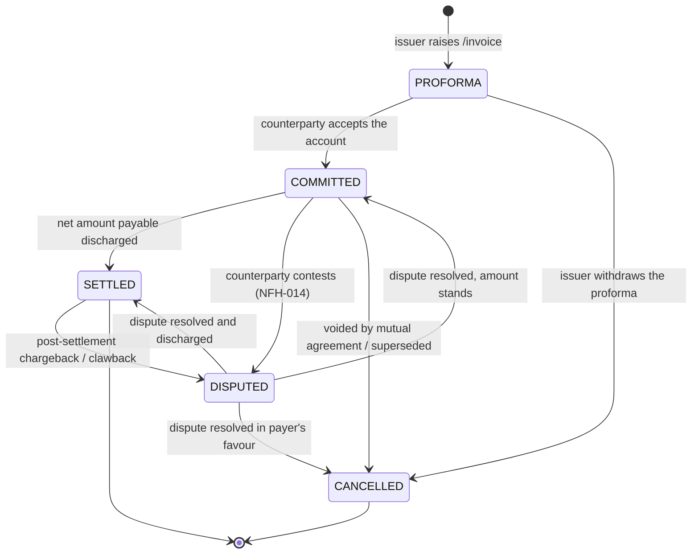

# Invoicing and Settlements

## Document Details

| Field | Value |
|---|---|
| **ID** | NFH-015 |
| **Publication Status** | Draft |
| **Authors** | [Ravi Prakash](https://github.com/ravi-prakash-v), [Networks for Humanity](https://networksforhumanity.org) |
| **Created** | 2026-06-03 |
| **Updated** | 2026-06-03 |
| **Version history** | Draft-01 (2026-06-03): Initial publication as `Payments_and_Settlements.md`. Draft-02 (2026-06-03): Renamed to `Invoicing_and_Settlements.md`; reframed settlement as bilateral invoicing with the `/invoice` and `/on_invoice` endpoints and the canonical `Invoice` and `PriceSpecification` schemas; generalized `/status`, `/update`, and `/cancel` to carry a contract, invoice, or dispute. |
| **Latest editor's draft** | This document |
| **Implementation report** | Not available. This document is at Initial Draft status; report will be linked in the next formal release of this RFC, following merge to main. |
| **Stress test report** | Not available. This document is at Initial Draft status; report will be linked in the next formal release of this RFC, following merge to main. |
| **Conformance impact** | Not determined. This document is at Initial Draft status; impact will be classified in the next formal release of this RFC, following merge to main. |
| **Security/privacy implications** | To be documented. Invoice records reference payment instruments, amounts, and party identities; handling, non-repudiation, and retention implications will be classified before this RFC advances to Candidate. |
| **Replaces / Relates to** | Relates to [NFH-006 — Beckn API Endpoints](./API.md) · [NFH-013 — Communication Protocol](./Communication_Protocol.md) · [NFH-014 — Resolving Disputes](./Resolving_Disputes.md). |
| **Feedback** | See subheadings below. |
| **Errata** | To be published. |

### Feedback

#### Issues

- [Open issues labelled NFH-015](https://github.com/beckn/protocol-specifications-v2/issues?q=is%3Aissue+label%3A%22NFH-015%22)

#### Discussions

- [GitHub Discussions labelled NFH-015](https://github.com/beckn/protocol-specifications-v2/discussions?discussions_q=label%3A%22NFH-015%22)

#### Pull Requests

- [Pull requests labelled NFH-015](https://github.com/beckn/protocol-specifications-v2/pulls?q=is%3Apr+label%3A%22NFH-015%22)

---

## Abstract

This document defines how value owed between network participants is settled by exchanging an `Invoice`: a statement raised by one participant to another that records, against one or more orders, the amounts owed between a payee and a payer and resolves to a net amount payable. It specifies the `/invoice` and `/on_invoice` endpoints, the `Invoice` lifecycle, and how invoice state is queried and managed through the existing `/status`, `/update`, and `/cancel` exchanges.

## Table of Contents

- [Invoicing and Settlements](#invoicing-and-settlements)
  - [Document Details](#document-details)
  - [Abstract](#abstract)
  - [Table of Contents](#table-of-contents)
  - [Context](#context)
  - [Specification](#specification)
    - [Definitions](#definitions)
    - [Normative Requirements](#normative-requirements)
      - [Invoice lifecycle](#invoice-lifecycle)
      - [Endpoints](#endpoints)
      - [Data model](#data-model)
    - [Conformance Requirements](#conformance-requirements)
    - [Cross-cutting considerations](#cross-cutting-considerations)
    - [Migration Notes](#migration-notes)
    - [Examples](#examples)
      - [Example 1 — PN raises an invoice for an order; CN commits](#example-1--pn-raises-an-invoice-for-an-order-cn-commits)
      - [Example 2 — CN raises a buyer-finder-fee invoice; state queried via /status](#example-2--cn-raises-a-buyer-finder-fee-invoice-state-queried-via-status)
  - [Conclusion](#conclusion)
    - [Open Questions](#open-questions)
  - [Acknowledgements](#acknowledgements)
  - [References](#references)

## Context

A confirmed Beckn contract records the agreed consideration, but value does not always move in a single, direct payment between the two transacting parties. In a multi-leg network, money may route through delivery agents, escrow services, and finder-fee arrangements; a consumer node may collect payment and remit it to a provider while retaining a fee; a provider may owe a refund or a buyer-finder fee back to the consumer node; and settlement may be deferred and netted across many orders on a `T+x` or end-of-month cycle.

Beckn v2 lacks a first-class, interoperable mechanism for stating and discharging such balances. This RFC introduces **invoicing**: a network participant raises an `Invoice` against a counterparty stating, per order, the amounts owed between a **payee** and a **payer** and the resulting net amount payable. **Any NP MAY raise an invoice against any other NP** — what an invoice is raised for is not coupled to who raises it. A PN typically raises an invoice for the orders placed with it; a CN MAY raise a *separate* invoice for an agreed buyer-finder fee. An invoice MAY be raised any number of times to reflect a running account.

> **This document is a DRAFT STUB.** The `/invoice` and `/on_invoice` endpoints and the `Invoice` schema are introduced as stubs in `api/v2.0.0/beckn.yaml` and are subject to change before release. The `Invoice` and `PriceSpecification` schemas mirror the canonical Beckn schemas at `https://schema.beckn.io/Invoice/v2.1` and `https://schema.beckn.io/PriceSpecification/v2.1`.

## Specification

The key words "MUST", "MUST NOT", "REQUIRED", "SHALL", "SHALL NOT", "SHOULD", "SHOULD NOT", "RECOMMENDED", "MAY", and "OPTIONAL" in this document are to be interpreted as described [here](./Keyword_Definitions.md). These definitions aim to ensure that the terms are understood precisely and consistently to avoid confusion in the interpretation of standards, specifications, and protocols.

### Definitions

- **Normative:** Requirements that define conformance and interoperability behavior.
- **Informative:** Explanatory guidance that does not by itself define conformance.
- **Invoice:** A statement raised by one network participant to another recording, against one or more orders, the amounts owed between a payee and a payer and resolving to a net amount payable.
- **Issuer:** The network participant (CN or PN) that raises an invoice by calling `/invoice`. Any NP MAY be the issuer of an invoice against any other NP.
- **Payee:** The participant to be paid — the creditor of the account.
- **Payer:** The participant that owes the net amount.
- **Cost-breakup line item:** A `PriceSpecification` within `costBreakup`. Typically one line item per order (referenced by its `contractId`) carrying that order's total; a line item not tied to a specific order — such as an agreed buyer-finder fee — omits `contractId` (or references a separate contract between the parties).
- **Net amount payable:** The signed sum of the `costBreakup` line-item values, from the payee's perspective (positive = owed to the payee).
- **Embedded settlement intent:** The per-`Consideration` `Settlement` record carried inside `Contract.settlements[]` (seeded during `/confirm`), expressing the expectation that a consideration is to be discharged. It is distinct from the first-class `Invoice` that states and discharges value.
- **Conformance impact:** Not determined. This document is at Initial Draft status; impact will be classified in the next formal release of this RFC, following merge to main.
- **Migration notes:** Operational guidance required to adopt the change safely.
- **Errata:** Post-publication corrections and clarifications.

### Normative Requirements

#### Invoice lifecycle

An `Invoice` progresses through the states `PROFORMA`, `COMMITTED`, `SETTLED`, `CANCELLED`, and `DISPUTED`, carried in `Invoice.status.code`. The permitted transitions are shown below.



- **PROFORMA** — a preliminary, non-binding statement. The issuer MAY revise and re-raise it.
- **COMMITTED** — the counterparty has accepted the stated account as a binding obligation; the net amount is owed.
- **SETTLED** — the net amount payable has been discharged.
- **CANCELLED** — the invoice has been withdrawn (from `PROFORMA`) or voided after commitment (for example, superseded by a corrected invoice). Terminal.
- **DISPUTED** — the invoice is contested; it mirrors an open `Dispute` case (see [NFH-014](./Resolving_Disputes.md)) referenced by `Invoice.disputeId`.

The issuer asserts `PROFORMA` (and withdrawal to `CANCELLED`); the counterparty asserts `COMMITTED`, `SETTLED`, and `DISPUTED` via `/on_invoice`. Either party MAY drive a `COMMITTED` invoice to `CANCELLED` by mutual agreement. Failures, refunds, and reversals beyond a single chargeback are expressed as new line items or new invoices rather than additional lifecycle states.

#### Endpoints

- **`/invoice` (POST)** — the issuing NP raises an invoice by submitting an `InvoiceAction` carrying the `Invoice`, whose `costBreakup` reflects the stated account. Any NP — CN or PN — MAY be the issuer.
- **`/on_invoice` (POST)** — the counterparty NP returns the updated `Invoice` via an `OnInvoiceAction`, reflecting its acknowledgement, commitment, settlement, dispute, or cancellation. The counterparty MAY also send proactive `/on_invoice` callbacks when invoice status changes asynchronously.

Both follow the asynchronous request/callback pattern of [NFH-013](./Communication_Protocol.md): the receiver returns a synchronous `Ack`, then delivers the callback in a separate session, and the issuer correlates it using `context.messageId`. Both endpoints are defined in the canonical OpenAPI contract; see [NFH-006](./API.md).

The current state of an invoice is **not** polled through a bespoke endpoint. The `StatusAction`, `OnStatusAction`, `UpdateAction`, `OnUpdateAction`, `CancelAction`, and `OnCancelAction` schemas each carry `anyOf { contract | invoice | dispute }`, so an `Invoice` (like a `Dispute`) MAY be queried via `/status`, mutated via `/update`, or withdrawn via `/cancel` using the existing exchanges.

#### Data model

The invoice exchange introduces the first-class **`Invoice`** and **`PriceSpecification`** schemas (mirroring the canonical Beckn schemas) and reuses `Participant`, `Descriptor`, `Attributes`, and `Contract`. The authoritative field definitions live in `api/v2.0.0/beckn.yaml`; the table below summarises the semantics.

| Field | Semantics | Cardinality |
|---|---|---|
| `id` | Stable invoice identifier (system id). The **same** `id` MUST be reused when re-raising a running account; a new `id` denotes a distinct invoice. | REQUIRED |
| `number` | Human-visible invoice number. | REQUIRED |
| `issueDate` | Date the invoice was issued. | REQUIRED |
| `dueDate` | Date the net amount is due, when applicable. | OPTIONAL |
| `status` | `Descriptor` whose `code` MUST be one of `PROFORMA`, `COMMITTED`, `SETTLED`, `CANCELLED`, `DISPUTED`. | OPTIONAL (issuer-asserted `PROFORMA` by default) |
| `payee` | The `Participant` to be paid. Rich identity (Provider, Consumer, Person, Organization) is carried in `payee.participantAttributes`. | REQUIRED |
| `payer` | The `Participant` that owes the net amount; rich identity in `payer.participantAttributes`. | REQUIRED |
| `costBreakup[]` | Line items, each a `PriceSpecification`; one per order (via `contractId`) carrying that order's total, plus any non-order line items (e.g. a buyer-finder fee). Values are signed from the payee's perspective. | REQUIRED on `/invoice`, ≥ 1 |
| `disputeId` | When `status` is `DISPUTED`, references the open `Dispute` case. | CONDITIONAL |
| `invoiceAttributes` | Attribute pack — tax regime (GST/VAT), e-invoice refs, settlement window (`T+x`, end-of-month), legal boilerplate. | OPTIONAL |

A `PriceSpecification` line item carries `value` (signed total), `currency`, an optional `contractId` (the order it concerns), and optional typed `components` (`UNIT`, `TAX`, `DELIVERY`, `DISCOUNT`, `FEE`, `SURCHARGE`). A buyer-finder fee that is **part of an order's terms** appears as a `FEE` component within that order's line item; a buyer-finder fee that is a **fixed amount agreed between the CN and PN** appears as its own line item with no `contractId` (or one referencing a separate CN↔PN contract).

The first-class `Invoice` **coexists** with the embedded settlement intent: `Contract.settlements[]` continues to record the per-`Consideration` expectation that value will be discharged, while the `Invoice` is the instrument that states and discharges it. Each order line item references back to its `contractId`, keeping every invoice — including bulk and netted ones — auditable to the orders it covers.

### Conformance Requirements

| ID | Requirement | Level |
|---|---|---|
| CON-015-01 | An `/invoice` request MUST carry an `InvoiceAction` whose `Invoice` has `id`, `number`, `issueDate`, `payee`, `payer`, and a `costBreakup` with at least one line item. | MUST |
| CON-015-02 | A `costBreakup` line item that concerns a specific order MUST reference it via `contractId`; a line item not tied to a specific order (for example an agreed buyer-finder fee) MAY omit `contractId` or reference a separate contract between the parties. | MUST |
| CON-015-03 | `Invoice.status.code` MUST be one of `PROFORMA`, `COMMITTED`, `SETTLED`, `CANCELLED`, `DISPUTED`. | MUST |
| CON-015-04 | An `Invoice` status change MUST follow a permitted transition of the invoice lifecycle state machine. | MUST |
| CON-015-05 | The counterparty NP SHOULD respond to an `/invoice` request with an `/on_invoice` callback carrying the updated `Invoice`, correlated via `context.messageId`. | SHOULD |
| CON-015-06 | When `Invoice.status.code` is `DISPUTED`, the `Invoice` MUST carry a `disputeId` referencing an open `Dispute` (NFH-014). | MUST |
| CON-015-07 | A re-raised invoice MUST reuse the original `id`; an `Invoice` bearing a new `id` MUST be treated as a distinct invoice. | MUST |
| CON-015-08 | Any NP MAY act as the issuer of an invoice against any other NP. The issuer MUST set `payee` and `payer` to reflect the direction in which the net amount is owed, independent of which NP issued the invoice. | MUST |
| CON-015-09 | `costBreakup` line-item `value`s MUST be signed from the payee's perspective — positive when owed to the payee, negative when owed by the payee. | MUST |
| CON-015-10 | The net amount payable SHOULD equal the signed sum of the `costBreakup` line-item values. | SHOULD |
| CON-015-11 | An NP MAY query or manage an invoice's state via `/status`, `/update`, or `/cancel` by carrying an `invoice` (with an `id`) in the respective action; the responder MUST reply on the corresponding `/on_*` endpoint carrying the `Invoice`. | MAY |

### Cross-cutting considerations

_Security and privacy._ Invoices reference payment-instrument detail, monetary amounts, and party identities. Authentication and signing follow [NFH-004](./Authentication_and_Trust.md): an `/invoice` request is signed by the issuing NP; an `/on_invoice` callback is signed by the counterparty NP using the callback signature that chains to the originating request. Non-repudiation of committed invoices, access control over line-item and party detail, and retention of settled and disputed invoices are to be documented before this RFC advances to Candidate. Identity and instrument detail carried in `participantAttributes`/`invoiceAttributes` SHOULD be minimised to what the counterparty requires to settle.

### Migration Notes

The `/invoice` and `/on_invoice` endpoints and the `Invoice`/`PriceSpecification` schemas are additive; existing implementations are unaffected until they adopt invoicing. The embedded `Settlement` schema in `Contract.settlements[]` is retained unchanged, so the `/confirm` flow is not affected. The generalization of `StatusAction`, `OnStatusAction`, `UpdateAction`, `OnUpdateAction`, `CancelAction`, and `OnCancelAction` to `anyOf { contract | invoice | dispute }` is backward compatible: a message carrying only a `contract` remains valid.

### Examples

> The following examples are **informative**. They are validated against `api/v2.0.0/beckn.yaml`.

#### Example 1 — PN raises an invoice for an order; CN commits

The provider node (`pn.example.org`) raises an invoice to the consumer node (`cn.example.org`) for confirmed order `ord-7781`. The single line item references the order via `contractId` and breaks its total down into goods and tax. The net amount payable (the signed sum of line items) is owed by the payer (CN) to the payee (PN).

```mermaid
sequenceDiagram
    participant P as Issuer = Payee (PN)
    participant C as Counterparty = Payer (CN)
    P->>C: POST /invoice (PROFORMA)
    C-->>P: 200 Ack
    Note over P,C: asynchronous gap
    C->>P: POST /on_invoice (COMMITTED)
    P-->>C: 200 Ack
    Note over P,C: net amount discharged on the rail; later /on_invoice carries SETTLED
```

**`/invoice` request (Issuer/PN → CN):**

```json
{
  "context": {
    "version": "2.0.0",
    "action": "invoice",
    "transactionId": "3f6c2b1e-9a4d-4c7e-bf2a-1d5e8c0a7b34",
    "messageId": "8d2a7c44-5b1f-4e9a-9c3d-6f0b2e1a4d77",
    "networkId": "acmenet.org/retail",
    "timestamp": "2026-06-03T12:00:00Z",
    "bapId": "cn.example.org",
    "bapUri": "https://cn.example.org/beckn",
    "bppId": "pn.example.org",
    "bppUri": "https://pn.example.org/beckn",
    "ttl": "PT30S"
  },
  "message": {
    "invoice": {
      "id": "c1a9f0e2-7d83-4b6a-9e51-2c4f8a0b1d63",
      "number": "INV-2026-06-0042",
      "issueDate": "2026-06-03",
      "dueDate": "2026-06-05",
      "status": { "code": "PROFORMA", "name": "Proforma" },
      "payee": {
        "id": "pn.example.org",
        "descriptor": { "name": "TechMart Provider Node" },
        "participantAttributes": {
          "@context": "https://schemas.becknprotocol.io/contexts/finance.jsonld",
          "@type": "schema:Organization",
          "legalName": "TechMart Pvt Ltd",
          "gstin": "29ABCDE1234F1Z5"
        }
      },
      "payer": {
        "id": "cn.example.org",
        "descriptor": { "name": "ShopBuddy Consumer Node" }
      },
      "costBreakup": [
        {
          "contractId": "a7e1d9c3-4f02-4a8b-8c61-9b3e5d2f1a08",
          "currency": "INR",
          "value": 1000,
          "components": [
            { "type": "UNIT", "value": 950, "currency": "INR", "description": "Goods" },
            { "type": "TAX", "value": 50, "currency": "INR", "description": "GST 5%" }
          ]
        }
      ],
      "invoiceAttributes": {
        "@context": "https://schemas.becknprotocol.io/contexts/finance.jsonld",
        "@type": "beckn:InvoiceAttributes",
        "settlementWindow": "T+2",
        "taxRegime": "IN-GST"
      }
    }
  }
}
```

**Synchronous `Ack` (CN → PN, same session):**

```json
{
  "context": {
    "action": "invoice",
    "messageId": "8d2a7c44-5b1f-4e9a-9c3d-6f0b2e1a4d77"
  },
  "message": {
    "status": "ACK",
    "messageId": "8d2a7c44-5b1f-4e9a-9c3d-6f0b2e1a4d77"
  }
}
```

**`/on_invoice` callback (CN → PN, separate session) — accepts the account:**

```json
{
  "context": {
    "version": "2.0.0",
    "action": "on_invoice",
    "transactionId": "3f6c2b1e-9a4d-4c7e-bf2a-1d5e8c0a7b34",
    "messageId": "8d2a7c44-5b1f-4e9a-9c3d-6f0b2e1a4d77",
    "networkId": "acmenet.org/retail",
    "timestamp": "2026-06-03T12:00:03Z",
    "bapId": "cn.example.org",
    "bapUri": "https://cn.example.org/beckn",
    "bppId": "pn.example.org",
    "bppUri": "https://pn.example.org/beckn"
  },
  "message": {
    "invoice": {
      "id": "c1a9f0e2-7d83-4b6a-9e51-2c4f8a0b1d63",
      "number": "INV-2026-06-0042",
      "issueDate": "2026-06-03",
      "status": { "code": "COMMITTED", "name": "Committed" },
      "payee": { "id": "pn.example.org", "descriptor": { "name": "TechMart Provider Node" } },
      "payer": { "id": "cn.example.org", "descriptor": { "name": "ShopBuddy Consumer Node" } },
      "costBreakup": [
        { "contractId": "a7e1d9c3-4f02-4a8b-8c61-9b3e5d2f1a08", "currency": "INR", "value": 1000 }
      ]
    }
  }
}
```

The issuer correlates this callback to its pending `invoice` operation using `messageId = "8d2a7c44-5b1f-4e9a-9c3d-6f0b2e1a4d77"`. A later proactive `/on_invoice` (a fresh `messageId`, same `transactionId`) carries `status.code = "SETTLED"` once the net amount is discharged.

#### Example 2 — CN raises a buyer-finder-fee invoice; state queried via /status

The buyer-finder fee is a fixed amount agreed between the CN and PN, **not** part of any single order's terms. So the **consumer node raises its own invoice** — issuer and payee are the CN, payer is the PN — netting June's fee across 12 orders into one end-of-month line item with **no `contractId`**.

**`/invoice` request (Issuer/CN → PN):**

```json
{
  "context": {
    "version": "2.0.0",
    "action": "invoice",
    "transactionId": "9e2d4a10-3b6c-4f81-a0d2-7c5e1b8f6a23",
    "messageId": "1a7c9b35-2e64-4d8a-9f01-3b6e2c4a5d88",
    "networkId": "acmenet.org/retail",
    "timestamp": "2026-06-30T18:00:00Z",
    "bapId": "cn.example.org",
    "bapUri": "https://cn.example.org/beckn",
    "bppId": "pn.example.org",
    "bppUri": "https://pn.example.org/beckn",
    "ttl": "PT30S"
  },
  "message": {
    "invoice": {
      "id": "d4b8f1a0-6c27-4e93-8a15-0f2d7b9c3e51",
      "number": "BFF-2026-06-0007",
      "issueDate": "2026-06-30",
      "dueDate": "2026-07-02",
      "status": { "code": "PROFORMA", "name": "Proforma" },
      "payee": { "id": "cn.example.org", "descriptor": { "name": "ShopBuddy Consumer Node" } },
      "payer": { "id": "pn.example.org", "descriptor": { "name": "TechMart Provider Node" } },
      "costBreakup": [
        {
          "currency": "INR",
          "value": 240,
          "components": [
            { "type": "FEE", "value": 240, "currency": "INR", "description": "Buyer-finder fee — June 2026, 12 orders @ INR 20" }
          ]
        }
      ],
      "invoiceAttributes": {
        "@context": "https://schemas.becknprotocol.io/contexts/finance.jsonld",
        "@type": "beckn:InvoiceAttributes",
        "settlementWindow": "end-of-month",
        "period": "2026-06"
      }
    }
  }
}
```

Later, the issuer polls the invoice's current state using the generalized `/status` exchange, carrying an `invoice` (not a `contract`) in the `StatusAction`.

**`/status` request (CN → PN):**

```json
{
  "context": {
    "version": "2.0.0",
    "action": "status",
    "transactionId": "9e2d4a10-3b6c-4f81-a0d2-7c5e1b8f6a23",
    "messageId": "5c0e2a17-8b43-4f6d-9a2c-1e7b3d6f0a99",
    "networkId": "acmenet.org/retail",
    "timestamp": "2026-07-03T09:00:00Z",
    "bapId": "cn.example.org",
    "bapUri": "https://cn.example.org/beckn",
    "bppId": "pn.example.org",
    "bppUri": "https://pn.example.org/beckn"
  },
  "message": {
    "invoice": {
      "id": "d4b8f1a0-6c27-4e93-8a15-0f2d7b9c3e51",
      "number": "BFF-2026-06-0007",
      "issueDate": "2026-06-30",
      "payee": { "id": "cn.example.org" },
      "payer": { "id": "pn.example.org" }
    }
  }
}
```

**`/on_status` callback (PN → CN) — invoice now settled:**

```json
{
  "context": {
    "version": "2.0.0",
    "action": "on_status",
    "transactionId": "9e2d4a10-3b6c-4f81-a0d2-7c5e1b8f6a23",
    "messageId": "5c0e2a17-8b43-4f6d-9a2c-1e7b3d6f0a99",
    "networkId": "acmenet.org/retail",
    "timestamp": "2026-07-03T09:00:01Z",
    "bapId": "cn.example.org",
    "bapUri": "https://cn.example.org/beckn",
    "bppId": "pn.example.org",
    "bppUri": "https://pn.example.org/beckn"
  },
  "message": {
    "invoice": {
      "id": "d4b8f1a0-6c27-4e93-8a15-0f2d7b9c3e51",
      "number": "BFF-2026-06-0007",
      "issueDate": "2026-06-30",
      "status": { "code": "SETTLED", "name": "Settled" },
      "payee": { "id": "cn.example.org", "descriptor": { "name": "ShopBuddy Consumer Node" } },
      "payer": { "id": "pn.example.org", "descriptor": { "name": "TechMart Provider Node" } },
      "costBreakup": [
        { "currency": "INR", "value": 240, "components": [ { "type": "FEE", "value": 240, "currency": "INR" } ] }
      ]
    }
  }
}
```

## Conclusion

This RFC reframes settlement as **invoicing**: a network participant raises an `Invoice` stating, per order, the amounts owed between a payee and a payer and the net amount payable, and the two parties drive it from `PROFORMA` through `COMMITTED` to `SETTLED`, with `CANCELLED` and `DISPUTED` exits. Because issuer, payee, and payer are independent, any NP can invoice any other — a PN for its orders, a CN for a buyer-finder fee — and multi-leg settlement is composed from a mesh of such invoices. The proposal advances to Candidate once the security/privacy classification, the dispute-linkage rules with NFH-014, and an implementation report are complete.

### Open Questions

1. Should a corrective invoice that supersedes a `DISPUTED` or `SETTLED` invoice carry an explicit `supersedesInvoiceId` link, or is reuse of the original `id` sufficient?
2. Should the status field be promoted into the canonical `Invoice` schema at `schema.beckn.io`, or remain a protocol-layer extension defined by this RFC?
3. For periodic (`T+x` / end-of-month) netting across many orders, should each `costBreakup` line item be required to reference its order's `contractId`, or is a single aggregate line item (as in Example 2) acceptable?

## Acknowledgements

> Acknowledge contributors, reviewers, working groups, and implementers whose feedback informed this RFC.

## References
- **Governance:** Click [here](../GOVERNANCE.md).
- **Keyword definitions:** Click [here](./Keyword_Definitions.md).
- **Beckn API Endpoints:** [NFH-006](./API.md).
- **Communication Protocol:** [NFH-013](./Communication_Protocol.md).
- **Authentication and Trust:** [NFH-004](./Authentication_and_Trust.md).
- **Resolving Disputes:** [NFH-014](./Resolving_Disputes.md).
- **Canonical schemas:** [Invoice v2.1](https://schema.beckn.io/Invoice/v2.1), [PriceSpecification v2.1](https://schema.beckn.io/PriceSpecification/v2.1).
- **Additional references:** _Add any external standards, prior art, or related RFCs here._
</content>
