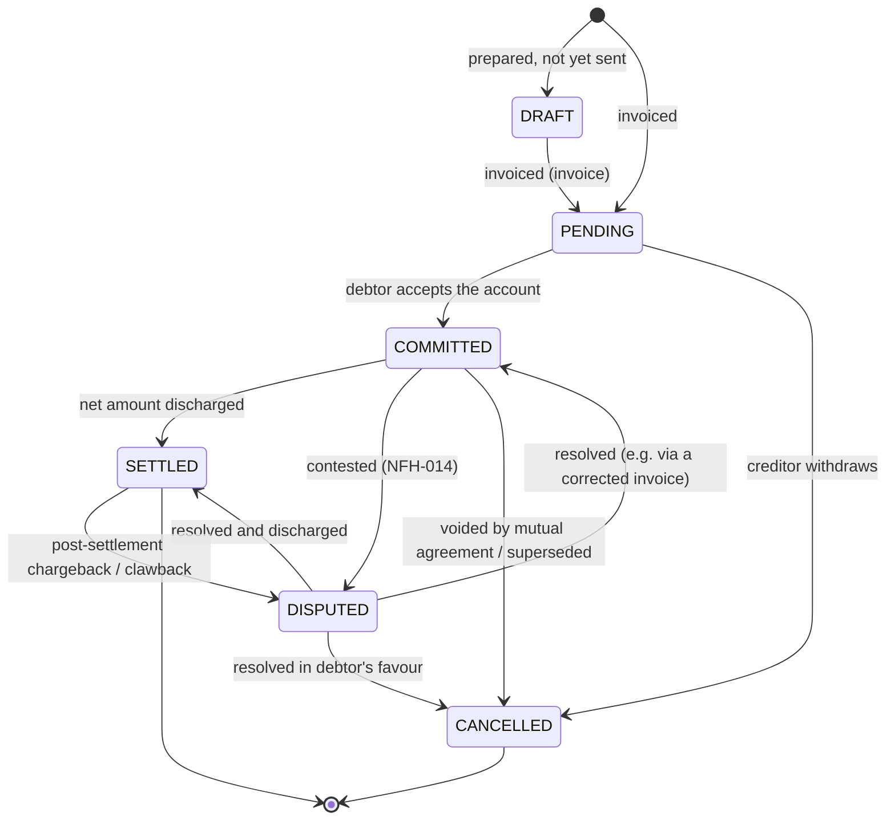
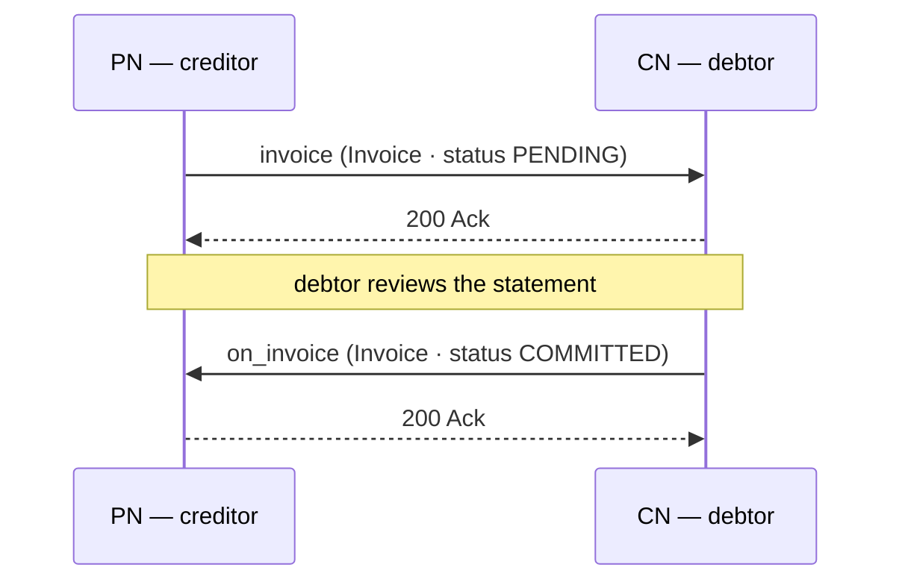
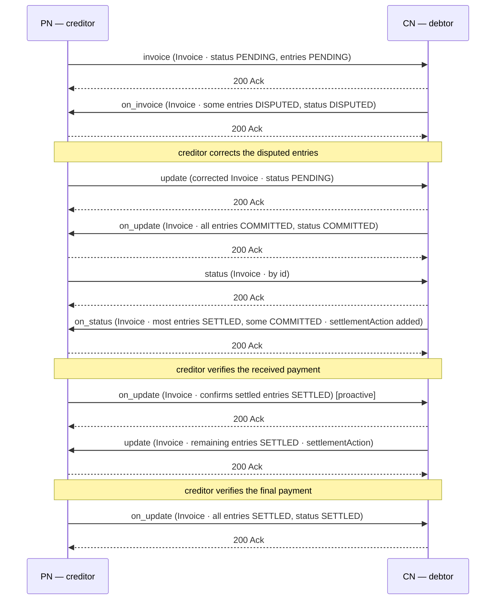

# Invoicing and Settlements

## Document Details

| Field | Value |
|---|---|
| **ID** | NFH-015 |
| **Publication Status** | Draft |
| **Authors** | [Ravi Prakash](https://github.com/ravi-prakash-v), [Networks for Humanity](https://networksforhumanity.org) |
| **Created** | 2026-06-03 |
| **Updated** | 2026-06-04 |
| **Version history** | Draft-01 (2026-06-03): Initial publication as `Payments_and_Settlements.md`. Draft-02 (2026-06-03): Renamed to `Invoicing_and_Settlements.md`; reframed settlement as bilateral invoicing with the `invoice` and `on_invoice` endpoints and the canonical `Invoice` and `PriceSpecification` schemas; generalized `status`, `update`, and `cancel` to carry a contract, invoice, or dispute. Draft-03 (2026-06-04): Aligned to canonical `Invoice` v2.2 — `creditor`/`debtor` (Participant), `issuedAt`, `statement` of `{ consideration, amount }` entries, `total`, `settlementAction` (PaymentAction); status codes `DRAFT`/`PENDING`/`COMMITTED`/`SETTLED`/`CANCELLED`/`DISPUTED`. Draft-04 (2026-06-04): Positioned `invoice`/`on_invoice` as verbs; added the Workflows section with sequence diagrams and worked accept and dispute-correct-settle scenarios. |
| **Latest editor's draft** | This document |
| **Implementation report** | Not available. This document is at Initial Draft status; report will be linked in the next formal release of this RFC, following merge to main. |
| **Stress test report** | Not available. This document is at Initial Draft status; report will be linked in the next formal release of this RFC, following merge to main. |
| **Conformance impact** | Not determined. This document is at Initial Draft status; impact will be classified in the next formal release of this RFC, following merge to main. |
| **Security/privacy implications** | To be documented. Invoice records reference payment instruments, amounts, and party identities; handling, non-repudiation, and retention implications will be classified before this RFC advances to Candidate. |
| **Replaces / Relates to** | Relates to [NFH-006 — Beckn API Endpoints](./API.md) · [NFH-013 — Communication Protocol](./Communication_Protocol.md) · [NFH-014 — Resolving Disputes](./Resolving_Disputes.md). |
| **Feedback** | See subheadings below. |
| **Errata** | To be published. |

### Feedback

#### Issues

- [Open issues labelled NFH-015](https://github.com/beckn/protocol-specifications-v2/issues?q=is%3Aissue+label%3A%22NFH-015%22)

#### Discussions

- [GitHub Discussions labelled NFH-015](https://github.com/beckn/protocol-specifications-v2/discussions?discussions_q=label%3A%22NFH-015%22)

#### Pull Requests

- [Pull requests labelled NFH-015](https://github.com/beckn/protocol-specifications-v2/pulls?q=is%3Apr+label%3A%22NFH-015%22)

---

## Abstract

This document defines how value owed between network participants is settled by **invoicing**: one NP *invoices* another by calling the `invoice` endpoint, submitting an `Invoice` — a financial statement from a creditor to a debtor that itemises the amounts owed — and the counterparty responds by calling `on_invoice`. It specifies the `invoice` and `on_invoice` verbs, the `Invoice` lifecycle, the itemised `statement`, the agreed `settlementTerms`, and the `settlementAction` proofs that discharge the amount due, and shows how the invoice is then committed, corrected, queried, settled, disputed, or cancelled through the `update`, `status`, and `cancel` exchanges.

## Table of Contents

- [Invoicing and Settlements](#invoicing-and-settlements)
  - [Document Details](#document-details)
  - [Abstract](#abstract)
  - [Table of Contents](#table-of-contents)
  - [Context](#context)
  - [Specification](#specification)
    - [Definitions](#definitions)
    - [Normative Requirements](#normative-requirements)
      - [Invoice lifecycle](#invoice-lifecycle)
      - [Endpoints](#endpoints)
      - [Workflows](#workflows)
      - [Data model](#data-model)
    - [Conformance Requirements](#conformance-requirements)
    - [Cross-cutting considerations](#cross-cutting-considerations)
    - [Migration Notes](#migration-notes)
    - [Examples](#examples)
      - [Example 1 — PN invoices the CN; CN commits](#example-1--pn-invoices-the-cn-cn-commits)
      - [Example 2 — Disputed, corrected, and settled](#example-2--disputed-corrected-and-settled)
      - [Example 3 — CN invoices the PN for finder fees across many contracts](#example-3--cn-invoices-the-pn-for-finder-fees-across-many-contracts)
      - [Example 4 — Discovery Node invoices the CN for discovery services](#example-4--discovery-node-invoices-the-cn-for-discovery-services)
  - [Conclusion](#conclusion)
    - [Open Questions](#open-questions)
  - [Acknowledgements](#acknowledgements)
  - [References](#references)

## Context

A confirmed Beckn contract records the agreed consideration, but value does not always move in a single, direct payment between the two transacting parties. In a multi-leg network, money may route through delivery agents, escrow services, and finder-fee arrangements; a consumer node may collect payment and remit it to a provider while retaining a fee; a provider may owe a refund or a buyer-finder fee back to the consumer node; and settlement may be deferred and netted across many orders on a `T+x` or end-of-month cycle.

This RFC upgrades Beckn v2 with **invoicing** — a first-class, interoperable way to state and discharge such balances: **one NP invoices another by calling `invoice` on it**. The NP that invokes `invoice` is billing the counterparty — it is the **creditor** (owed the net amount) and the counterparty is the **debtor** (who owes it). The `Invoice` object it carries is a financial statement that itemises the billed entries and records how they settle. **Any NP MAY invoice any other NP** — a PN typically invoices the CN for the orders placed with it, while a CN MAY invoice the PN for an agreed buyer-finder fee. Once the invoice exists, either party drives it forward — committing, correcting, querying, settling, disputing, or cancelling — through `on_invoice` and the generalized `update`, `status`, and `cancel` exchanges.

> The `invoice` and `on_invoice` endpoints and the `Invoice`, `PriceSpecification`, `SettlementTerm`, and `PaymentAction` schemas are defined in `api/v2.0.0/beckn.yaml` and mirror the canonical Beckn schemas at `https://schema.beckn.io/Invoice/v2.2`, `.../PriceSpecification/v2.1`, `.../SettlementTerm/v2.0`, and `.../PaymentAction/v2.0`.

## Specification

The key words "MUST", "MUST NOT", "REQUIRED", "SHALL", "SHALL NOT", "SHOULD", "SHOULD NOT", "RECOMMENDED", "MAY", and "OPTIONAL" in this document are to be interpreted as described [here](./Keyword_Definitions.md). These definitions aim to ensure that the terms are understood precisely and consistently to avoid confusion in the interpretation of standards, specifications, and protocols.

### Definitions

- **Normative:** Requirements that define conformance and interoperability behavior.
- **Informative:** Explanatory guidance that does not by itself define conformance.
- **To invoice (verb):** The act of billing a counterparty by calling the `invoice` endpoint on it, carrying an `Invoice`. The NP that invokes `invoice` is the creditor of that invoice; there is no separate "issuer" field on the object.
- **Invoice (noun):** The `Invoice` object exchanged — a financial statement issued by a creditor to a debtor that itemises the amounts owed and records how they are settled. It is an **independent** schema, not a specialisation of `Contract`.
- **Creditor:** The participant that is owed the net amount — the seller / provider. The party that invoices.
- **Debtor:** The participant the invoice is issued to and who owes the net amount — the consumer being billed.
- **Statement entry:** One line of the `statement` array, pairing a `Consideration` (the billed item) with its monetary `amount` (a `PriceSpecification`).
- **Billed item:** What a statement entry charges for — carried polymorphically inside the entry's `consideration.considerationAttributes` JSON-LD bag, identified by `@type` (e.g. `Contract`, `RetailOrder`, `DeliveryService`, `Commission`, `FinderFee`, `Adjustment`, `Refund`). A statement entry bills a *financial* item, not a product or service.
- **Total:** The net amount payable across all statement entries (`total`, a `PriceSpecification`).
- **Settlement terms:** The agreed terms under which the invoice is settled — amount, payment trigger, schedule, remittance account (`payTo`), and accepted methods — carried in `settlementTerms` (a `SettlementTerm`).
- **Settlement action:** A proof of settlement that discharges all or part of the invoice — one `PaymentAction` per payment event, supporting installments and partial payments (`settlementAction[]`).
- **Embedded settlement intent:** The per-`Consideration` `Settlement` record carried inside `Contract.settlements[]` (seeded during `/confirm`), expressing the expectation that a consideration is to be discharged. It is distinct from the first-class `Invoice` that states and discharges value.
- **Conformance impact:** Not determined. This document is at Initial Draft status; impact will be classified in the next formal release of this RFC, following merge to main.
- **Migration notes:** Operational guidance required to adopt the change safely.
- **Errata:** Post-publication corrections and clarifications.

### Normative Requirements

#### Invoice lifecycle

An `Invoice` progresses through the states `DRAFT`, `PENDING`, `COMMITTED`, `SETTLED`, `CANCELLED`, and `DISPUTED`, carried in `Invoice.status.code` (default `PENDING`). The permitted transitions are shown below.



- **DRAFT** — being prepared; not yet sent to the debtor.
- **PENDING** — invoiced and awaiting the debtor's acceptance (the default state once invoiced).
- **COMMITTED** — the debtor has accepted the stated account as a binding obligation; the net amount is owed.
- **SETTLED** — the net amount payable has been discharged (evidenced by `settlementAction` proofs).
- **CANCELLED** — withdrawn before commitment, or voided after commitment (for example, superseded by a corrected invoice). Terminal: a `CANCELLED` invoice MUST NOT be revived or modified with `update`. To re-bill, the creditor MUST **invoice the debtor afresh** via `invoice`/`on_invoice`, carrying a new `Invoice` with a new `id`.
- **DISPUTED** — the invoice is contested; it corresponds to an open `Dispute` case (see [NFH-014](./Resolving_Disputes.md)).

Each **statement entry** carries its own lifecycle in `consideration.status.code`, one of `PENDING`, `COMMITTED`, `DISPUTED`, `SETTLED` (default `PENDING`), updatable by either the creditor or the debtor — so individual billed entries may be committed, disputed, or settled independently while the invoice-level `status` reflects the account as a whole (for example, an invoice is `SETTLED` only once every entry is `SETTLED`).

**Disputed entries SHOULD NOT block settlement.** Because a `DISPUTED` entry drives the whole invoice to `DISPUTED`, a single contested entry can stall the discharge of the other, legitimate entries. Rather than leaving a contested entry sitting `DISPUTED` on the invoice, the contesting node SHOULD raise it as a separate `Dispute` through the `dispute`/`on_dispute` flow (see [NFH-014](./Resolving_Disputes.md)) and remove that entry from the invoice with `update`, so the remaining `PENDING`/`COMMITTED` entries are free to commit and settle on their own timeline. The dispute's resolution then feeds back as a corrective statement entry (for example a `Refund` or `Adjustment`) on the same invoice, or as a fresh invoice. A quick correction the parties can agree on inline (as in Workflow 2 below) MAY stay within the invoice; an unresolved disagreement SHOULD move to the dispute flow.

The creditor sets `DRAFT`/`PENDING` when it invoices (and MAY withdraw to `CANCELLED`); the debtor drives `COMMITTED`, `SETTLED`, and `DISPUTED` via `on_invoice`/`on_update`. Either party MAY drive a `COMMITTED` invoice to `CANCELLED` by mutual agreement. Failures, refunds, and reversals are expressed as new statement entries (e.g. an entry whose `consideration` is a `Refund`) or new invoices rather than additional lifecycle states.

#### Endpoints

`invoice` and `on_invoice` are **verbs**: an NP *invoices* a counterparty by calling `invoice` on it, and the counterparty responds by calling `on_invoice` back.

- **`invoice` (POST)** — invoked by an NP to **invoice** a counterparty: it submits an `InvoiceAction` carrying the `Invoice`, whose `statement` itemises the billed account. The caller is the **creditor** of that invoice (the party owed); the counterparty is the **debtor**. Any NP — CN or PN — MAY invoice any other.
- **`on_invoice` (POST)** — the debtor calls this back on the creditor, returning the updated `Invoice` (via an `OnInvoiceAction`) to acknowledge, commit, settle, dispute, or cancel the account, including any `settlementAction` proofs. It MAY also be sent proactively when invoice status changes asynchronously.

Once an invoice exists, **either party** MAY act on the shared `Invoice` through the generalized lifecycle endpoints, each of which carries `anyOf { contract | invoice | dispute }`:

- **`update` / `on_update`** — to revise the invoice and confirm the revision: the creditor corrects disputed entries, or the debtor marks entries `SETTLED` and attaches `settlementAction` proofs.
- **`status` / `on_status`** — to query the current state of an invoice by its `id` and return it.
- **`cancel` / `on_cancel`** — to withdraw or void an invoice.

All follow the asynchronous request/callback pattern of [NFH-013](./Communication_Protocol.md): the receiver returns a synchronous `Ack`, then delivers the callback in a separate session, and the caller correlates it using `context.messageId`. A receiver MAY send the corresponding `on_*` callback proactively (without a preceding request) to report an asynchronous state change. All endpoints are defined in the canonical OpenAPI contract; see [NFH-006](./API.md).

> **Endpoints are not actor-exclusive.** Because an invoice may originate from either side — a PN invoicing a CN, or a CN invoicing a PN — **both nodes MUST implement the full set of endpoints**: `invoice`/`on_invoice`, `update`/`on_update`, `status`/`on_status`, and `cancel`/`on_cancel`. This symmetry is not specific to invoicing (or to disputes); it holds protocol-wide, including the contracting lifecycle. Every action endpoint and its `on_*` callback MUST be implemented by **both** the CN and the PN, and a node MUST NOT assume it will only ever receive a given call or only ever originate it. See [NFH-006](./API.md).

#### Workflows

The two workflows below show how invoicing plays out end to end. Synchronous `Ack`s are shown; per NFH-013 each request is acknowledged before its callback is delivered in a separate session.

**Workflow 1 — Invoice accepted.** The creditor invoices the debtor; the debtor accepts, committing the account.



**Workflow 2 — Disputed, corrected, and settled.** The debtor disputes some entries; the creditor corrects them with `update`; the account is then committed, partially settled, and finally settled in full. `update`/`status` may be initiated by **either** party, and `on_*` callbacks may be sent proactively to confirm an observed state. This workflow shows a contested entry the parties resolve inline by correction; where a contested entry **cannot** be resolved so quickly, the contesting node SHOULD instead move it to the `dispute`/`on_dispute` flow so it does not block the rest (see the lifecycle recommendation above and CON-015-12).



#### Data model

The invoice exchange introduces the first-class **`Invoice`**, **`PriceSpecification`**, **`SettlementTerm`**, and **`PaymentAction`** schemas (mirroring the canonical Beckn schemas) and reuses `Participant`, `Consideration`, `Descriptor`, and `Attributes`. The authoritative field definitions live in `api/v2.0.0/beckn.yaml`; the table below summarises the semantics.

| Field | Semantics | Cardinality |
|---|---|---|
| `id` | Stable invoice identifier (system id, UUID). The **same** `id` MUST be reused when re-issuing a running account; a new `id` denotes a distinct invoice. | REQUIRED |
| `number` | Human-visible invoice number. | REQUIRED |
| `issuedAt` | Timestamp (date-time) at which the invoice was issued. | REQUIRED |
| `dueDate` | Date by which the amount is due for settlement. | OPTIONAL |
| `descriptor` | Human / agent readable description of the invoice. | OPTIONAL |
| `status` | A `Descriptor` whose `code` MUST be one of `DRAFT`, `PENDING`, `COMMITTED`, `SETTLED`, `CANCELLED`, `DISPUTED` (default `PENDING`). | OPTIONAL |
| `creditor` | The `Participant` owed the net amount (the party that invoices); rich identity in `creditor.participantAttributes`. | REQUIRED |
| `debtor` | The `Participant` that owes the net amount; rich identity in `debtor.participantAttributes`. | REQUIRED |
| `statement[]` | The itemised statement; each entry pairs a `Consideration` (billed item via `considerationAttributes.@type`, with its own `status`) and a monetary `amount` (`PriceSpecification`). | REQUIRED, ≥ 1 |
| `total` | The net amount payable across all statement entries (`PriceSpecification`). | OPTIONAL |
| `settlementTerms` | A `SettlementTerm` — `amount`, `paymentTrigger`, `settlementSchedule`, `payTo`, `acceptedPaymentMethods`. | OPTIONAL |
| `settlementAction[]` | `PaymentAction` proofs of discharge — one per payment event (installments / partial payments). | OPTIONAL |
| `invoiceAttributes` | Attribute pack — tax regime (GST/VAT), e-invoice refs, legal boilerplate. | OPTIONAL |

A statement entry's **billed item** is whatever its `consideration.considerationAttributes.@type` declares — a `Contract`/`RetailOrder` for the goods or service, a `FinderFee` or `Commission` for an intermediary fee, an `Adjustment` or `Refund` for a correction. This is how the same statement can mix an order charge, a fee, and a refund without any of them being a product or a resource.

The first-class `Invoice` **coexists** with the embedded settlement intent: `Contract.settlements[]` continues to record the per-`Consideration` expectation that value will be discharged, while the `Invoice` is the instrument that states and discharges it. A statement entry whose billed item references a `Contract` keeps the invoice auditable back to the orders it covers.

### Conformance Requirements

| ID | Requirement | Level |
|---|---|---|
| CON-015-01 | An `invoice` request MUST carry an `InvoiceAction` whose `Invoice` has `id`, `number`, `issuedAt`, `creditor`, `debtor`, and a `statement` with at least one entry. | MUST |
| CON-015-02 | Each `statement` entry MUST pair a `consideration` (whose `considerationAttributes` identifies the billed item by `@type`) with a monetary `amount` (a `PriceSpecification`). | MUST |
| CON-015-03 | `Invoice.status.code` MUST be one of `DRAFT`, `PENDING`, `COMMITTED`, `SETTLED`, `CANCELLED`, `DISPUTED`; when absent it defaults to `PENDING`. | MUST |
| CON-015-04 | Each statement entry's `consideration.status.code` MUST be one of `PENDING`, `COMMITTED`, `DISPUTED`, `SETTLED`; when absent it defaults to `PENDING`. | MUST |
| CON-015-05 | Invoice-level and entry-level status changes MUST follow a permitted transition of the invoice lifecycle. | MUST |
| CON-015-06 | The debtor SHOULD respond to an `invoice` request with an `on_invoice` callback carrying the updated `Invoice`, correlated via `context.messageId`. | SHOULD |
| CON-015-07 | A re-issued invoice MUST reuse the original `id`; an `Invoice` bearing a new `id` MUST be treated as a distinct invoice. | MUST |
| CON-015-08 | Any NP MAY invoice any other NP by calling `invoice`. The caller MUST be the `creditor` (the party owed) and MUST set `debtor` to the party that owes. | MUST |
| CON-015-09 | When `total` is present, it SHOULD equal the sum of the `statement` entry `amount` values. | SHOULD |
| CON-015-10 | Each `settlementAction` entry MUST be a `PaymentAction` carrying a `paymentStatus`; an invoice SHOULD NOT be marked `SETTLED` without at least one `settlementAction` evidencing discharge. | MUST |
| CON-015-11 | Either party MAY revise, query, or void a shared invoice by carrying it in `update`, `status`, or `cancel`; the responder MUST reply on the corresponding `on_*` endpoint carrying the `Invoice`. | MAY |
| CON-015-12 | A contested statement entry that cannot be resolved by inline correction SHOULD be removed from the invoice (via `update`) and pursued through the `dispute`/`on_dispute` flow ([NFH-014](./Resolving_Disputes.md)) rather than left `DISPUTED` on the invoice, so that disputed entries do not block settlement of the remaining entries. | SHOULD |
| CON-015-13 | A `CANCELLED` invoice MUST NOT be modified via `update`. To re-bill, the creditor MUST issue a new invoice via `invoice`/`on_invoice` carrying a new `id`. | MUST |

### Cross-cutting considerations

_Security and privacy._ Invoices reference payment-instrument detail (`settlementTerms.payTo`, `settlementAction`), monetary amounts, and party identities. Authentication and signing follow [NFH-004](./Authentication_and_Trust.md): an `invoice` request is signed by the calling NP; an `on_invoice` callback is signed by the responding NP using the callback signature that chains to the originating request. Non-repudiation of committed invoices and of `settlementAction` proofs, access control over statement and party detail, and retention of settled and disputed invoices are to be documented before this RFC advances to Candidate. Account and instrument detail in `payTo`/`participantAttributes`/`invoiceAttributes` SHOULD be minimised to what the counterparty requires to settle. A `DISPUTED` invoice corresponds to an [NFH-014](./Resolving_Disputes.md) `Dispute` case; the linkage mechanism between the two is to be finalised with NFH-014.

### Migration Notes

The `invoice` and `on_invoice` endpoints and the `Invoice`, `PriceSpecification`, `SettlementTerm`, and `PaymentAction` schemas are additive; existing implementations are unaffected until they adopt invoicing. The embedded `Settlement` schema in `Contract.settlements[]` is retained unchanged, so the `/confirm` flow is not affected. The generalization of `StatusAction`, `OnStatusAction`, `UpdateAction`, `OnUpdateAction`, `CancelAction`, and `OnCancelAction` to `anyOf { contract | invoice | dispute }` is backward compatible: a message carrying only a `contract` remains valid.

### Examples

> The following examples are **informative**. They are validated against `api/v2.0.0/beckn.yaml`. They realise the two workflows above; `context` envelopes follow [NFH-013](./Communication_Protocol.md).

#### Example 1 — PN invoices the CN; CN commits

The provider node (`pn.example.org`) **invoices** the consumer node (`cn.example.org`) for confirmed order `ord-7781` — `pn` is the creditor (owed), `cn` the debtor. The single statement entry bills a `RetailOrder` consideration and breaks its amount into goods and tax. The CN accepts by calling `on_invoice` with the account `COMMITTED`.

**`invoice` request (PN → CN):**

```json
{
  "context": {
    "version": "2.0.0",
    "action": "invoice",
    "transactionId": "3f6c2b1e-9a4d-4c7e-bf2a-1d5e8c0a7b34",
    "messageId": "8d2a7c44-5b1f-4e9a-9c3d-6f0b2e1a4d77",
    "networkId": "acmenet.org/retail",
    "timestamp": "2026-06-04T12:00:00Z",
    "bapId": "cn.example.org",
    "bapUri": "https://cn.example.org/beckn",
    "bppId": "pn.example.org",
    "bppUri": "https://pn.example.org/beckn",
    "ttl": "PT30S"
  },
  "message": {
    "invoice": {
      "id": "c1a9f0e2-7d83-4b6a-9e51-2c4f8a0b1d63",
      "number": "INV-2026-06-0042",
      "issuedAt": "2026-06-04T12:00:00Z",
      "dueDate": "2026-06-06",
      "descriptor": { "name": "Invoice for order ord-7781" },
      "status": { "code": "PENDING", "name": "Pending" },
      "creditor": {
        "id": "pn.example.org",
        "descriptor": { "name": "TechMart Provider Node" },
        "participantAttributes": {
          "@context": "https://schemas.becknprotocol.io/contexts/finance.jsonld",
          "@type": "schema:Organization",
          "legalName": "TechMart Pvt Ltd",
          "gstin": "29ABCDE1234F1Z5"
        }
      },
      "debtor": {
        "id": "cn.example.org",
        "descriptor": { "name": "ShopBuddy Consumer Node" }
      },
      "statement": [
        {
          "consideration": {
            "id": "cons-ord-7781",
            "status": { "code": "PENDING", "name": "Pending" },
            "considerationAttributes": {
              "@context": "https://schemas.becknprotocol.io/contexts/finance.jsonld",
              "@type": "RetailOrder",
              "contractId": "a7e1d9c3-4f02-4a8b-8c61-9b3e5d2f1a08",
              "orderNumber": "ord-7781"
            }
          },
          "amount": {
            "currency": "INR",
            "value": 1000,
            "components": [
              { "type": "UNIT", "value": 950, "currency": "INR", "description": "Goods" },
              { "type": "TAX", "value": 50, "currency": "INR", "description": "GST 5%" }
            ]
          }
        }
      ],
      "total": { "currency": "INR", "value": 1000 },
      "settlementTerms": {
        "amount": { "currency": "INR", "value": 1000 },
        "settlementStatus": "PENDING",
        "settlementSchedule": { "type": "RELATIVE", "schedule": "T+2" },
        "payTo": {
          "accountHolderName": "TechMart Pvt Ltd",
          "accountNumber": "000123456789",
          "branchCode": "HDFC0001234",
          "bankName": "HDFC Bank"
        },
        "acceptedPaymentMethods": ["BANK_TRANSFER"]
      }
    }
  }
}
```

**Synchronous `Ack` (CN → PN, same session):**

```json
{
  "context": { "action": "invoice", "messageId": "8d2a7c44-5b1f-4e9a-9c3d-6f0b2e1a4d77" },
  "message": { "status": "ACK", "messageId": "8d2a7c44-5b1f-4e9a-9c3d-6f0b2e1a4d77" }
}
```

**`on_invoice` callback (CN → PN) — the debtor commits:**

```json
{
  "context": {
    "version": "2.0.0",
    "action": "on_invoice",
    "transactionId": "3f6c2b1e-9a4d-4c7e-bf2a-1d5e8c0a7b34",
    "messageId": "8d2a7c44-5b1f-4e9a-9c3d-6f0b2e1a4d77",
    "networkId": "acmenet.org/retail",
    "timestamp": "2026-06-04T12:00:03Z",
    "bapId": "cn.example.org",
    "bapUri": "https://cn.example.org/beckn",
    "bppId": "pn.example.org",
    "bppUri": "https://pn.example.org/beckn"
  },
  "message": {
    "invoice": {
      "id": "c1a9f0e2-7d83-4b6a-9e51-2c4f8a0b1d63",
      "number": "INV-2026-06-0042",
      "issuedAt": "2026-06-04T12:00:00Z",
      "status": { "code": "COMMITTED", "name": "Committed" },
      "creditor": { "id": "pn.example.org", "descriptor": { "name": "TechMart Provider Node" } },
      "debtor": { "id": "cn.example.org", "descriptor": { "name": "ShopBuddy Consumer Node" } },
      "statement": [
        {
          "consideration": {
            "id": "cons-ord-7781",
            "status": { "code": "COMMITTED", "name": "Committed" },
            "considerationAttributes": {
              "@context": "https://schemas.becknprotocol.io/contexts/finance.jsonld",
              "@type": "RetailOrder",
              "contractId": "a7e1d9c3-4f02-4a8b-8c61-9b3e5d2f1a08"
            }
          },
          "amount": { "currency": "INR", "value": 1000 }
        }
      ],
      "total": { "currency": "INR", "value": 1000 }
    }
  }
}
```

#### Example 2 — Disputed, corrected, and settled

This realises **Workflow 2**. The PN invoices the CN for three entries — an order (₹1000), delivery (₹100), and a finder fee (₹50), total ₹1150. The CN disputes the finder fee; the PN corrects it to ₹40 with `update`; the CN commits; the order and delivery settle first (with a `settlementAction`), and the finder fee settles last. Only the distinctive messages are shown as JSON; the full sequence is in Workflow 2 above.

**(Step 2) `on_invoice` (CN → PN) — finder fee disputed, invoice `DISPUTED`:**

```json
{
  "context": {
    "version": "2.0.0",
    "action": "on_invoice",
    "transactionId": "b71c0a52-3d8e-4f19-9c6a-2e4d7f1a0b33",
    "messageId": "2c9e7a13-6b40-4d8f-9a21-5e0c3b7d6f02",
    "networkId": "acmenet.org/retail",
    "timestamp": "2026-06-04T12:05:00Z",
    "bapId": "cn.example.org",
    "bapUri": "https://cn.example.org/beckn",
    "bppId": "pn.example.org",
    "bppUri": "https://pn.example.org/beckn"
  },
  "message": {
    "invoice": {
      "id": "e2f4a6c8-1b3d-4e5f-8a09-7c6b5d4e3f21",
      "number": "INV-2026-06-0050",
      "issuedAt": "2026-06-04T12:04:00Z",
      "status": { "code": "DISPUTED", "name": "Disputed" },
      "creditor": { "id": "pn.example.org", "descriptor": { "name": "TechMart Provider Node" } },
      "debtor": { "id": "cn.example.org", "descriptor": { "name": "ShopBuddy Consumer Node" } },
      "statement": [
        {
          "consideration": { "id": "cons-order", "status": { "code": "COMMITTED" },
            "considerationAttributes": { "@context": "https://schemas.becknprotocol.io/contexts/finance.jsonld", "@type": "RetailOrder", "orderNumber": "ord-9001" } },
          "amount": { "currency": "INR", "value": 1000 }
        },
        {
          "consideration": { "id": "cons-delivery", "status": { "code": "COMMITTED" },
            "considerationAttributes": { "@context": "https://schemas.becknprotocol.io/contexts/finance.jsonld", "@type": "DeliveryService" } },
          "amount": { "currency": "INR", "value": 100 }
        },
        {
          "consideration": { "id": "cons-fee", "status": { "code": "DISPUTED", "name": "Disputed" },
            "considerationAttributes": { "@context": "https://schemas.becknprotocol.io/contexts/finance.jsonld", "@type": "FinderFee", "note": "fee rate contested" } },
          "amount": { "currency": "INR", "value": 50 }
        }
      ],
      "total": { "currency": "INR", "value": 1150 }
    }
  }
}
```

**(Step 3) `update` (PN → CN) — corrected finder fee, re-issued `PENDING`:**

```json
{
  "context": {
    "version": "2.0.0",
    "action": "update",
    "transactionId": "b71c0a52-3d8e-4f19-9c6a-2e4d7f1a0b33",
    "messageId": "7f1d2e84-9c05-4a6b-8e3d-1b9c6a2f4d70",
    "networkId": "acmenet.org/retail",
    "timestamp": "2026-06-04T12:10:00Z",
    "bapId": "cn.example.org",
    "bapUri": "https://cn.example.org/beckn",
    "bppId": "pn.example.org",
    "bppUri": "https://pn.example.org/beckn"
  },
  "message": {
    "invoice": {
      "id": "e2f4a6c8-1b3d-4e5f-8a09-7c6b5d4e3f21",
      "number": "INV-2026-06-0050",
      "issuedAt": "2026-06-04T12:04:00Z",
      "status": { "code": "PENDING", "name": "Pending" },
      "creditor": { "id": "pn.example.org", "descriptor": { "name": "TechMart Provider Node" } },
      "debtor": { "id": "cn.example.org", "descriptor": { "name": "ShopBuddy Consumer Node" } },
      "statement": [
        {
          "consideration": { "id": "cons-order", "status": { "code": "COMMITTED" },
            "considerationAttributes": { "@context": "https://schemas.becknprotocol.io/contexts/finance.jsonld", "@type": "RetailOrder", "orderNumber": "ord-9001" } },
          "amount": { "currency": "INR", "value": 1000 }
        },
        {
          "consideration": { "id": "cons-delivery", "status": { "code": "COMMITTED" },
            "considerationAttributes": { "@context": "https://schemas.becknprotocol.io/contexts/finance.jsonld", "@type": "DeliveryService" } },
          "amount": { "currency": "INR", "value": 100 }
        },
        {
          "consideration": { "id": "cons-fee", "status": { "code": "PENDING", "name": "Pending" },
            "considerationAttributes": { "@context": "https://schemas.becknprotocol.io/contexts/finance.jsonld", "@type": "FinderFee", "note": "corrected to agreed rate" } },
          "amount": { "currency": "INR", "value": 40 }
        }
      ],
      "total": { "currency": "INR", "value": 1140 }
    }
  }
}
```

**(Step 6) `on_status` (CN → PN) — order and delivery settled, fee still committed, with a `settlementAction`:**

```json
{
  "context": {
    "version": "2.0.0",
    "action": "on_status",
    "transactionId": "b71c0a52-3d8e-4f19-9c6a-2e4d7f1a0b33",
    "messageId": "9a3c1e75-2d68-4b0f-8c41-6e2b7d9f5a08",
    "networkId": "acmenet.org/retail",
    "timestamp": "2026-06-06T09:00:00Z",
    "bapId": "cn.example.org",
    "bapUri": "https://cn.example.org/beckn",
    "bppId": "pn.example.org",
    "bppUri": "https://pn.example.org/beckn"
  },
  "message": {
    "invoice": {
      "id": "e2f4a6c8-1b3d-4e5f-8a09-7c6b5d4e3f21",
      "number": "INV-2026-06-0050",
      "issuedAt": "2026-06-04T12:04:00Z",
      "status": { "code": "COMMITTED", "name": "Partially settled" },
      "creditor": { "id": "pn.example.org", "descriptor": { "name": "TechMart Provider Node" } },
      "debtor": { "id": "cn.example.org", "descriptor": { "name": "ShopBuddy Consumer Node" } },
      "statement": [
        {
          "consideration": { "id": "cons-order", "status": { "code": "SETTLED", "name": "Settled" },
            "considerationAttributes": { "@context": "https://schemas.becknprotocol.io/contexts/finance.jsonld", "@type": "RetailOrder", "orderNumber": "ord-9001" } },
          "amount": { "currency": "INR", "value": 1000 }
        },
        {
          "consideration": { "id": "cons-delivery", "status": { "code": "SETTLED", "name": "Settled" },
            "considerationAttributes": { "@context": "https://schemas.becknprotocol.io/contexts/finance.jsonld", "@type": "DeliveryService" } },
          "amount": { "currency": "INR", "value": 100 }
        },
        {
          "consideration": { "id": "cons-fee", "status": { "code": "COMMITTED", "name": "Committed" },
            "considerationAttributes": { "@context": "https://schemas.becknprotocol.io/contexts/finance.jsonld", "@type": "FinderFee" } },
          "amount": { "currency": "INR", "value": 40 }
        }
      ],
      "total": { "currency": "INR", "value": 1140 },
      "settlementAction": [
        {
          "paymentStatus": "SETTLED",
          "amount": { "currency": "INR", "value": 1100 },
          "paymentMethod": { "method": "BANK_TRANSFER" },
          "txnRef": "UTR9001ORDDEL",
          "paidAt": "2026-06-06T08:55:00Z"
        }
      ]
    }
  }
}
```

**(Step 9) `on_update` (PN → CN) — final payment verified, all entries `SETTLED`, invoice `SETTLED`:**

```json
{
  "context": {
    "version": "2.0.0",
    "action": "on_update",
    "transactionId": "b71c0a52-3d8e-4f19-9c6a-2e4d7f1a0b33",
    "messageId": "4d8b2f60-7a19-4c3e-9b50-2f6c1a8d7e94",
    "networkId": "acmenet.org/retail",
    "timestamp": "2026-06-07T11:30:00Z",
    "bapId": "cn.example.org",
    "bapUri": "https://cn.example.org/beckn",
    "bppId": "pn.example.org",
    "bppUri": "https://pn.example.org/beckn"
  },
  "message": {
    "invoice": {
      "id": "e2f4a6c8-1b3d-4e5f-8a09-7c6b5d4e3f21",
      "number": "INV-2026-06-0050",
      "issuedAt": "2026-06-04T12:04:00Z",
      "status": { "code": "SETTLED", "name": "Settled" },
      "creditor": { "id": "pn.example.org", "descriptor": { "name": "TechMart Provider Node" } },
      "debtor": { "id": "cn.example.org", "descriptor": { "name": "ShopBuddy Consumer Node" } },
      "statement": [
        {
          "consideration": { "id": "cons-order", "status": { "code": "SETTLED" },
            "considerationAttributes": { "@context": "https://schemas.becknprotocol.io/contexts/finance.jsonld", "@type": "RetailOrder", "orderNumber": "ord-9001" } },
          "amount": { "currency": "INR", "value": 1000 }
        },
        {
          "consideration": { "id": "cons-delivery", "status": { "code": "SETTLED" },
            "considerationAttributes": { "@context": "https://schemas.becknprotocol.io/contexts/finance.jsonld", "@type": "DeliveryService" } },
          "amount": { "currency": "INR", "value": 100 }
        },
        {
          "consideration": { "id": "cons-fee", "status": { "code": "SETTLED" },
            "considerationAttributes": { "@context": "https://schemas.becknprotocol.io/contexts/finance.jsonld", "@type": "FinderFee" } },
          "amount": { "currency": "INR", "value": 40 }
        }
      ],
      "total": { "currency": "INR", "value": 1140 },
      "settlementAction": [
        {
          "paymentStatus": "SETTLED",
          "amount": { "currency": "INR", "value": 1100 },
          "paymentMethod": { "method": "BANK_TRANSFER" },
          "txnRef": "UTR9001ORDDEL",
          "paidAt": "2026-06-06T08:55:00Z"
        },
        {
          "paymentStatus": "SETTLED",
          "amount": { "currency": "INR", "value": 40 },
          "paymentMethod": { "method": "BANK_TRANSFER" },
          "txnRef": "UTR9001FEE",
          "paidAt": "2026-06-07T11:25:00Z"
        }
      ]
    }
  }
}
```

#### Example 3 — CN invoices the PN for finder fees across many contracts

A consumer node bills a provider node a buyer-finder fee for several confirmed contracts in one invoice — `cn` is the creditor (owed the fees), `pn` is the debtor. Each statement entry is a `FinderFee` consideration referencing the contract it relates to; the entries net to the invoice `total`. This is the bulk / running-account pattern: one invoice, many billed entries.

**`invoice` request (CN → PN):**

```json
{
  "context": {
    "version": "2.0.0",
    "action": "invoice",
    "transactionId": "c0a1b2c3-4d5e-4f60-8a91-2b3c4d5e6f70",
    "messageId": "5e6f7a80-9b1c-4d2e-8f30-4a5b6c7d8e91",
    "networkId": "acmenet.org/retail",
    "timestamp": "2026-06-30T18:30:00Z",
    "bapId": "cn.example.org",
    "bapUri": "https://cn.example.org/beckn",
    "bppId": "pn.example.org",
    "bppUri": "https://pn.example.org/beckn",
    "ttl": "PT30S"
  },
  "message": {
    "invoice": {
      "id": "f1a2b3c4-d5e6-4f70-8a91-0b1c2d3e4f50",
      "number": "BFF-2026-06-BATCH-03",
      "issuedAt": "2026-06-30T18:30:00Z",
      "dueDate": "2026-07-05",
      "descriptor": { "name": "Buyer-finder fees — June 2026" },
      "status": { "code": "PENDING", "name": "Pending" },
      "creditor": { "id": "cn.example.org", "descriptor": { "name": "ShopBuddy Consumer Node" } },
      "debtor": { "id": "pn.example.org", "descriptor": { "name": "TechMart Provider Node" } },
      "statement": [
        {
          "consideration": {
            "id": "ff-ord-9001",
            "status": { "code": "PENDING" },
            "considerationAttributes": {
              "@context": "https://schemas.becknprotocol.io/contexts/finance.jsonld",
              "@type": "FinderFee",
              "contractId": "a1111111-1111-4111-8111-111111111111",
              "orderNumber": "ord-9001"
            }
          },
          "amount": { "currency": "INR", "value": 20 }
        },
        {
          "consideration": {
            "id": "ff-ord-9002",
            "status": { "code": "PENDING" },
            "considerationAttributes": {
              "@context": "https://schemas.becknprotocol.io/contexts/finance.jsonld",
              "@type": "FinderFee",
              "contractId": "a2222222-2222-4222-8222-222222222222",
              "orderNumber": "ord-9002"
            }
          },
          "amount": { "currency": "INR", "value": 20 }
        },
        {
          "consideration": {
            "id": "ff-ord-9003",
            "status": { "code": "PENDING" },
            "considerationAttributes": {
              "@context": "https://schemas.becknprotocol.io/contexts/finance.jsonld",
              "@type": "FinderFee",
              "contractId": "a3333333-3333-4333-8333-333333333333",
              "orderNumber": "ord-9003"
            }
          },
          "amount": { "currency": "INR", "value": 20 }
        }
      ],
      "total": { "currency": "INR", "value": 60 },
      "settlementTerms": {
        "amount": { "currency": "INR", "value": 60 },
        "settlementStatus": "PENDING",
        "settlementSchedule": { "type": "PERIODIC", "schedule": "end-of-month" },
        "payTo": { "vpa": "shopbuddy@examplebank" },
        "acceptedPaymentMethods": ["BANK_TRANSFER"]
      }
    }
  }
}
```

The PN commits, disputes, or settles individual entries exactly as in Examples 1 and 2 — a single disputed fee can be lifted out per [CON-015-12](#conformance-requirements) while the rest settle.

#### Example 4 — Discovery Node invoices the CN for discovery services

A **Discovery Node (DN)** — the fabric discovery service — bills a consumer node for discovery services rendered over a period. At the API level this is the same invoicing exchange: because the DN *provides* a service, it acts as a provider (a PN, in the role sense) and is the **creditor**; the CN is the **debtor**. The statement entry's billed item is a `DiscoveryService` consideration.

> **Note.** Discovery offered as a *contracted, billable service* — how a DN advertises, contracts, meters, and prices discovery — is out of scope here and may be specified in its own RFC later. This example only shows that, once such a service has been rendered, it is billed through the same `invoice`/`on_invoice` exchange as any other value exchange.

**`invoice` request (DN → CN):**

```json
{
  "context": {
    "version": "2.0.0",
    "action": "invoice",
    "transactionId": "d1e2f3a4-b5c6-4d70-8e91-1a2b3c4d5e60",
    "messageId": "6a7b8c90-1d2e-4f30-8a41-5b6c7d8e9f01",
    "networkId": "acmenet.org/retail",
    "timestamp": "2026-07-01T00:05:00Z",
    "bapId": "cn.example.org",
    "bapUri": "https://cn.example.org/beckn",
    "bppId": "dn.example.org",
    "bppUri": "https://dn.example.org/beckn",
    "ttl": "PT30S"
  },
  "message": {
    "invoice": {
      "id": "b9c8d7e6-f5a4-4b30-8c21-9d8e7f6a5b40",
      "number": "DSVC-2026-06-0001",
      "issuedAt": "2026-07-01T00:05:00Z",
      "dueDate": "2026-07-10",
      "descriptor": { "name": "Discovery services — June 2026" },
      "status": { "code": "PENDING", "name": "Pending" },
      "creditor": { "id": "dn.example.org", "descriptor": { "name": "FindIt Discovery Node" } },
      "debtor": { "id": "cn.example.org", "descriptor": { "name": "ShopBuddy Consumer Node" } },
      "statement": [
        {
          "consideration": {
            "id": "disc-2026-06",
            "status": { "code": "PENDING" },
            "considerationAttributes": {
              "@context": "https://schemas.becknprotocol.io/contexts/finance.jsonld",
              "@type": "DiscoveryService",
              "period": "2026-06",
              "queryCount": 124500,
              "plan": "metered"
            }
          },
          "amount": {
            "currency": "INR",
            "value": 12450,
            "components": [
              { "type": "UNIT", "value": 12450, "currency": "INR", "description": "124,500 discovery queries @ INR 0.10" }
            ]
          }
        }
      ],
      "total": { "currency": "INR", "value": 12450 },
      "settlementTerms": {
        "amount": { "currency": "INR", "value": 12450 },
        "settlementStatus": "PENDING",
        "settlementSchedule": { "type": "RELATIVE", "schedule": "T+9" },
        "payTo": { "vpa": "findit@examplebank" },
        "acceptedPaymentMethods": ["BANK_TRANSFER"]
      }
    }
  }
}
```

## Conclusion

This RFC models settlement as **invoicing** — a verb: a creditor invoices a debtor by calling `invoice`, carrying an `Invoice` that itemises the billed entries (each a `Consideration` paired with an `amount`), and the two parties drive it from `PENDING` through `COMMITTED` to `SETTLED` (with `DRAFT`, `CANCELLED`, and `DISPUTED`), correcting via `update`, querying via `status`, and recording discharge through `settlementAction` proofs. Because the party that invokes `invoice` is the creditor and `creditor`/`debtor` carry the money direction, any NP can invoice any other — a PN for its orders, a CN for a buyer-finder fee — and multi-leg settlement is composed from a mesh of such invoices. The proposal advances to Candidate once the security/privacy classification, the dispute-linkage rules with NFH-014, and an implementation report are complete.

### Open Questions

1. `StatusAction`/`UpdateAction`/`CancelAction` compose the full `Invoice` (whose `required` includes `statement`), so a state query must carry more than a bare `id`. Should these actions admit a partial invoice (just `id`) for queries?
2. How is a `DISPUTED` invoice linked to its [NFH-014](./Resolving_Disputes.md) `Dispute` — by a reference on the `Dispute` back to the invoice, or by an explicit field on the `Invoice`?
3. Should `total` be REQUIRED (and MUST-equal the sum of entry amounts) rather than OPTIONAL/SHOULD, to remove ambiguity for multi-entry invoices?

## Acknowledgements

> Acknowledge contributors, reviewers, working groups, and implementers whose feedback informed this RFC.

## References
- **Governance:** Click [here](../GOVERNANCE.md).
- **Keyword definitions:** Click [here](./Keyword_Definitions.md).
- **Beckn API Endpoints:** [NFH-006](./API.md).
- **Communication Protocol:** [NFH-013](./Communication_Protocol.md).
- **Authentication and Trust:** [NFH-004](./Authentication_and_Trust.md).
- **Resolving Disputes:** [NFH-014](./Resolving_Disputes.md).
- **Canonical schemas:** [Invoice v2.2](https://schema.beckn.io/Invoice/v2.2), [PriceSpecification v2.1](https://schema.beckn.io/PriceSpecification/v2.1), [SettlementTerm v2.0](https://schema.beckn.io/SettlementTerm/v2.0), [PaymentAction v2.0](https://schema.beckn.io/PaymentAction/v2.0).
- **Additional references:** _Add any external standards, prior art, or related RFCs here._
</content>
