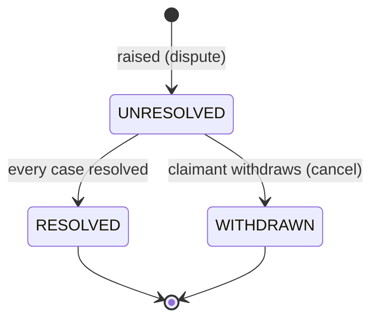
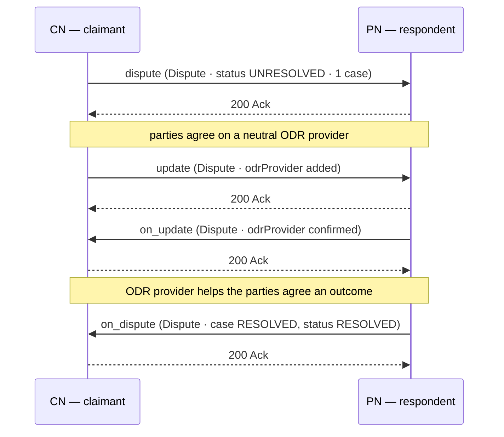

# Resolving Disputes

## Document Details

| Field | Value |
|---|---|
| **ID** | NFH-014 |
| **Publication Status** | Draft |
| **Authors** | [Ravi Prakash](https://github.com/ravi-prakash-v), [Networks for Humanity](https://networksforhumanity.org) |
| **Created** | 2026-06-03 |
| **Updated** | 2026-06-04 |
| **Version history** | Draft-01 (2026-06-03): Initial publication as the template scaffold, with the `dispute`/`on_dispute` endpoints and a `Dispute` stub introduced in `api/v2.0.0/beckn.yaml`. Draft-02 (2026-06-04): Full RFC, aligned to the canonical `Dispute` v2.0 schema. Positioned `dispute`/`on_dispute` as verbs raised by either NP; modelled the generic `Dispute` (anything publishable can be disputed) as a `claimant`/`respondent` pair, an optional neutral `odrProvider` for tri-party online dispute resolution, and an itemised `cases[]` (each a `subject` + `reason` + `evidence`, individually status-tracked); defined the `UNRESOLVED`/`RESOLVED`/`WITHDRAWN` lifecycle with a state diagram; added the Workflows section with sequence diagrams; bridged dispute resolution back to settlement via NFH-015; added schema-validated examples; converted Document Details to table format. Draft-03 (2026-06-04): Synced to the canonical `Dispute` update that adds a required `supportCases` — a dispute MUST attach at least one unresolved support case (support-resolution-first); mirrored the `SupportCase` and `CommunicationChannel` schemas locally and added `supportCases` to the examples. |
| **Latest editor's draft** | This document |
| **Implementation report** | Not available. This document is at Initial Draft status; report will be linked in the next formal release of this RFC, following merge to main. |
| **Stress test report** | Not available. This document is at Initial Draft status; report will be linked in the next formal release of this RFC, following merge to main. |
| **Conformance impact** | Not determined. This document is at Initial Draft status; impact will be classified in the next formal release of this RFC, following merge to main. |
| **Security/privacy implications** | To be documented. Dispute records may carry sensitive grievance details and supporting evidence, and may be shared with a third-party ODR provider; handling, access control, and retention implications will be classified before this RFC advances to Candidate. |
| **Replaces / Relates to** | Relates to [NFH-006 — Beckn API Endpoints](./API.md) · [NFH-013 — Communication Protocol](./Communication_Protocol.md) · [NFH-015 — Invoicing and Settlements](./Invoicing_and_Settlements.md). |
| **Feedback** | See subheadings below. |
| **Errata** | To be published. |

### Feedback

#### Issues

- [Open issues labelled NFH-014](https://github.com/beckn/protocol-specifications-v2/issues?q=is%3Aissue+label%3A%22NFH-014%22)

#### Discussions

- [GitHub Discussions labelled NFH-014](https://github.com/beckn/protocol-specifications-v2/discussions?discussions_q=label%3A%22NFH-014%22)

#### Pull Requests

- [Pull requests labelled NFH-014](https://github.com/beckn/protocol-specifications-v2/pulls?q=is%3Apr+label%3A%22NFH-014%22)

---

## Abstract

This document defines how a formal disagreement over **any** piece of information published on the network is raised and resolved by **disputing**: one NP *disputes* another by calling the `dispute` endpoint on it, carrying a `Dispute` — a case record from a claimant against a respondent — and the counterparty responds by calling `on_dispute`. A dispute itemises one or more **cases**, each naming what is contested (its `subject`), why (`reason`), and the `evidence` backing it; it may be raised only after the parties have attempted support resolution, so it MUST carry at least one unresolved **support case**. A dispute is resolved as a **tri-party** process in which the two parties agree on a neutral online dispute resolution (ODR) provider. It specifies the `dispute` and `on_dispute` verbs, the `Dispute` lifecycle (`UNRESOLVED` → `RESOLVED` | `WITHDRAWN`), and how the dispute is queried, revised, or withdrawn through the `status`, `update`, and `cancel` exchanges — and shows how a resolution that owes money feeds back into settlement as a corrective invoice (NFH-015).

## Table of Contents

- [Resolving Disputes](#resolving-disputes)
  - [Document Details](#document-details)
  - [Abstract](#abstract)
  - [Table of Contents](#table-of-contents)
  - [Context](#context)
  - [Specification](#specification)
    - [Definitions](#definitions)
    - [Normative Requirements](#normative-requirements)
      - [Dispute lifecycle](#dispute-lifecycle)
      - [Endpoints](#endpoints)
      - [Workflows](#workflows)
      - [Data model](#data-model)
    - [Conformance Requirements](#conformance-requirements)
    - [Cross-cutting considerations](#cross-cutting-considerations)
    - [Migration Notes](#migration-notes)
    - [Examples](#examples)
      - [Example 1 — A quality dispute, resolved bilaterally](#example-1--a-quality-dispute-resolved-bilaterally)
      - [Example 2 — A contested invoice entry, escalated to an ODR provider and settled via a corrective invoice](#example-2--a-contested-invoice-entry-escalated-to-an-odr-provider-and-settled-via-a-corrective-invoice)
      - [Example 3 — Withdrawal through the generalized cancel exchange](#example-3--withdrawal-through-the-generalized-cancel-exchange)
  - [Conclusion](#conclusion)
    - [Open Questions](#open-questions)
  - [Acknowledgements](#acknowledgements)
  - [References](#references)

## Context

Value exchange does not always complete cleanly. A consumer may contest a charge or the quality of a delivered order; a provider may contest a chargeback or a withheld fee; either side may contest a settlement, a fulfilment milestone, a commitment that was not met, or the terms of a contract itself. A Beckn network publishes many kinds of object — contracts, invoices, settlements, performances, considerations — and any of them may become the subject of a disagreement.

This RFC upgrades Beckn v2 with a **first-class, generic dispute model**: **one NP disputes another by calling `dispute` on it**. The NP that invokes `dispute` is the **claimant** raising the disagreement; the counterparty is the **respondent**. A `Dispute` is deliberately generic — it is not tied to invoicing — and mirrors the shape of an `Invoice`: a two-party pair plus an itemised, individually status-tracked list. Here the list is **cases**: each case names what is disputed (a `subject`, identified polymorphically by its JSON-LD `@type`), why (`reason`), and the `evidence` backing it. **Either NP MAY be the claimant.** Resolution is a **tri-party** arrangement: the claimant and respondent agree on a neutral **ODR provider** (a mediator, arbitrator, conciliator, and so on) that helps resolve the case. Once the dispute exists, either party drives it forward — reviewing, resolving, or withdrawing — through `on_dispute` and the generalized `update`, `status`, and `cancel` exchanges. Where a resolution owes money, it is carried into settlement as a corrective invoice (NFH-015), closing the loop between the two RFCs.

> The `dispute` and `on_dispute` endpoints and the `Dispute` schema are defined in `api/v2.0.0/beckn.yaml` and mirror the canonical Beckn `Dispute` schema at `https://schema.beckn.io/Dispute/v2.0`. The `Dispute` composes the existing `Participant`, `Descriptor`, `Document`, and `Attributes` schemas rather than introducing parallel structures.

## Specification

The key words "MUST", "MUST NOT", "REQUIRED", "SHALL", "SHALL NOT", "SHOULD", "SHOULD NOT", "RECOMMENDED", "MAY", and "OPTIONAL" in this document are to be interpreted as described [here](./Keyword_Definitions.md). These definitions aim to ensure that the terms are understood precisely and consistently to avoid confusion in the interpretation of standards, specifications, and protocols.

### Definitions

- **Normative:** Requirements that define conformance and interoperability behavior.
- **Informative:** Explanatory guidance that does not by itself define conformance.
- **To dispute (verb):** The act of formally disagreeing with a counterparty over a published object by calling the `dispute` endpoint on it, carrying a `Dispute`. The NP that invokes `dispute` is the claimant of that dispute; there is no separate "initiator" field on the object.
- **Dispute (noun):** The `Dispute` object exchanged — a formal disagreement raised by a claimant against a respondent, itemising one or more cases and tracked from unresolved through to resolved or withdrawn. It is a **generic, independent** schema, not a specialisation of `Contract` and not tied to invoicing.
- **Claimant:** The participant that raises the dispute — the party that calls `dispute`. MAY be either the CN or the PN.
- **Respondent:** The counterparty against which the dispute is raised.
- **ODR provider:** The neutral third party (`odrProvider`, a `Participant`) the two parties agree on to help resolve the dispute — a mediator, arbitrator, conciliator, adjudicator, ombudsman, neutral evaluator, or expert (carried in its `descriptor.code`). Dispute resolution is a tri-party arrangement; agreement on the provider MAY happen after the dispute is raised, so it is optional.
- **Support case:** A customer-support ticket (`SupportCase`) recording an issue the parties raised and attempted to resolve through support before disputing — its category, status, attachments, and support sessions. A dispute MUST attach at least one unresolved support case (`supportCases`), expressing that support resolution was attempted first.
- **Case:** One disputed matter — an entry of the `cases` array, pairing a `case` (`subject` + `reason` + `evidence`) with its own resolution `status`.
- **Subject:** What a case is about — a JSON-LD object (`Attributes`) whose `@type` identifies the disputed entity (e.g. `Contract`, `Invoice`, `Settlement`, `Performance`, `Consideration`, `ContractTerms`), embedded inline or referenced by URL.
- **Reason:** Why the subject is disputed — a `Descriptor` whose `code` categorises the reason and whose `name`/`shortDesc`/`longDesc` carry the narrative.
- **Evidence:** Supporting proofs backing a case — an array of `Document`, each machine-readable (e.g. a verifiable credential) or human-readable (images, audio, video, chat logs, emails, off-network artifacts), distinguished by `mimeType`.
- **Corrective invoice:** An `Invoice` (NFH-015) raised to carry a dispute remedy — a refund or adjustment — into settlement.
- **Conformance impact:** Not determined. This document is at Initial Draft status; impact will be classified in the next formal release of this RFC, following merge to main.
- **Migration notes:** Operational guidance required to adopt the change safely.
- **Errata:** Post-publication corrections and clarifications.

### Normative Requirements

#### Dispute lifecycle

A `Dispute` progresses through the states `UNRESOLVED`, `RESOLVED`, and `WITHDRAWN`, carried in `Dispute.status.code` (default `UNRESOLVED`). `RESOLVED` and `WITHDRAWN` are terminal; `WITHDRAWN` is a cancellation by the claimant. Each **case** carries its own resolution status in `cases[].status.code`, one of `UNRESOLVED` or `RESOLVED` (default `UNRESOLVED`), so individual matters resolve independently while the dispute-level status reflects the case set as a whole.



- **UNRESOLVED** — the dispute has been raised and one or more cases are still open (the default state once a dispute is raised).
- **RESOLVED** — terminal. Every case has been resolved; the agreed outcomes have been reached, bilaterally or with the help of the agreed ODR provider.
- **WITHDRAWN** — terminal. The claimant withdrew the dispute (a cancellation) before it was resolved.

**Support resolution comes first.** A dispute MUST NOT be raised until the parties have attempted support resolution: a `Dispute` MUST carry at least one `supportCases` entry, and at least one of those support cases MUST be `UNRESOLVED` (enforced in the schema by a `contains` constraint). This expresses that disputing is an escalation of an unresolved support ticket, not a first resort.

The claimant sets `UNRESOLVED` when it disputes, and MAY withdraw the case to `WITHDRAWN` (via `cancel`) until it is otherwise terminal. The respondent drives case resolution via `on_dispute`/`on_update`; a `RESOLVED` outcome is reached bilaterally or through the agreed `odrProvider`. A dispute MUST NOT be marked `RESOLVED` while any case remains `UNRESOLVED`. Terminal states are final: a `RESOLVED` or `WITHDRAWN` dispute MUST NOT be reopened or modified with `update`. To pursue a fresh or recurring grievance, the claimant MUST **dispute afresh** via `dispute`/`on_dispute`, carrying a new `Dispute` with a new `id`.

Both nodes are expected to persist their own change history of each dispute — who changed what, and when — for audit and reconciliation. This log is **node-local** and is intentionally **not** part of the wire schema; only the current state of the dispute travels between nodes.

This lifecycle is the destination for a contested invoice entry under [NFH-015](./Invoicing_and_Settlements.md): per CON-015-12, a contested statement entry that cannot be resolved by inline correction SHOULD be removed from the invoice and pursued here as a dispute whose case `subject` is the invoice (or the contested entry), so that the disputed entry does not block settlement of the rest. A `RESOLVED` outcome that owes money then feeds back as a corrective invoice — see Workflow 2.

#### Endpoints

`dispute` and `on_dispute` are **verbs**: an NP *disputes* a counterparty by calling `dispute` on it, and the counterparty responds by calling `on_dispute` back.

- **`dispute` (POST)** — invoked by an NP to **dispute** a counterparty: it submits a `DisputeAction` carrying the `Dispute`, whose `cases` itemise what is contested. The caller is the **claimant**; the counterparty is the **respondent**. Any NP — CN or PN — MAY be the claimant.
- **`on_dispute` (POST)** — the respondent calls this back on the claimant, returning the updated `Dispute` (via an `OnDisputeAction`) to acknowledge, progress, or resolve the cases. It MAY also be sent proactively when the case status changes asynchronously.

Once a dispute exists, **either party** MAY act on the shared `Dispute` through the generalized lifecycle endpoints, each of which carries `anyOf { contract | invoice | dispute }`:

- **`update` / `on_update`** — to revise the dispute and confirm the revision: add or amend a case, attach evidence, record the agreed `odrProvider`, or mark cases `RESOLVED`.
- **`status` / `on_status`** — to query the current state of a dispute by its `id` and return it.
- **`cancel` / `on_cancel`** — for the claimant to withdraw the dispute (`WITHDRAWN`).

All follow the asynchronous request/callback pattern of [NFH-013](./Communication_Protocol.md): the receiver returns a synchronous `Ack`, then delivers the callback in a separate session, and the caller correlates it using `context.messageId`. A receiver MAY send the corresponding `on_*` callback proactively (without a preceding request) to report an asynchronous state change. All endpoints are defined in the canonical OpenAPI contract; see [NFH-006](./API.md).

> **Endpoints are not actor-exclusive.** Because a dispute may originate from either side — a CN disputing a PN, or a PN disputing a CN — **both nodes MUST implement the full set of endpoints**: `dispute`/`on_dispute`, `update`/`on_update`, `status`/`on_status`, and `cancel`/`on_cancel`. This symmetry is not specific to disputes (or to invoicing); it holds protocol-wide, including the contracting lifecycle. Every action endpoint and its `on_*` callback MUST be implemented by **both** the CN and the PN, and a node MUST NOT assume it will only ever receive a given call or only ever originate it. See [NFH-006](./API.md).

#### Workflows

The two workflows below show how disputing plays out end to end. Synchronous `Ack`s are shown; per NFH-013 each request is acknowledged before its callback is delivered in a separate session.

**Workflow 1 — Dispute raised, ODR provider engaged, resolved.** The claimant disputes the respondent over a fulfilment grievance; the parties agree on a neutral ODR provider, who helps them reach an outcome; the case is resolved.



**Workflow 2 — A contested invoice entry, disputed and settled via a corrective invoice.** This is the bridge to [NFH-015](./Invoicing_and_Settlements.md). A contested statement entry is removed from the invoice with `update` (CON-015-12) so the remaining entries settle, and the grievance is pursued as a dispute whose case subject is the invoice. The case is resolved bilaterally, and the remedy is carried into settlement as a corrective invoice.

```mermaid
sequenceDiagram
    participant CN as CN — debtor / claimant
    participant PN as PN — creditor / respondent
    Note over CN,PN: an invoice entry is contested (NFH-015)
    CN->>PN: update (Invoice · contested entry removed)
    PN-->>CN: 200 Ack
    PN->>CN: on_update (Invoice · remaining entries proceed to settle)
    CN-->>PN: 200 Ack
    CN->>PN: dispute (Dispute · case subject @type Invoice)
    PN-->>CN: 200 Ack
    Note over CN,PN: case upheld; remedy agreed
    PN->>CN: on_dispute (Dispute · case RESOLVED, status RESOLVED)
    CN-->>PN: 200 Ack
    PN->>CN: invoice (corrective Invoice · Refund / Adjustment entry)
    CN-->>PN: 200 Ack
```

#### Data model

The `Dispute` composes `Participant` (claimant, respondent, and the neutral ODR provider), `Descriptor` (dispute and case status, and each case reason), `Attributes` (each case subject, polymorphic via its JSON-LD `@type`), `Document` (each piece of case evidence), and `SupportCase` (the prior support tickets — itself composing `CommunicationChannel` and `MediaFile` for its support sessions). The `SupportCase` and `CommunicationChannel` schemas are mirrored locally alongside the existing `MediaFile`. The authoritative field definitions live in `api/v2.0.0/beckn.yaml` and mirror the canonical `Dispute` at `https://schema.beckn.io/Dispute/v2.0`; the tables below summarise the semantics.

| Field | Semantics | Cardinality |
|---|---|---|
| `id` | Stable dispute identifier (system id, UUID). | REQUIRED |
| `raisedAt` | Timestamp (date-time) at which the dispute was raised. | OPTIONAL |
| `descriptor` | Human / agent readable description of the dispute. | OPTIONAL |
| `status` | A `Descriptor` whose `code` MUST be one of `UNRESOLVED`, `RESOLVED`, `WITHDRAWN` (default `UNRESOLVED`). | OPTIONAL |
| `claimant` | The `Participant` raising the dispute (CN or PN). | REQUIRED |
| `respondent` | The `Participant` against whom it is raised. | REQUIRED |
| `odrProvider` | The agreed neutral ODR provider (a `Participant`); its `descriptor.code` MUST be one of `MEDIATOR`, `ARBITRATOR`, `CONCILIATOR`, `ADJUDICATOR`, `OMBUDSMAN`, `NEUTRAL_EVALUATOR`, `EXPERT`. | OPTIONAL |
| `supportCases[]` | The prior support tickets (`SupportCase`) underpinning the dispute. At least one MUST be present and at least one MUST be `UNRESOLVED` (a `contains` constraint) — disputing escalates an unresolved support case. | REQUIRED, ≥ 1 |
| `cases[]` | The disputed matters; each entry pairs a `case` with its resolution `status`. | REQUIRED, ≥ 1 |
| `disputeAttributes` | Attribute pack — domain-specific extension attributes for the dispute as a whole. | OPTIONAL |

Each **`cases[]`** entry is `{ case, status }`:

| Field | Semantics | Cardinality |
|---|---|---|
| `case.id` | Identifier of this case. | OPTIONAL |
| `case.subject` | The disputed object, an `Attributes` JSON-LD bag whose `@type` names what it is (`Contract`, `Invoice`, `Settlement`, `Performance`, `Consideration`, `ContractTerms`, …); embedded inline or referenced by URL. | REQUIRED |
| `case.reason` | A `Descriptor` — `code` categorises the reason, `name`/`shortDesc`/`longDesc` carry the narrative. | REQUIRED |
| `case.evidence[]` | An array of `Document` backing the case (machine- or human-readable proofs). A case without any attached proof MAY be rejected at the respondent's discretion. | REQUIRED, ≥ 1 |
| `status` | A `Descriptor` whose `code` MUST be one of `UNRESOLVED`, `RESOLVED` (default `UNRESOLVED`). | REQUIRED |

Because the case `subject` is a JSON-LD object identified by `@type`, the same dispute can itemise heterogeneous matters — a fulfilment grievance against a `Performance`, a billing grievance against an `Invoice`, a terms grievance against `ContractTerms` — without any of them being modelled as a distinct schema. A dispute that contests an invoice (NFH-015) carries a case whose `subject.@type` is `Invoice`, referencing the invoice `id`; that reference, held **on the `Dispute`**, is the link between a `DISPUTED` invoice and its case, and resolves [NFH-015 Open Question #2](./Invoicing_and_Settlements.md#open-questions) without any change to the `Invoice` schema.

### Conformance Requirements

| ID | Requirement | Level |
|---|---|---|
| CON-014-01 | A `dispute` request MUST carry a `DisputeAction` whose `Dispute` has `id`, `claimant`, `respondent`, a `supportCases` array, and a `cases` array, each with at least one entry. | MUST |
| CON-014-02 | The `supportCases` array MUST contain at least one `SupportCase` whose `status.code` is `UNRESOLVED`; a dispute MUST NOT be raised without a prior, unresolved support case. | MUST |
| CON-014-03 | Each `cases` entry MUST carry a `case` (with a `subject` whose `@type` names the disputed object, a `reason` `Descriptor`, and at least one `evidence` `Document`) and a resolution `status`. | MUST |
| CON-014-04 | `Dispute.status.code` MUST be one of `UNRESOLVED`, `RESOLVED`, `WITHDRAWN` (default `UNRESOLVED`); each `cases[].status.code` MUST be one of `UNRESOLVED`, `RESOLVED` (default `UNRESOLVED`). | MUST |
| CON-014-05 | A `Dispute` MUST NOT be marked `RESOLVED` while any case remains `UNRESOLVED`. `RESOLVED` and `WITHDRAWN` are terminal; `WITHDRAWN` is a claimant cancellation. | MUST |
| CON-014-06 | The respondent SHOULD respond to a `dispute` request with an `on_dispute` callback carrying the dispute, correlated via `context.messageId`. | SHOULD |
| CON-014-07 | Either NP MAY be the claimant. The caller MUST set itself as `claimant` and the counterparty as `respondent`. | MUST |
| CON-014-08 | When dispute resolution involves a neutral third party, the agreed provider MUST be recorded in `odrProvider`, and its `descriptor.code` MUST be one of `MEDIATOR`, `ARBITRATOR`, `CONCILIATOR`, `ADJUDICATOR`, `OMBUDSMAN`, `NEUTRAL_EVALUATOR`, `EXPERT`. | MUST |
| CON-014-09 | A dispute that contests an invoice ([NFH-015](./Invoicing_and_Settlements.md)) SHOULD carry a case whose `subject.@type` is `Invoice`, referencing the invoice `id`; this is the link between a `DISPUTED` invoice and its dispute. | SHOULD |
| CON-014-10 | Either party MAY query, revise, or withdraw a shared dispute by carrying it in `status`, `update`, or `cancel`; the responder MUST reply on the corresponding `on_*` endpoint carrying the `Dispute`. | MAY |
| CON-014-11 | A terminal dispute (`RESOLVED`/`WITHDRAWN`) MUST NOT be reopened or modified via `update`. To pursue a fresh grievance, the claimant MUST raise a new dispute via `dispute`/`on_dispute` carrying a new `id`. | MUST |
| CON-014-12 | Each node SHOULD persist its own change history of a dispute for audit and reconciliation; this log is node-local and is not carried in the wire schema. | SHOULD |

### Cross-cutting considerations

_Security and privacy._ Dispute records may carry sensitive grievance details, party identities, and supporting evidence (`case.evidence`, which may include signed or checksummed `Document` artifacts and verifiable credentials). Authentication and signing follow [NFH-004](./Authentication_and_Trust.md): a `dispute` request is signed by the claimant; an `on_dispute` callback is signed by the respondent using the callback signature that chains to the originating request. Because resolution is tri-party, case detail and evidence may be disclosed to the agreed `odrProvider`; the parties SHOULD minimise the evidence and claim detail shared to what the provider requires to adjudicate, and the provider's access and retention obligations are to be documented before this RFC advances to Candidate. Non-repudiation of resolved cases, access control over grievance and party detail, and retention and redaction of resolved disputes (alongside the node-local audit history) are likewise to be classified. A dispute whose case `subject` is an [NFH-015](./Invoicing_and_Settlements.md) invoice inherits that invoice's confidentiality expectations.

### Migration Notes

The `dispute` and `on_dispute` endpoints and the build-out of the `Dispute` schema are additive; existing implementations are unaffected until they adopt dispute handling. The `Dispute` mirrors the canonical `https://schema.beckn.io/Dispute/v2.0` and composes only schemas already present in `beckn.yaml` (`Participant`, `Descriptor`, `Document`, `Attributes`), so no new dependencies are introduced. The generalization of `StatusAction`, `OnStatusAction`, `UpdateAction`, `OnUpdateAction`, `CancelAction`, and `OnCancelAction` to `anyOf { contract | invoice | dispute }` — introduced alongside [NFH-015](./Invoicing_and_Settlements.md) — is backward compatible: a message carrying only a `contract` (or only an `invoice`) remains valid, and the `dispute` branch is the path by which an existing dispute is queried, revised, or withdrawn through those same endpoints. No change is required to the `Contract` or `Invoice` schemas: an invoice is linked to its dispute by a reference on the `Dispute` (a case `subject` of `@type` `Invoice`), not by a new field on the `Invoice`.

### Examples

> The following examples are **informative**. They are validated against `api/v2.0.0/beckn.yaml`. They realise the two workflows above; `context` envelopes follow [NFH-013](./Communication_Protocol.md).

#### Example 1 — A quality dispute, resolved bilaterally

This realises **Workflow 1** (shown here resolved bilaterally; an ODR provider would be added via `update` as in the workflow). The consumer node (`cn.example.org`) **disputes** the provider node (`pn.example.org`) over two damaged units in confirmed order `ord-7781` — `cn` is the claimant, `pn` the respondent. The single case names a `RetailOrder` subject, gives a reason, and attaches a signed PDF as evidence. The PN resolves the case; the agreed ₹400 refund is carried into settlement via a corrective invoice (recorded in `disputeAttributes`).

**`dispute` request (CN → PN):**

```json
{
  "context": {
    "version": "2.0.0",
    "action": "dispute",
    "transactionId": "9b1d4c2e-7a36-4f81-b0d9-3e6c5a8f2b14",
    "messageId": "1a2b3c4d-5e6f-4a7b-8c9d-0e1f2a3b4c5d",
    "networkId": "acmenet.org/retail",
    "timestamp": "2026-06-04T14:00:00Z",
    "bapId": "cn.example.org",
    "bapUri": "https://cn.example.org/beckn",
    "bppId": "pn.example.org",
    "bppUri": "https://pn.example.org/beckn",
    "ttl": "PT30S"
  },
  "message": {
    "dispute": {
      "id": "d1f2a3b4-c5d6-4e7f-8a90-1b2c3d4e5f60",
      "raisedAt": "2026-06-04T14:00:00Z",
      "descriptor": { "name": "Damaged items on delivery of order ord-7781" },
      "status": { "code": "UNRESOLVED", "name": "Unresolved" },
      "claimant": {
        "id": "cn.example.org",
        "descriptor": { "name": "ShopBuddy Consumer Node" }
      },
      "respondent": {
        "id": "pn.example.org",
        "descriptor": { "name": "TechMart Provider Node" }
      },
      "supportCases": [
        {
          "id": "SUP-2026-06-0007",
          "category": { "code": "FULFILMENT_QUALITY", "name": "Damaged on arrival" },
          "description": "Two units of order ord-7781 arrived damaged; refund requested.",
          "status": { "code": "UNRESOLVED", "name": "Unresolved" },
          "createdAt": "2026-06-02T09:15:00Z"
        }
      ],
      "cases": [
        {
          "case": {
            "id": "case-ord-7781-damage",
            "subject": {
              "@context": "https://schemas.becknprotocol.io/contexts/finance.jsonld",
              "@type": "RetailOrder",
              "contractId": "a7e1d9c3-4f02-4a8b-8c61-9b3e5d2f1a08",
              "orderNumber": "ord-7781"
            },
            "reason": {
              "code": "GOODS_DAMAGED",
              "name": "Goods damaged on arrival",
              "longDesc": "Two of five units arrived with cracked casings; replacement or refund requested."
            },
            "evidence": [
              {
                "label": "Photographs of damaged units",
                "url": "https://cn.example.org/evidence/ord-7781/damage.pdf",
                "mimeType": "application/pdf",
                "security": { "checksum": "9f86d081884c7d659a2feaa0c55ad015", "checksumAlgorithm": "SHA256" }
              }
            ]
          },
          "status": { "code": "UNRESOLVED", "name": "Unresolved" }
        }
      ],
      "disputeAttributes": {
        "@context": "https://schemas.becknprotocol.io/contexts/disputes.jsonld",
        "@type": "GrievanceClaim",
        "category": "FULFILMENT_QUALITY",
        "claimedAmount": { "currency": "INR", "value": 400 }
      }
    }
  }
}
```

**Synchronous `Ack` (PN → CN, same session):**

```json
{
  "context": { "action": "dispute", "messageId": "1a2b3c4d-5e6f-4a7b-8c9d-0e1f2a3b4c5d" },
  "message": { "status": "ACK", "messageId": "1a2b3c4d-5e6f-4a7b-8c9d-0e1f2a3b4c5d" }
}
```

**`on_dispute` callback (PN → CN) — case resolved with an agreed remedy:**

```json
{
  "context": {
    "version": "2.0.0",
    "action": "on_dispute",
    "transactionId": "9b1d4c2e-7a36-4f81-b0d9-3e6c5a8f2b14",
    "messageId": "1a2b3c4d-5e6f-4a7b-8c9d-0e1f2a3b4c5d",
    "networkId": "acmenet.org/retail",
    "timestamp": "2026-06-05T10:30:00Z",
    "bapId": "cn.example.org",
    "bapUri": "https://cn.example.org/beckn",
    "bppId": "pn.example.org",
    "bppUri": "https://pn.example.org/beckn"
  },
  "message": {
    "dispute": {
      "id": "d1f2a3b4-c5d6-4e7f-8a90-1b2c3d4e5f60",
      "raisedAt": "2026-06-04T14:00:00Z",
      "status": { "code": "RESOLVED", "name": "Resolved" },
      "claimant": { "id": "cn.example.org", "descriptor": { "name": "ShopBuddy Consumer Node" } },
      "respondent": { "id": "pn.example.org", "descriptor": { "name": "TechMart Provider Node" } },
      "supportCases": [
        { "id": "SUP-2026-06-0007", "category": { "code": "FULFILMENT_QUALITY", "name": "Damaged on arrival" }, "status": { "code": "UNRESOLVED", "name": "Unresolved" } }
      ],
      "cases": [
        {
          "case": {
            "id": "case-ord-7781-damage",
            "subject": {
              "@context": "https://schemas.becknprotocol.io/contexts/finance.jsonld",
              "@type": "RetailOrder",
              "orderNumber": "ord-7781"
            },
            "reason": { "code": "GOODS_DAMAGED", "name": "Goods damaged on arrival" },
            "evidence": [
              {
                "label": "Photographs of damaged units",
                "url": "https://cn.example.org/evidence/ord-7781/damage.pdf",
                "mimeType": "application/pdf"
              }
            ]
          },
          "status": { "code": "RESOLVED", "name": "Resolved — refund agreed" }
        }
      ],
      "disputeAttributes": {
        "@context": "https://schemas.becknprotocol.io/contexts/disputes.jsonld",
        "@type": "GrievanceResolution",
        "outcome": "PARTIALLY_UPHELD",
        "remedy": "Refund of INR 400 for 2 damaged units",
        "correctiveInvoiceId": "f0a1b2c3-d4e5-4f60-8a71-0b1c2d3e4f50"
      }
    }
  }
}
```

#### Example 2 — A contested invoice entry, escalated to an ODR provider and settled via a corrective invoice

This realises **Workflow 2** and the bridge to [NFH-015](./Invoicing_and_Settlements.md). On invoice `INV-2026-06-0050` the CN contests the finder-fee entry. Per CON-015-12, the entry is first removed from the invoice with `update` (so the order and delivery entries settle on their own timeline — that `update`/`on_update` exchange is the NFH-015 message shape and is not repeated here), then the CN **disputes** it with a case whose `subject.@type` is `Invoice`. The parties engage an arbitrator as `odrProvider`; the case is resolved by re-rating the fee, and the ₹10 adjustment is carried into a corrective invoice.

**`dispute` request (CN → PN) — contesting an invoice, ODR provider proposed:**

```json
{
  "context": {
    "version": "2.0.0",
    "action": "dispute",
    "transactionId": "c4b5a6d7-e8f9-4a01-9b23-4c5d6e7f8a90",
    "messageId": "2b3c4d5e-6f7a-4b8c-9d0e-1f2a3b4c5d6e",
    "networkId": "acmenet.org/retail",
    "timestamp": "2026-06-06T09:00:00Z",
    "bapId": "cn.example.org",
    "bapUri": "https://cn.example.org/beckn",
    "bppId": "pn.example.org",
    "bppUri": "https://pn.example.org/beckn",
    "ttl": "PT30S"
  },
  "message": {
    "dispute": {
      "id": "e2d3c4b5-a6f7-4081-9234-5b6c7d8e9f01",
      "raisedAt": "2026-06-06T09:00:00Z",
      "descriptor": { "name": "Contested finder-fee rate on invoice INV-2026-06-0050" },
      "status": { "code": "UNRESOLVED", "name": "Unresolved" },
      "claimant": { "id": "cn.example.org", "descriptor": { "name": "ShopBuddy Consumer Node" } },
      "respondent": { "id": "pn.example.org", "descriptor": { "name": "TechMart Provider Node" } },
      "odrProvider": {
        "id": "odr.example.org",
        "descriptor": { "code": "ARBITRATOR", "name": "FairResolve ODR Services" }
      },
      "supportCases": [
        {
          "id": "SUP-2026-06-0011",
          "category": { "code": "BILLING_DISPUTE", "name": "Finder-fee rate query" },
          "description": "Finder fee on invoice INV-2026-06-0050 billed above the agreed rate.",
          "status": { "code": "UNRESOLVED", "name": "Unresolved" },
          "claimAmount": 10,
          "createdAt": "2026-06-05T11:00:00Z"
        }
      ],
      "cases": [
        {
          "case": {
            "id": "case-fee-rate",
            "subject": {
              "@context": "https://schemas.becknprotocol.io/contexts/finance.jsonld",
              "@type": "Invoice",
              "invoiceId": "e2f4a6c8-1b3d-4e5f-8a09-7c6b5d4e3f21",
              "entryConsiderationId": "cons-fee",
              "billedType": "FinderFee"
            },
            "reason": {
              "code": "FEE_RATE_CONTESTED",
              "name": "Finder-fee rate above the agreed rate",
              "longDesc": "Invoiced at INR 50; the agreed rate per the contract is INR 40."
            },
            "evidence": [
              {
                "label": "Signed fee schedule (contract annexe)",
                "url": "https://cn.example.org/evidence/inv-0050/fee-schedule.json",
                "mimeType": "application/json",
                "standard": "verifiableCredential",
                "security": { "checksum": "ab12cd34ef56", "checksumAlgorithm": "SHA512" }
              }
            ]
          },
          "status": { "code": "UNRESOLVED", "name": "Unresolved" }
        }
      ]
    }
  }
}
```

**`on_dispute` callback (PN → CN) — case resolved, remedy carried into a corrective invoice:**

```json
{
  "context": {
    "version": "2.0.0",
    "action": "on_dispute",
    "transactionId": "c4b5a6d7-e8f9-4a01-9b23-4c5d6e7f8a90",
    "messageId": "2b3c4d5e-6f7a-4b8c-9d0e-1f2a3b4c5d6e",
    "networkId": "acmenet.org/retail",
    "timestamp": "2026-06-07T15:00:00Z",
    "bapId": "cn.example.org",
    "bapUri": "https://cn.example.org/beckn",
    "bppId": "pn.example.org",
    "bppUri": "https://pn.example.org/beckn"
  },
  "message": {
    "dispute": {
      "id": "e2d3c4b5-a6f7-4081-9234-5b6c7d8e9f01",
      "raisedAt": "2026-06-06T09:00:00Z",
      "status": { "code": "RESOLVED", "name": "Resolved" },
      "claimant": { "id": "cn.example.org", "descriptor": { "name": "ShopBuddy Consumer Node" } },
      "respondent": { "id": "pn.example.org", "descriptor": { "name": "TechMart Provider Node" } },
      "odrProvider": {
        "id": "odr.example.org",
        "descriptor": { "code": "ARBITRATOR", "name": "FairResolve ODR Services" }
      },
      "supportCases": [
        {
          "id": "SUP-2026-06-0011",
          "category": { "code": "BILLING_DISPUTE", "name": "Finder-fee rate query" },
          "description": "Finder fee on invoice INV-2026-06-0050 billed above the agreed rate.",
          "status": { "code": "UNRESOLVED", "name": "Unresolved" },
          "claimAmount": 10,
          "createdAt": "2026-06-05T11:00:00Z"
        }
      ],
      "cases": [
        {
          "case": {
            "id": "case-fee-rate",
            "subject": {
              "@context": "https://schemas.becknprotocol.io/contexts/finance.jsonld",
              "@type": "Invoice",
              "invoiceId": "e2f4a6c8-1b3d-4e5f-8a09-7c6b5d4e3f21",
              "entryConsiderationId": "cons-fee"
            },
            "reason": { "code": "FEE_RATE_CONTESTED", "name": "Finder-fee rate above the agreed rate" },
            "evidence": [
              {
                "label": "Arbitrator determination",
                "url": "https://odr.example.org/determinations/case-fee-rate.pdf",
                "mimeType": "application/pdf",
                "security": { "checksum": "ee99ff00aa11", "checksumAlgorithm": "SHA256" }
              }
            ]
          },
          "status": { "code": "RESOLVED", "name": "Resolved — fee re-rated to INR 40" }
        }
      ],
      "disputeAttributes": {
        "@context": "https://schemas.becknprotocol.io/contexts/disputes.jsonld",
        "@type": "GrievanceResolution",
        "outcome": "PARTIALLY_UPHELD",
        "remedy": "Finder fee re-rated from INR 50 to INR 40; INR 10 adjusted via corrective invoice ADJ-2026-06-0003.",
        "correctiveInvoiceId": "b1c2d3e4-f5a6-4b70-8c81-9d0e1f2a3b40"
      }
    }
  }
}
```

The PN then **invoices** the CN with the corrective `Invoice` (`b1c2d3e4-…`, an `Adjustment` statement entry of ₹10) through the `invoice`/`on_invoice` exchange of [NFH-015](./Invoicing_and_Settlements.md), closing the loop.

#### Example 3 — Withdrawal through the generalized cancel exchange

The claimant resolves the matter with the provider out of band and **withdraws** the dispute from Example 1 by carrying it in a `cancel` request — the same generalized endpoint used for contracts and invoices, here with the `dispute` branch. The respondent confirms on `on_cancel`.

**`cancel` request (CN → PN) — withdraw the dispute:**

```json
{
  "context": {
    "version": "2.0.0",
    "action": "cancel",
    "transactionId": "9b1d4c2e-7a36-4f81-b0d9-3e6c5a8f2b14",
    "messageId": "3c4d5e6f-7a8b-4c9d-0e1f-2a3b4c5d6e7f",
    "networkId": "acmenet.org/retail",
    "timestamp": "2026-06-04T16:00:00Z",
    "bapId": "cn.example.org",
    "bapUri": "https://cn.example.org/beckn",
    "bppId": "pn.example.org",
    "bppUri": "https://pn.example.org/beckn",
    "ttl": "PT30S"
  },
  "message": {
    "dispute": {
      "id": "d1f2a3b4-c5d6-4e7f-8a90-1b2c3d4e5f60",
      "raisedAt": "2026-06-04T14:00:00Z",
      "status": { "code": "WITHDRAWN", "name": "Withdrawn by claimant" },
      "claimant": { "id": "cn.example.org", "descriptor": { "name": "ShopBuddy Consumer Node" } },
      "respondent": { "id": "pn.example.org", "descriptor": { "name": "TechMart Provider Node" } },
      "supportCases": [
        { "id": "SUP-2026-06-0007", "category": { "code": "FULFILMENT_QUALITY", "name": "Damaged on arrival" }, "status": { "code": "UNRESOLVED", "name": "Unresolved" } }
      ],
      "cases": [
        {
          "case": {
            "id": "case-ord-7781-damage",
            "subject": {
              "@context": "https://schemas.becknprotocol.io/contexts/finance.jsonld",
              "@type": "RetailOrder",
              "orderNumber": "ord-7781"
            },
            "reason": { "code": "GOODS_DAMAGED", "name": "Goods damaged on arrival" },
            "evidence": [
              {
                "label": "Photographs of damaged units",
                "url": "https://cn.example.org/evidence/ord-7781/damage.pdf",
                "mimeType": "application/pdf"
              }
            ]
          },
          "status": { "code": "UNRESOLVED", "name": "Unresolved" }
        }
      ],
      "disputeAttributes": {
        "@context": "https://schemas.becknprotocol.io/contexts/disputes.jsonld",
        "@type": "GrievanceClaim",
        "withdrawalReason": "Resolved directly with the provider out of band."
      }
    }
  }
}
```

**`on_cancel` callback (PN → CN) — withdrawal confirmed:**

```json
{
  "context": {
    "version": "2.0.0",
    "action": "on_cancel",
    "transactionId": "9b1d4c2e-7a36-4f81-b0d9-3e6c5a8f2b14",
    "messageId": "3c4d5e6f-7a8b-4c9d-0e1f-2a3b4c5d6e7f",
    "networkId": "acmenet.org/retail",
    "timestamp": "2026-06-04T16:00:05Z",
    "bapId": "cn.example.org",
    "bapUri": "https://cn.example.org/beckn",
    "bppId": "pn.example.org",
    "bppUri": "https://pn.example.org/beckn"
  },
  "message": {
    "dispute": {
      "id": "d1f2a3b4-c5d6-4e7f-8a90-1b2c3d4e5f60",
      "raisedAt": "2026-06-04T14:00:00Z",
      "status": { "code": "WITHDRAWN", "name": "Withdrawn" },
      "claimant": { "id": "cn.example.org", "descriptor": { "name": "ShopBuddy Consumer Node" } },
      "respondent": { "id": "pn.example.org", "descriptor": { "name": "TechMart Provider Node" } },
      "supportCases": [
        { "id": "SUP-2026-06-0007", "category": { "code": "FULFILMENT_QUALITY", "name": "Damaged on arrival" }, "status": { "code": "UNRESOLVED", "name": "Unresolved" } }
      ],
      "cases": [
        {
          "case": {
            "id": "case-ord-7781-damage",
            "subject": {
              "@context": "https://schemas.becknprotocol.io/contexts/finance.jsonld",
              "@type": "RetailOrder",
              "orderNumber": "ord-7781"
            },
            "reason": { "code": "GOODS_DAMAGED", "name": "Goods damaged on arrival" },
            "evidence": [
              {
                "label": "Photographs of damaged units",
                "url": "https://cn.example.org/evidence/ord-7781/damage.pdf",
                "mimeType": "application/pdf"
              }
            ]
          },
          "status": { "code": "UNRESOLVED", "name": "Unresolved" }
        }
      ]
    }
  }
}
```

## Conclusion

This RFC models grievance handling as **disputing** — a verb: a claimant disputes a respondent by calling `dispute`, carrying a generic `Dispute` that itemises one or more cases, each naming what is contested (`subject`), why (`reason`), and the `evidence` backing it. The two parties drive it from `UNRESOLVED` to a terminal `RESOLVED` or `WITHDRAWN`, querying via `status`, revising via `update`, and withdrawing via `cancel`, with resolution reached bilaterally or through an agreed neutral `odrProvider` in a tri-party arrangement. Because the party that invokes `dispute` is the claimant and `claimant`/`respondent` carry the direction of the grievance, either NP can dispute the other over anything published on the network. Where a resolution owes money, it is carried into settlement as an [NFH-015](./Invoicing_and_Settlements.md) corrective invoice, and a case `subject` of `@type` `Invoice` links a `DISPUTED` invoice to its dispute (resolving NFH-015 Open Question #2). The proposal advances to Candidate once the security/privacy classification (including ODR-provider disclosure), a normative ODR resolution sub-protocol, and an implementation report are complete.

### Open Questions

1. `StatusAction`/`UpdateAction`/`CancelAction` compose the full `Dispute` (whose `required` includes `claimant`, `respondent`, and `cases`), so a state query or a withdrawal must carry more than a bare `id`. Should these actions admit a partial dispute (just `id`) for queries and withdrawals? (This mirrors [NFH-015 Open Question #1](./Invoicing_and_Settlements.md#open-questions); the two SHOULD be resolved together.)
2. The model records the agreed `odrProvider` and its role, but not the **adjudication exchange** — how a mediator's or arbitrator's determination is recorded, signed, and made binding, nor how the provider participates on the wire. Should a future revision specify a normative ODR resolution sub-protocol, and a discovery/registry mechanism for ODR providers?
3. A monetary remedy from a `RESOLVED` dispute is carried into settlement as a fresh / corrective invoice (NFH-015) by process; the canonical `Dispute` records the outcome narrative in `disputeAttributes` rather than a typed `resolution` object with an explicit corrective-invoice reference. Should the linkage between a resolution and its corrective invoice be made an explicit, typed cross-reference (on the `Dispute`, the `Invoice`, or both)?

## Acknowledgements

> Acknowledge contributors, reviewers, working groups, and implementers whose feedback informed this RFC.

## References
- **Governance:** Click [here](../GOVERNANCE.md).
- **Keyword definitions:** Click [here](./Keyword_Definitions.md).
- **Beckn API Endpoints:** [NFH-006](./API.md).
- **Communication Protocol:** [NFH-013](./Communication_Protocol.md).
- **Authentication and Trust:** [NFH-004](./Authentication_and_Trust.md).
- **Invoicing and Settlements:** [NFH-015](./Invoicing_and_Settlements.md).
- **Canonical schema:** [Dispute v2.0](https://schema.beckn.io/Dispute/v2.0).
- **Additional references:** _Add any external standards, prior art, or related RFCs here._
