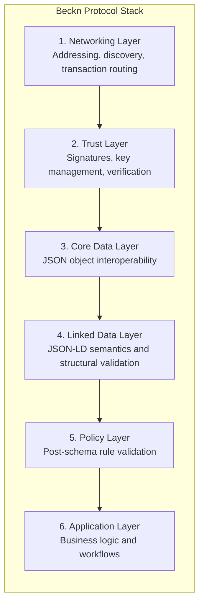
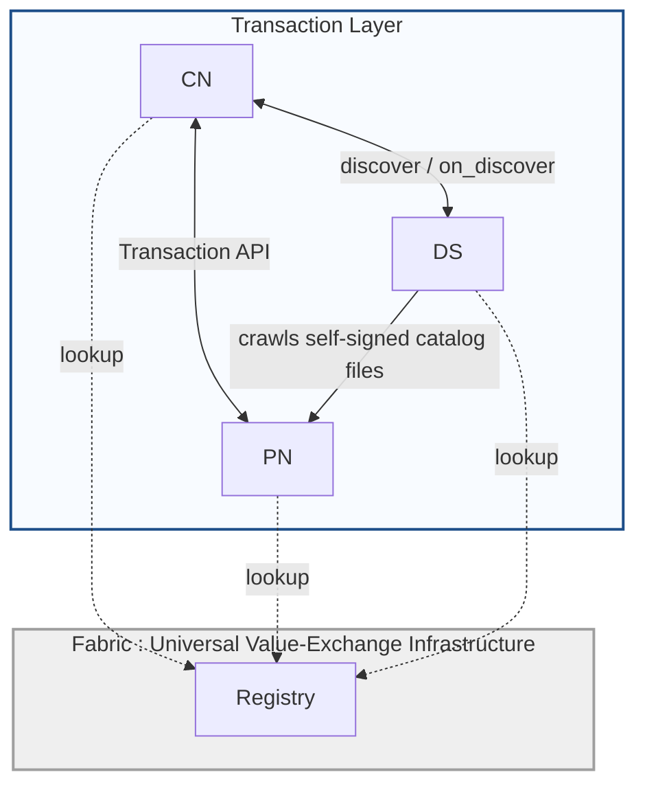
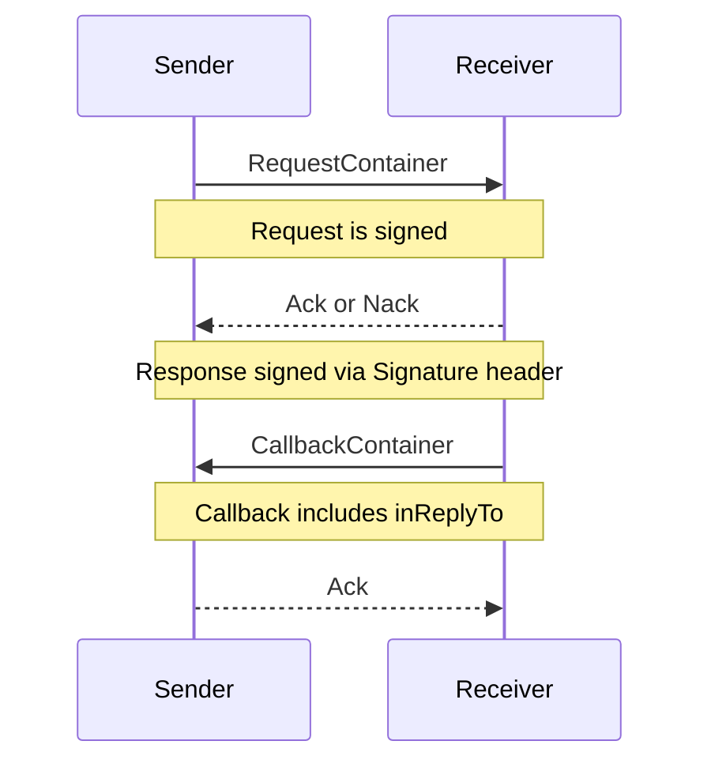
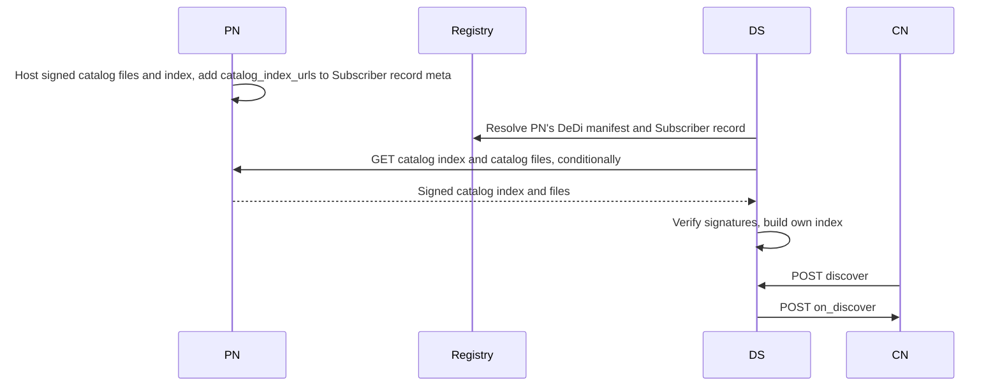

# The Beckn Protocol Stack

## Document Details

- **ID:** NFH-003
- **Status:** Draft.
- **Authors:**
  - [Ravi Prakash](https://github.com/ravi-prakash-v), [Networks for Humanity](https://networksforhumanity.org)
- **Created:** 2026-05-11
- **Updated:** 2026-08-07
- **Version history:** Repository history on `main` does not yet show commits for this file; Draft-01 (2026-04-10) migrated the protocol stack guide into RFC template structure. Draft-02 (2026-08-07): Removed the Cataloging Service (CS) actor and its publish/subscribe/push/pull flow from the Networking Layer, Definitions, and both diagrams; realigned catalog discovery around NFH-014's self-hosted, DeDi-anchored publishing and DS-side crawling model; this document now describes the stack-level shape of catalog discovery and links to NFH-014 for the full mechanism.
- **Latest editor's draft:** Click [here](https://github.com/beckn/protocol-specifications-v2/blob/decentralised-catalog/docs/The_Beckn_Protocol_Stack.md).
- **Implementation report:** Not available. This document is at Initial Draft status; report will be linked in the next formal release of this RFC, following merge to main.
- **Stress test report:** Not available. This document is at Initial Draft status; report will be linked in the next formal release of this RFC, following merge to main.
- **Conformance impact:** Not determined. This document is at Initial Draft status; impact will be classified in the next formal release of this RFC, following merge to main.
- **Security/privacy implications:** Clarifies trust-layer and signature responsibilities across the stack.
- **Replaces / relates to:** Replaces non-RFC-form content in `03_The_Beckn_Protocol_Stack.md`. Relates to [NFH-014](./Catalog_Publishing_and_Discovery.md) (Decentralized Catalog Publishing and Discovery), which replaces the Cataloging Service (CS) actor and its publish/subscribe/push/pull flow described in earlier drafts of this document with self-hosted, DeDi-anchored catalog publishing and direct DS-side crawling.
- **Feedback:** Issues Click [here](https://github.com/beckn/protocol-specifications-v2/issues?q=is%3Aissue+label%3A%22RFC-003%22), discussions Click [here](https://github.com/beckn/protocol-specifications-v2/discussions?discussions_q=label%3A%22RFC-003%22), pull requests Click [here](https://github.com/beckn/protocol-specifications-v2/pulls?q=is%3Apr+label%3A%22RFC-003%22).
- **Errata:** To be published.

## Abstract

This RFC defines the Beckn v2 protocol stack as six layers and explains how networking, trust, data, semantics, policy, and application concerns interact to provide a consistent implementation model across participants.

## Table of Contents

- [The Beckn Protocol Stack](#the-beckn-protocol-stack)
  - [Document Details](#document-details)
  - [Abstract](#abstract)
  - [Table of Contents](#table-of-contents)
  - [Introduction](#introduction)
  - [Specification](#specification)
    - [Definitions](#definitions)
    - [Stack definition](#stack-definition)
    - [Layer 1: Networking Layer](#layer-1-networking-layer)
      - [Network Architecture](#network-architecture)
      - [Endpoint Pattern and Action Surface](#endpoint-pattern-and-action-surface)
      - [Request Modes and Message Exchange](#request-modes-and-message-exchange)
      - [Discovery on Beckn](#discovery-on-beckn)
    - [Layer 2: Trust Layer](#layer-2-trust-layer)
    - [Layer 3: Core Data Layer](#layer-3-core-data-layer)
    - [Layer 4: Linked Data Layer](#layer-4-linked-data-layer)
    - [Layer 5: Policy Layer](#layer-5-policy-layer)
    - [Layer 6: Application Layer](#layer-6-application-layer)
    - [Interaction examples](#interaction-examples)
    - [Conformance requirements](#conformance-requirements)
    - [Security considerations](#security-considerations)
    - [Migration notes](#migration-notes)
  - [Conclusion](#conclusion)
  - [Acknowledgements](#acknowledgements)
  - [References](#references)

## Introduction

Beckn implementations involve multiple independently operated actors and services, and without a canonical layering model responsibilities can blur across transport, trust, data, semantics, policy, and business workflow concerns. This RFC establishes a shared architecture baseline so implementations remain coherent and interoperable across CN, PN, DS, Registry, and related infrastructure.

In this layering model, the Networking Layer handles routing, addressing, discovery flow, and request/callback movement; the Trust Layer handles identity resolution, signature verification, key management, and non-repudiation controls; the Core Data Layer handles structural payload interoperability using JSON and schema validation; the Linked Data Layer handles JSON-LD semantics for extensibility and shared meaning; the Policy Layer handles runtime rule enforcement beyond core schema constraints; and the Application Layer handles participant-specific business logic and workflow execution.

The stack is guided by four implementation principles: each layer MUST own a clearly defined set of responsibilities, shared contracts and semantics SHOULD be interpreted consistently across participants, request acknowledgement and callback completion patterns SHOULD be preserved for async-ready exchanges, and signature verification with trust lookup MUST be treated as first-class runtime behavior.

## Specification

The key words "MUST", "MUST NOT", "REQUIRED", "SHALL", "SHALL NOT", "SHOULD", "SHOULD NOT", "RECOMMENDED", "MAY", and "OPTIONAL" in this document are to be interpreted as described [here](./Keyword_Definitions.md). These definitions aim to ensure that the terms are understood precisely and consistently to avoid confusion in the interpretation of standards, specifications, and protocols.

### Definitions

The following actors participate in a Beckn network:

- **Consumer Node (CN):** A platform or agent that initiates value-exchange transactions by discovering and transacting with Provider Nodes through the Beckn protocol.
- **Provider Node (PN):** A platform that offers goods, services, or capabilities through the Beckn protocol. Self-hosts and self-signs its own catalog data on infrastructure it controls, discoverable via its existing Registry-anchored identity (see [NFH-014](./Catalog_Publishing_and_Discovery.md)).
- **Discovery Service (DS):** An infrastructure actor that crawls and independently verifies self-hosted catalog data published by Provider Nodes, builds its own index from what it verifies, and responds to `discover` requests from Consumer Nodes.
- **Registry:** The Global Root Registry — the authoritative directory for participant identity, endpoint addressing, and public key resolution. Used by all actors for trust lookups.

There is no centralized Cataloging Service in this stack. A catalog flows directly from its Provider Node (the publisher) to a Discovery Service, which crawls, verifies, and indexes it; a Consumer Node then searches that index via `discover`/`on_discover`. See [NFH-014](./Catalog_Publishing_and_Discovery.md) for the full publishing and discovery mechanism.

### Stack definition

Beckn v2 architecture is defined as a six-layer stack:

1. Networking Layer
2. Trust Layer
3. Core Data Layer
4. Linked Data Layer
5. Policy Layer
6. Application Layer



### Layer 1: Networking Layer

The networking layer defines how participants are arranged and how requests, callbacks, and discovery traffic move between them.

#### Network Architecture

A Beckn network is a set of independently run platforms that communicate through common protocol contracts.

In Beckn v2, the runtime can be viewed as two architectural bands:

1. **Open Network Layer (top):** CN, PN, DS  
2. **Universal Value-Exchange Infrastructure Fabric (bottom):** Registry

The Fabric's role in catalog discovery is limited to identity resolution. Catalog data itself never passes through a Fabric-hosted service: a PN self-hosts and self-signs it, and a DS crawls the PN directly, verifying independently against the PN's Registry-anchored key. Registry lookups (via DeDi) are what every actor still shares — resolving who a domain is and what its current signing key is, not what it's currently offering.



The key networking shift in v2 is catalog-first discovery, with no dependency on live multicast fan-out and no centrally-operated catalog index: a DS builds its own index by crawling every PN it cares about directly, per [NFH-014](./Catalog_Publishing_and_Discovery.md).

#### Endpoint Pattern and Action Surface

Beckn endpoints follow a simple action/callback pairing pattern:

```text
/discover, /on_discover, /select, /on_select, and related action endpoints
```

Typical role endpoints include:

- `/discover`
- `/on_discover`
- `/select`
- `/on_select`
- `/confirm`
- `/on_confirm`

Action support depends on the participant role and network policy.

#### Request Modes and Message Exchange

Beckn v2 supports three transport request modes:

1. `POST` for normal forward requests and callbacks  
2. `GET` mode with JSON body for Discovery Service 
3. `GET` mode with query parameters request and signature are URL-contained

The standard exchange pattern is:

1. Signed request is sent  
2. Receiver returns `Ack` or `Nack` immediately  
3. Business result returns later via callback in most flows  
4. Callback carries `inReplyTo` for correlation  
5. Response is signed via the `Signature` response header



In `GET Query` mode, the server only returns acknowledgement and does not send asynchronous callbacks.

#### Discovery on Beckn

Discovery in Beckn is performed by direct crawling: a **Provider Node** self-hosts its catalog data, and a **Discovery Service** finds and verifies it, with no Fabric-hosted intermediary in between. This subsection summarizes the shape at stack level; the full mechanism — file and index schemas, signing and verification, versioning, incremental updates, and lifecycle — is specified in [NFH-014](./Catalog_Publishing_and_Discovery.md) and not repeated here.

1. The **Provider Node** (PN) writes signed catalog files and a signed catalog index to storage it controls, and points to that index via `catalog_index_urls` in its existing Beckn Subscriber DeDi record's `meta` section (NFH-014 §Schema Changes).
2. The **Discovery Service** (DS) resolves the PN's DeDi manifest and Beckn Subscriber record, via the same Registry lookup every actor already uses, and finds `catalog_index_urls`.
3. The **Discovery Service** (DS) crawls the catalog index and referenced catalog files directly from the PN, verifying every signature independently before indexing anything (NFH-014 §10.2).
4. The **Discovery Service** (DS) builds and maintains its own index from what it has verified, re-crawling on its own schedule to pick up incremental changes.
5. The **Consumer Node** (CN) calls `discover` on DS, exactly as before.
6. The **Discovery Service** (DS) returns matching results from its own index (sync or callback per policy).


### Layer 2: Trust Layer

The trust layer provides identity and non-repudiation controls.

- The NFH Fabric contains a Registry service that MUST be used as a trust directory for identity, endpoint, and key resolution.
- Open Network Participants (CN, PN, DS) MUST lookup the Registry using DeDi protocol
- Receivers MUST verify signatures against trusted key material returned from the Registry `lookup`

### Layer 3: Core Data Layer

The core data layer defines structural interoperability.

- Payloads MUST preserve envelope fields such as `context` and `message`.
- Core objects MUST be validated with JSON Schema/OpenAPI constraints.
- Callback correlation SHOULD use `inReplyTo`.

### Layer 4: Linked Data Layer

The linked data layer defines semantic interoperability through JSON-LD.

- `Attribute` extension points MAY carry JSON-LD structures.
- `@context` and `@type` SHOULD be used for semantic interpretation.
- Structural validation and semantic validation are complementary and SHOULD both be applied.

### Layer 5: Policy Layer

The policy layer governs runtime behavior outside core schema structure.

Examples include:

1. Sync vs async callback behavior by action.
2. Mandatory/optional action groups by network.
3. Ranking, filtering, and discovery constraints.
4. Timeout/TTL and acknowledgement expectations.

### Layer 6: Application Layer

The application layer contains participant workflows and business logic.

Typical lifecycle groups:

- Discovery: `discover`, `on_discover`.
- Contracting: `select`, `on_select`, `init`, `on_init`, `confirm`, `on_confirm`.
- Fulfillment: `status`, `on_status`, `update`, `on_update`, `track`, `on_track`, `cancel`, `on_cancel`.
- Post-fulfillment: `rate`, `on_rate`, `support`, `on_support`.
- Infrastructure: `publish`, trust lookups.

### Interaction examples

Example 1 - Discovery to transaction path:

```text
PN -> Storage (self-host signed catalog files + index)
DS -> PN (crawl, verify, index)
CN -> DS (discover)
CN <-> PN (select/init/confirm/.../support lifecycle)
```

Example 2 - Envelope shape:

```json
{
  "context": {
    "action": "discover",
    "version": "2.0.0",
    "transactionId": "txn-123",
    "messageId": "msg-456"
  },
  "message": {}
}
```

### Conformance requirements

| ID | Requirement | Level |
|---|---|---|
| CON-003-01 | Implementations MUST preserve the six-layer responsibility boundaries defined in this RFC. | MUST |
| CON-003-02 | Implementations MUST enforce signature verification and trust lookup behavior in the trust layer. | MUST |
| CON-003-03 | Implementations SHOULD preserve async acknowledgement/callback interaction semantics where defined by action policy. | SHOULD |

### Security considerations

This RFC emphasizes trust-layer controls including signature verification, key resolution, and signed acknowledgements. Misplacing these responsibilities outside the trust layer can create verification gaps and replay/non-repudiation weaknesses.

### Migration notes

The original migration to RFC format introduced no new wire-level protocol behavior. The subsequent removal of the Cataloging Service (CS) actor does not change `/discover`/`/on_discover` or any other transaction-leg endpoint either — it changes how a DS obtains catalog data to serve those endpoints from, per [NFH-014](./Catalog_Publishing_and_Discovery.md). Implementers currently depending on `beckn.yaml`'s `/catalog/*` endpoints are unaffected by this document; those endpoints' own retirement and migration path is tracked separately (NFH-014 Non-Goal NG6).

## Conclusion

The Beckn protocol stack provides a consistent implementation model by separating networking, trust, structural data validation, semantic interpretation, policy enforcement, and application behavior into explicit layers. Future standardization work may still be useful for formal actor capability profiles and policy-layer conformance profiles across networks, but these questions do not change the stack definition established here.

## Acknowledgements

This RFC reflects contributions from Beckn Protocol contributors who developed and reviewed the architecture, interoperability, and trust-model guidance represented in this stack description.

## References

- Click [here](./Keyword_Definitions.md)
- Click [here](../api/v2.0.0/beckn.yaml)
- Click [here](https://docs.beckn.io/introduction-to-beckn/beckn-protocol)
- Click [here](https://docs.beckn.io/introduction-to-beckn/fabric-the-value-exchange-infrastructure)
- [NFH-014](./Catalog_Publishing_and_Discovery.md) — Decentralized Catalog Publishing and Discovery; the full specification for the PN self-hosting and DS crawling model summarized in §Discovery on Beckn above.
